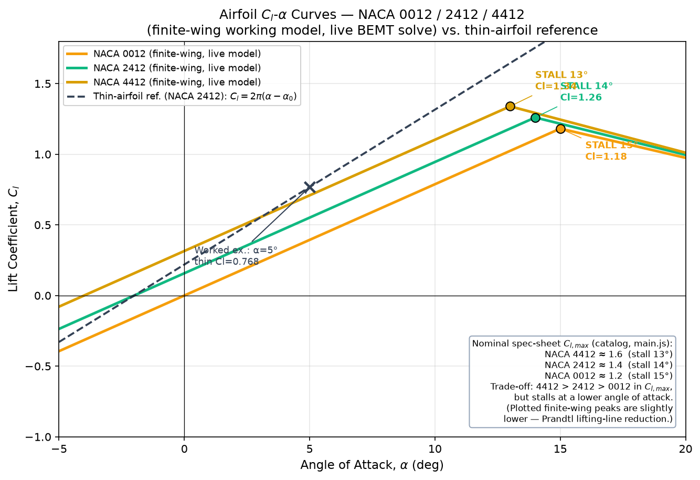
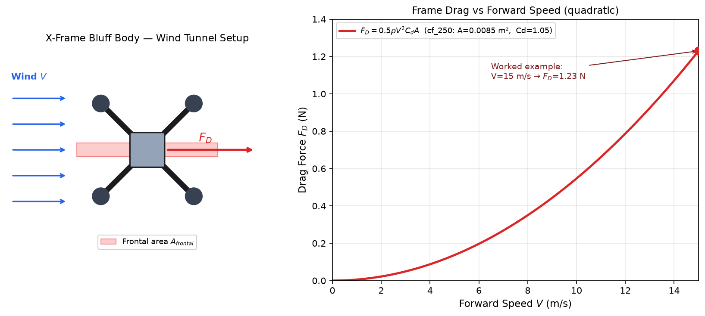
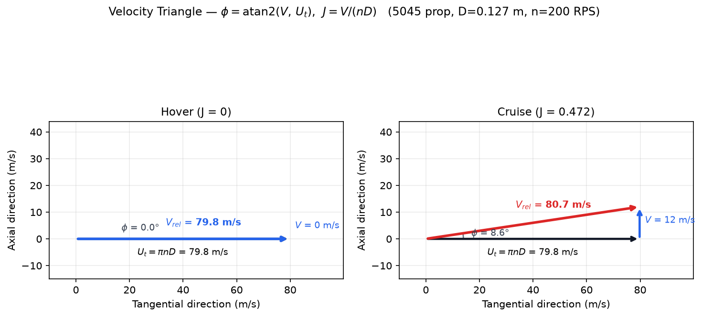
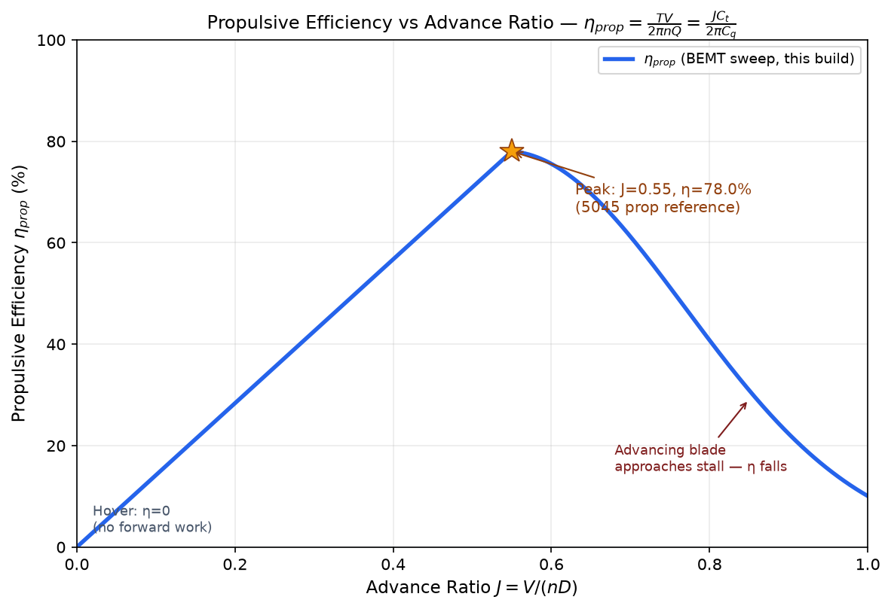

# Lab Procedure: Aerodynamic Analysis

This experiment takes the propeller apart aerodynamically. Module 1 puts a single blade section in a wind tunnel and sweeps it to stall; Module 2 puts the whole aircraft in forward flight and sweeps airspeed. Both modules live on the same page — the tabs across the top of the viewport switch between them, and nothing is locked.

| Module | Sub-experiment | What comes out |
|---|---|---|
| Module 1 · Airfoil Lab | Airfoil Polar | Cl–α curve, Cl_max, stall angle |
| Module 2 · Forward Flight | Forward Flight | Frame drag F_D(V), propulsive efficiency η(J) |

Three sub-calculations run underneath, and the **Calculations** card carries all three with your current numbers substituted in:

- **A** — lift coefficient, Cl = 2π(α − α₀)
- **B** — frame drag, F_D = ½·ρ·V²·Cd·A_frontal
- **C** — advance ratio J = V/(n·D) and propulsive efficiency η = T·V / (2π·n·Q)

---

## Module 1 · Airfoil Polar

### Objective

Build the lift curve for a blade section, find where it stalls, and see how camber moves both.

1. Set the blade up first. The geometry card on the left has blade count, diameter, root and tip pitch, and root and tip chord. The 3D propeller rebuilds as you change them, and the section you are about to test comes from that geometry — it is not a stock shape.

2. Choose a NACA section from the airfoil card. **NACA 0012** is symmetric, **2412** carries 2% camber and **4412** carries 4%. The section library opens in its own window if you want to compare the profiles side by side.

3. Set the **Angle of Attack** slider to the highest angle you want to reach. This matters: the sweep runs from below the zero-lift angle *up to wherever you leave the slider*. If you stop short of the stall angle, you never see the stall.

4. Press **▶ Run Sim**. The section tilts through the sweep while the telemetry strip reads α, Cl, Cd, L/D, Reynolds number and tip Mach. The phase word flips from ATTACHED to STALLED the moment you cross the stall angle, and the streamlines visibly detach.

5. The verdict names the section, how far you swept it, the Cl_max and stall angle if you got there, and the zero-lift angle α₀. Each airfoil you profile is remembered separately, so run all three and compare.

### What to expect

NACA 4412 reaches a higher Cl_max than the symmetric 0012, but it gets there at a lower angle. That is camber's whole bargain — more lift per degree, less warning before it lets go. Watch the drag polar at the same time: the extra lift is not free.

The **Diagnostics Log** will flag things the sweep cannot fix for you. High solidity means too many blades or too much chord for a clean disc. Low blade Reynolds means the section is running in a regime where the polar stops behaving. Tip Mach above 0.6 means the blade tip is going fast enough for compressibility to matter, and you should drop RPM or diameter.

---

## Module 2 · Forward Flight

### Objective

Push the aircraft forward and watch two things happen at once — drag rising with the square of speed, and propulsive efficiency peaking then falling away.

1. Switch to Module 2. The viewport becomes a wind tunnel with the whole airframe in it.

2. Check the frontal area and drag coefficient in the panel on the left — they come from the chassis you have selected, not from a typed-in number. A quadcopter X-frame is a bluff body, so Cd sits near 1.05, nothing like a wing.

3. Set the **RPM** slider. It fixes n in J = V/(n·D), so it decides where on the efficiency curve the sweep will land.

4. Turn on **rotor-wash drag** if you want the honest number. Clean-tunnel drag underestimates real forward flight, because the airframe is sitting in its own downwash. The panel shows the clean and the effective values side by side.

5. Press **▶ Run Sim**. One pass sweeps airspeed from zero to the maximum the build can reach, and both curves are drawn against that shared axis. The telemetry reads V, F_D, J, η, thrust and body Reynolds. If J climbs past J₀ the propeller stops producing thrust and starts windmilling — the phase word says so.

6. To pass, the drag fit needs R² above 0.999 against V² and the peak propulsive efficiency needs to be at least 40%. The verdict reports both, plus the advance ratio where the peak sits.

### What to expect

Drag is quadratic, so doubling airspeed quadruples the force. Plot F_D against V and you get a curve; plot it against V² and you get a straight line, which is the point of the regression readout.

Propulsive efficiency is zero at hover — no forward motion means no useful work, however hard the propeller is spinning — climbs to a single clean peak, then collapses as the advancing blade approaches its own stall. Flying either side of that peak wastes power, and the peak is a speed, not a throttle setting.

---

## What gets stored

Finishing both modules unlocks a profiled propeller set in the Outputs column, and writes the results the downstream experiments need: clean and wash-corrected frame drag, the peak efficiency and the advance ratio it happens at, the trim speed, and the measured Cl_max and stall angle for the section you chose. Change the propeller in the propulsion experiment afterwards and these results are flagged stale, because they no longer describe the aircraft you are flying.
