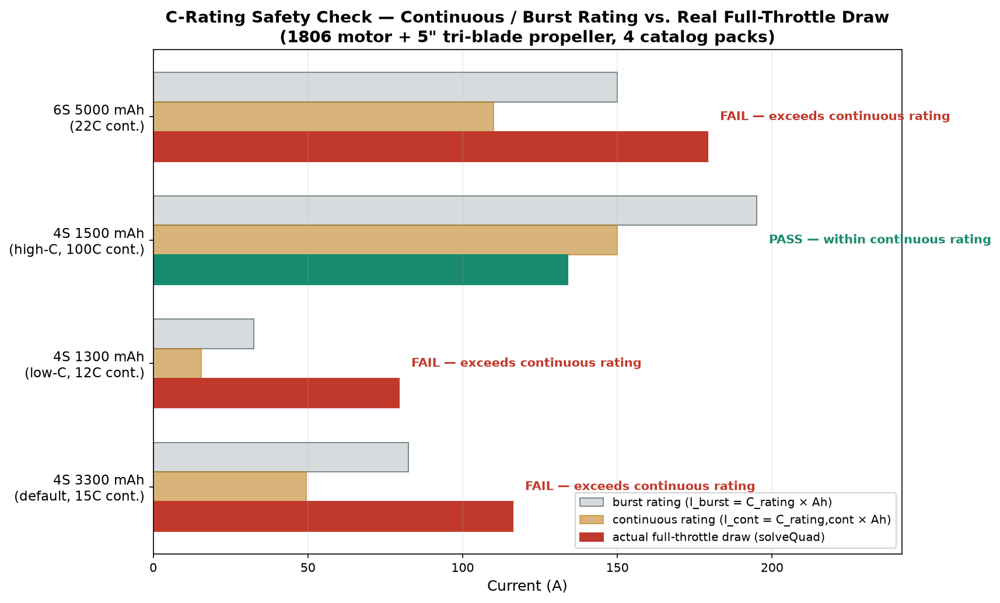
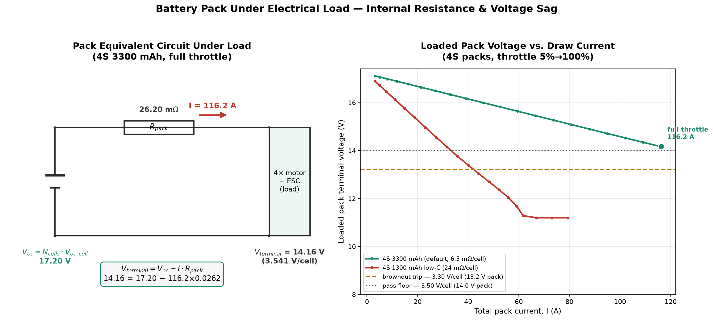
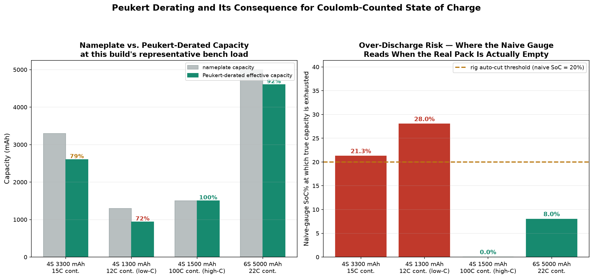
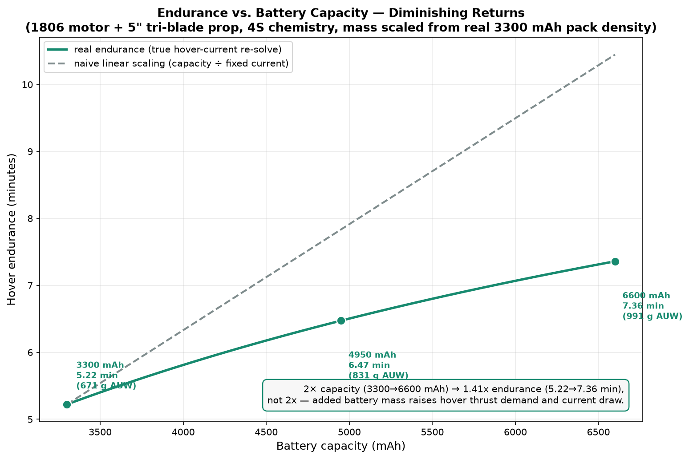

<h1>Theoretical Background: Drone Battery Pack Energy Storage &amp; Discharge Behaviour</h1>

A multirotor's propulsion system is only as good as the pack feeding it. The same motor and propeller can be perfectly safe on one battery and kill a cell on another, because a LiPo pack is not a fixed voltage source. It is a chemical cell with a rate-dependent capacity, an internal resistance that grows as it empties, and a hard current ceiling built into it. This chapter works through the four things that actually limit a pack in service: how much current it can hold without venting, how far its terminal voltage sags under that current, how much of its printed capacity is really there at a given discharge rate, and how that capacity turns into minutes of hover once you account for the pack's own weight.

<blockquote>

<strong>A note on the build used throughout this chapter.</strong> Every worked example below uses the same build: four 2806 motors, four 5" tri-blade propellers (4.3" pitch), four 45 A ESCs, an X-Quad 5" chassis, a PiHawk v2 autopilot and a CM703 receiver, for a 476 g all-up mass before you add a battery. With the default 4S 5200 mAh pack that comes to 956 g. Only the pack changes between examples. That is on purpose: it isolates exactly what a pack's C-rating and internal resistance do to a fixed airframe. All numbers come straight from the equations below (they are not hand-rounded), so they match what the simulator's own solver produces for the same build.

</blockquote>

Before we get into the physics, the animation below walks through the full pack story: what the cell count and C-rating actually promise, then the internal resistance that makes terminal voltage sag under load and the Peukert effect that hides part of the printed capacity at high discharge rates, and finally how the energy left over turns into minutes of hover once the pack has to carry its own weight.

  <video controls playsinline preload="metadata" width="100%" style="max-width: 860px; border-radius: 8px;">
    <source src="./videos/energy_storage_final.mp4" type="video/mp4">
    Your browser does not support the HTML5 video tag. You can
    <a href="./videos/energy_storage_final.mp4">download the video</a> instead.
  </video>

<h2>1. Pack Voltage, C-Rating &amp; the Continuous Discharge Limit</h2>

A LiPo cell's printed capacity (in mAh) tells you how much charge it holds, not how fast it can safely give that charge up. The rate limit is the C-rating, and every pack's label shows it two ways: a continuous rating the cell can hold indefinitely without damage, and a higher burst rating it survives for only a few seconds before the electrolyte starts to break down. Both are defined against the pack's own capacity:

<i>I</i>cont = <i>C</i>rating,cont &middot; <i>Capacity</i>Ah &nbsp;&nbsp;&nbsp; <i>I</i>burst = <i>C</i>rating &middot; <i>Capacity</i>Ah

A 3300 mAh pack rated 25C continuous can hold 3.3 &times; 25 = 82.5 A indefinitely; a 100C pack of under half that capacity can hold 150 A. What matters is the current the airframe actually pulls at full throttle. That comes out of the coupled motor/propeller/pack circuit, solved the same way Module 1's propulsion did it, not assumed. If the sustained draw sits above <i>I</i>cont, the cells are working harder than they were built for: internal heating outruns the pack's ability to shed it, the electrolyte gasses off, and the pouch swells. The bench test uses a timer rather than an instant cutoff, because a current spike during a throttle ramp is normal. Three seconds of sustained over-continuous draw is treated as real: <code>"Battery vented - sustained &lt;I&gt; A draw exceeds the &lt;I_cont&gt; A continuous rating (&lt;C&gt;C pack). Cells overheated and swelled."</code>

<h3>Worked Example: C-Rating Margin, Two Packs on the Same Airframe</h3>

The build above draws a real full-throttle current once you solve the motor/propeller/pack circuit (Section&nbsp;3 shows exactly how), and that draw is not the same for every pack: a stiffer pack holds its bus voltage up, so the motors take more current from it. Check each catalog pack against its own continuous limit:

<table>
<thead><tr><th>Pack</th><th><i>I</i>cont = <i>C</i>cont &middot; Ah</th><th><i>I</i>total (solved)</th><th>Verdict</th></tr></thead>
<tbody>
<tr><td>4S 5200 mAh (default, 30C)</td><td>30 &middot; 5.20 = 156 A</td><td>79.9 A</td><td>pass, wide margin</td></tr>
<tr><td>4S 3300 mAh (25C)</td><td>25 &middot; 3.30 = 82.5 A</td><td>81.1 A</td><td>pass by 1.4 A</td></tr>
<tr><td>4S 1500 mAh high-C (100C)</td><td>100 &middot; 1.50 = 150 A</td><td>90.7 A</td><td>pass, wide margin</td></tr>
<tr><td>4S 1300 mAh low-C (12C)</td><td>12 &middot; 1.30 = 15.6 A</td><td>55.6 A</td><td><b>vents</b> &mdash; 3.6&times; over</td></tr>
</tbody>
</table>

The low-C pack draws the <em>least</em> current of the four and is the only one that fails, because its 15.6 A ceiling is far below what any airframe of this class demands. Meanwhile the 1500 mAh high-C pack draws the most current of the 4S options and passes comfortably. Capacity and discharge capability are separate specs, and the mAh on the label predicts neither the current the pack will supply nor the current it can survive. Note also the 3300 mAh pack: a 1.4 A margin on 82.5 A is a pass in name only, since cell resistance rises with age and temperature. Figure 1 lays out the catalog packs against this build.

<h2>2. Internal Resistance &amp; Voltage Sag Under Load</h2>

Every real cell has some internal resistance, and every amp you draw through it costs voltage. The open-circuit voltage a cell would show with no load follows a curve set by lithium-cobalt electrochemistry: steep near full charge and near empty, flat through the middle.

<i>V</i>oc,cell = 3.50 + 0.70 &middot; <i>SoC</i> + 0.10 &middot; <i>SoC</i>3

Under load, the terminal voltage the ESC actually sees is lower than this by the ohmic drop across the pack's internal resistance:

<i>V</i>terminal = <i>N</i>cells &middot; (<i>V</i>oc,cell &minus; <i>I</i> &middot; <i>R</i>cell,eff)

The pack resistance is built from each cell's catalog <code>cell_ir_mohm</code> rating plus a swell term that grows sharply as the cell empties. Reaction rates slow near depletion, so the effective resistance is worse at low SoC than at full charge:

<i>R</i>pack = <i>N</i>cells &middot; <i>R</i>cell,eff &nbsp;&nbsp;&nbsp; <i>R</i>cell,eff = <i>R</i>cell,nominal &middot; (1 + 0.25 &middot; <i>e</i>5&middot;(0.3&minus;<i>SoC</i>))

A cell's <code>cell_ir_mohm</code> spec is not a side detail. It is the same physical property that sets the C-rating. A high-C race pack uses thicker current collectors and lower-resistance electrolyte to keep this number small; a budget storage pack trades that away for cheaper construction and higher capacity per cell, which is why its <code>cell_ir_mohm</code> reads several times higher. The bench test calls a sustained sag below 3.30 V/cell for 1.5 s an ESC brownout (the RPM collapses as the available voltage drops below what the motor needs to keep spinning against load), and it wants at least 3.50 V/cell at full draw to pass cleanly.

<h3>Worked Example: Sag on a Healthy Pack vs a High-Resistance One</h3>

The default 4S 5200 mAh pack carries about 7.05 m&Omega;/cell, giving <i>R</i>pack = 4 &middot; 7.05 m&Omega; &asymp; 28.2 m&Omega;. At its solved 79.9 A full-throttle draw from Section 1 the loaded terminal voltage settles at 3.737 V/cell, comfortably clear of both the 3.50 V/cell pass floor and the 3.30 V/cell brownout line.

The interesting comparison is against the extremes of the catalog:

<table>
<thead><tr><th>Pack</th><th><i>R</i>cell</th><th><i>I</i>total</th><th>Loaded V/cell</th><th>Against 3.30 V brownout</th></tr></thead>
<tbody>
<tr><td>4S 1500 mAh high-C</td><td>3.22 m&Omega;</td><td>90.7 A</td><td>4.007 V</td><td>+0.71 V, no sag problem at all</td></tr>
<tr><td>4S 5200 mAh (default)</td><td>7.05 m&Omega;</td><td>79.9 A</td><td>3.737 V</td><td>+0.44 V</td></tr>
<tr><td>4S 3300 mAh</td><td>6.55 m&Omega;</td><td>81.1 A</td><td>3.769 V</td><td>+0.47 V</td></tr>
<tr><td>4S 1300 mAh low-C</td><td>24.18 m&Omega;</td><td>55.6 A</td><td>3.022 V</td><td><b>&minus;0.28 V &mdash; brownout</b></td></tr>
</tbody>
</table>

Read the first and last rows together. The high-C pack has the lowest resistance, so it holds the highest voltage under load <em>and</em> lets the motors draw the most current. The low-C pack has nearly eight times that resistance, so it draws the least current of any pack here and still collapses below the brownout line, because the sag is <i>I</i> &middot; <i>R</i> and its <i>R</i> dominates. High internal resistance is simultaneously what caps a pack's C-rating and what destroys its loaded voltage &mdash; one property, both failures. Figure 2 plots the real nonlinear sag curves against the brownout and pass thresholds.

<h2>3. Peukert-Style Derating: Why a Pack Delivers Less Than Its Nameplate mAh</h2>

A cell's printed capacity is measured at a slow, gentle discharge, the kind a capacity tester uses, not the kind a quadcopter's motors demand. Draw a cell harder and its usable capacity actually shrinks. This is the practical form of Peukert's law, and it hits low-C packs hardest, because the same high internal resistance that limits their safe current also means more of the stored energy is lost to internal heating before it ever reaches the motor. The model here scales a derating factor straight off the pack's own continuous C-rating. A genuinely low-C pack is also a high-IR pack, so it gets penalised twice: once on safe current, once on real deliverable capacity.

<i>peukertFactor</i>(<i>C</i>rating,cont) =

<ul>
<li>1.00, for <i>C</i>rating,cont &ge; 30C: a race-grade pack tracks its nameplate almost exactly</li>
<li>0.90 to 1.00 (linear), for 20C &le; <i>C</i>rating,cont &lt; 30C</li>
<li>0.72 to 0.90 (linear), for 12C &le; <i>C</i>rating,cont &lt; 20C</li>
<li>0.70, for <i>C</i>rating,cont &lt; 12C: a genuinely undersized pack</li>
</ul>

<i>Capacity</i>effective = <i>Capacity</i>nameplate &middot; <i>peukertFactor</i>

This is the gap between what the label says and what a coulomb counter watching real cell voltage will actually measure before the pack is empty.

<h3>Worked Example: Effective Capacity Across the Catalog</h3>

<table>
<thead><tr><th>Pack</th><th>Crating,cont</th><th>peukertFactor</th><th>Nameplate</th><th>Effective</th></tr></thead>
<tbody>
<tr><td>4S 5200 mAh (default)</td><td>30C</td><td>1.0000</td><td>5200 mAh</td><td>5200 mAh (&minus;0.0%)</td></tr>
<tr><td>4S 3300 mAh</td><td>25C</td><td>0.9500</td><td>3300 mAh</td><td>3135 mAh (&minus;5.0%)</td></tr>
<tr><td>4S 1500 mAh (high-C)</td><td>100C</td><td>1.0000</td><td>1500 mAh</td><td>1500 mAh (&minus;0.0%)</td></tr>
<tr><td>6S 5000 mAh</td><td>40C</td><td>1.0000</td><td>5000 mAh</td><td>5000 mAh (&minus;0.0%)</td></tr>
<tr><td>4S 1300 mAh (low-C)</td><td>12C</td><td>0.7200</td><td>1300 mAh</td><td>936 mAh (&minus;28.0%)</td></tr>
</tbody>
</table>

The derating is a step function of the pack's own continuous rating: at 30C and above it vanishes entirely, and it only bites hard at the bottom of the range. The low-C pack loses more than a quarter of its printed capacity, which is the third time that pack has been punished for the same underlying property. Everything above 30C keeps its nameplate, so on this catalog the Peukert term separates one genuinely poor pack from the rest rather than penalising everyone a little. This effective-capacity number governs both the state-of-charge estimate in the next section and the endurance figure in the last one. Figure 3 (left panel) shows the nameplate-versus-effective bars.

<h2>4. Coulomb Counting &amp; State-of-Charge Estimation</h2>

A coulomb counter tracks state of charge by integrating current over time and comparing the charge removed against a reference capacity: <i>SoC</i>(<i>t</i>) = <i>SoC</i>(0) &minus; &int; <i>I</i> <i>dt</i> / <i>Capacity</i>ref. The catch is which capacity it uses as the reference. A cheap fuel-gauge circuit, like the rig's own automatic cutoff, counts against the printed nameplate figure, because that is the only number it has. Proper accounting instead needs the Peukert-derated effective capacity from Section 3. Run both counters in parallel from the same current draw and the gap shows up directly:

<i>SoC</i>naive = <i>SoC</i>naive &minus; &Delta;<i>Ah</i>&frasl;<i>Capacity</i>nameplate &nbsp;&nbsp;&nbsp; <i>SoC</i>true = <i>SoC</i>true &minus; &Delta;<i>Ah</i>&frasl;<i>Capacity</i>effective

There is a second, independent way to read SoC: straight off the loaded cell voltage. A naive rig reads it linearly across the nominal voltage window; the true relationship has to invert the nonlinear OCV curve from Section 2, which is far flatter through the middle of the discharge than at the ends:

<i>SoC</i>naive,V = (<i>V</i>cell &minus; 3.5)&frasl;(4.2 &minus; 3.5) &middot; 100%

<table>
<thead><tr><th><i>V</i>cell</th><th>naive (linear) SoC%</th><th>true (OCV-inverted) SoC%</th></tr></thead>
<tbody>
<tr><td>4.20 V</td><td>100.0%</td><td>89.7%</td></tr>
<tr><td>4.00 V</td><td>71.4%</td><td>67.1%</td></tr>
<tr><td>3.80 V</td><td>42.9%</td><td>41.8%</td></tr>
<tr><td>3.70 V</td><td>28.6%</td><td>28.3%</td></tr>
<tr><td>3.50 V</td><td>0.0%</td><td>0.0%</td></tr>
</tbody>
</table>

The two tracks agree at the extremes and split the most in the middle, exactly where the OCV curve is flattest and a small voltage error maps to a big SoC error. The discharge rig watches only the naive nameplate-referenced count and cuts the run automatically once it reads 20%. That is a sensible, conservative rule for a pack whose effective capacity roughly matches its nameplate, and it fails for a pack that does not.

<h3>Worked Example: Over-Discharge on the Low-C Pack</h3>

The true pack empties (<i>SoC</i>true reaches 0) once the drawn charge equals the <em>effective</em> capacity, which happens at a naive reading of exactly (1 &minus; <i>peukertFactor</i>) &times; 100%. For the low-C 4S 1300 mAh pack that is 1 &minus; 0.72 = 28%: the real cells are empty while the rig's own gauge still claims 28% left, eight full points above the 20% auto-cut. Work out the actual cell voltage at that moment, at the representative 6C bench load (<i>I</i>load = 7.8 A) and the swollen near-empty resistance (48.3 m&Omega;/cell):

<table>
<thead><tr><th>Quantity</th><th>Substitution</th><th>Result</th></tr></thead>
<tbody>
<tr><td><i>V</i>oc (pack, SoC&asymp;0)</td><td>4 &middot; 3.514</td><td>14.06 V</td></tr>
<tr><td><i>I</i>load &middot; <i>R</i>pack</td><td>7.8 &middot; 0.1933</td><td>1.51 V</td></tr>
<tr><td><i>V</i>pack,loaded</td><td>14.06 &minus; 1.51</td><td>12.55 V</td></tr>
<tr><td>per-cell</td><td>12.55 / 4</td><td>3.14 V/cell</td></tr>
</tbody>
</table>

3.14 V/cell is already well past the 3.5 V/cell over-discharge floor while the naive readout still sits above its own 20% cutoff. That is exactly the fault the rig is built to catch: <code>"Cell over-discharged - true SoC hit the 3.5 V/cell floor while the naive nameplate readout still showed 28% remaining (Peukert-derated pack, 12C). Cell puffed - permanent damage."</code> The 4S 3300 mAh pack has a 5-point overhang (1 &minus; 0.95 = 5%), comfortably inside the 20% cutoff, so the auto-cut fires before the cells run dry. Every pack rated 30C or higher &mdash; including the default 5200 mAh and the high-C 1500 mAh &mdash; has zero overhang: the true and naive tracks coincide, so the cutoff always protects them. Only the low-C pack, whose 28% overhang exceeds the 20% cutoff, can reach true empty while the gauge still shows charge. Figure 3's right panel plots this overhang against the cutoff line for the catalog packs.

<h2>5. Endurance &amp; the Hover Flight Energy Budget</h2>

Flight endurance is not just nameplate capacity divided by hover current. A bigger battery is also a heavier one, and a heavier airframe needs more thrust to hover, which pulls more current, which eats into the very capacity gain the bigger pack was supposed to buy. The nominal energy budget uses a flat 3.7 V/cell reference regardless of the chemistry-curve detail (a standard bookkeeping simplification, not the loaded voltage from Section 2):

<i>E</i>total = <i>Capacity</i>Ah &middot; <i>N</i>cells &middot; 3.7 V &middot; 3600 s/h &nbsp; [J]

Endurance comes from the pack's usable 80% depth of discharge (LiPo packs are not run to true zero; 20% is held back as the same safety floor the SoC rig enforces) divided by the true hover current, not an assumed one. The hover current comes from re-solving the exact same coupled motor/propeller/pack circuit from Section 1, bisecting throttle until thrust matches the new, heavier all-up weight:

<i>T</i>flight = (<i>Capacity</i>Ah &middot; 0.80)&frasl;<i>I</i>hover &middot; 60 &nbsp; [min]

Because a bigger pack is heavier, <i>I</i>hover itself climbs with capacity. That is what makes the capacity-to-endurance curve bend over instead of running as a straight proportional line, and it is also what can wipe out hover entirely if you push it too far (a thrust-to-weight below 1.0 is a flat "cannot hover" fault, no matter how much energy the pack holds).

<h3>Worked Example: Diminishing Returns on the Reference Airframe</h3>

Rather than scaling a hypothetical pack, take the real 4S packs from the catalog and re-solve hover for each on the same 476 g airframe:

<table>
<thead><tr><th>Pack</th><th>Pack mass</th><th>All-up mass</th><th>Endurance</th><th>Straight-line prediction</th></tr></thead>
<tbody>
<tr><td>4S 1500 mAh</td><td>175 g</td><td>651 g</td><td>10.67 min</td><td>&mdash; (reference point)</td></tr>
<tr><td>4S 3300 mAh</td><td>320 g</td><td>796 g</td><td>18.28 min</td><td>23.5 min</td></tr>
<tr><td>4S 5200 mAh</td><td>480 g</td><td>956 g</td><td>22.86 min</td><td>37.0 min</td></tr>
</tbody>
</table>

Going from 1500 mAh to 5200 mAh multiplies capacity by 3.47 but endurance by only 2.14. A straight-line projection off the smallest pack predicts 37.0 minutes; the real figure is 22.86, a shortfall of 38%. The cause is in the third column: the pack grew by 305 g, the all-up mass grew by 47%, and every one of those extra milliamp-hours is now being spent against a higher hover current. Push it far enough and the added mass stops paying for itself entirely &mdash; and past that, thrust-to-weight falls below 1.0 and the aircraft simply cannot hover, however much energy the pack holds. That is the physical reason "bigger battery" is not a universal upgrade on a fixed airframe. Figure 4 plots the real curve against the straight-line projection.

