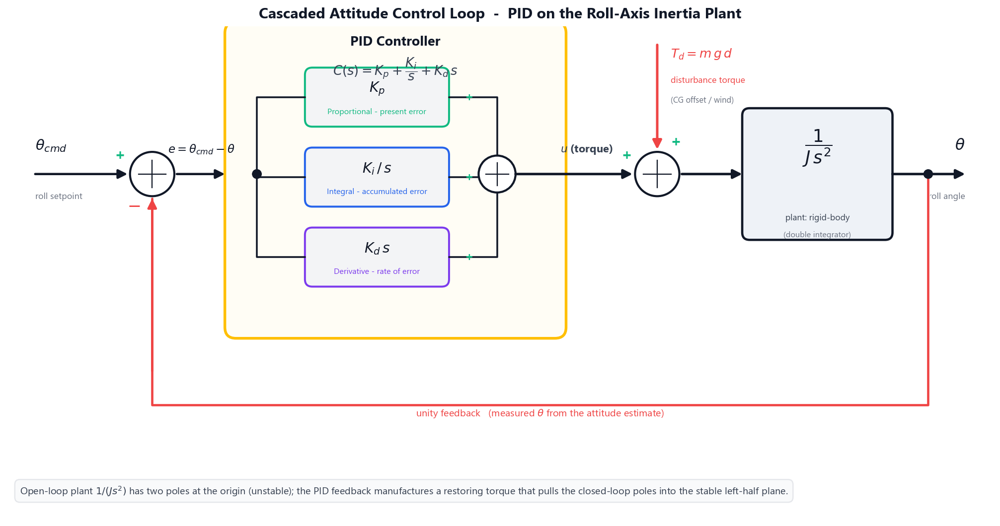
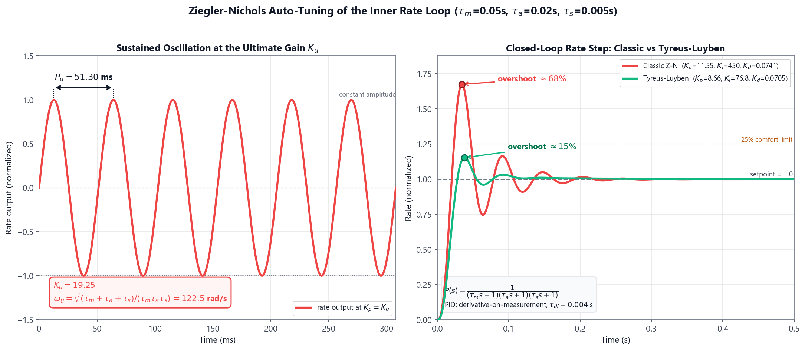

# Theory: Flight Control — PID Tuning, Ziegler–Nichols & Sensor Fusion

A multirotor is **open-loop unstable**: with no active control a quadcopter cannot hold its attitude, because the smallest disturbance torque integrates unchecked into a tumble. Stable flight is therefore created entirely by the **flight-control loop** running on the autopilot — it reads the vehicle's attitude many hundreds of times per second, compares it with the pilot's command, and continuously trims the four motor thrusts to drive the error to zero. This experiment builds that loop from the ground up: the **PID controller** that generates the corrective torque, the **Ziegler–Nichols** procedure that gives a first set of gains automatically, and the **complementary filter** that fuses the gyroscope and accelerometer into the clean attitude estimate the controller depends on.

---

## **1. The Attitude Control Problem**

Consider rotation about a single axis — the **roll** axis. Newton's second law for rotation states that the net torque equals the moment of inertia times the angular acceleration:

<i>&tau;</i> = <i>J</i> &middot; <i>&theta;&#776;</i>

where <i>J</i> is the roll-axis moment of inertia [kg&middot;m2] and <i>&theta;</i> is the roll angle [rad]. Rearranging, the angle is the **double integral** of the applied torque:

<i>&theta;</i>(<i>s</i>) / <i>&tau;</i>(<i>s</i>) = 1 / (<i>J s</i>2)

This plant — a **double integrator** — is the root of the instability. It has two poles at the origin, so any constant disturbance torque produces an angle that grows without bound. The controller's job is to manufacture a restoring torque that pulls the two poles into the stable left-half plane.

Real autopilots use a **cascaded** structure: an outer **angle loop** (commanding a desired angular rate from the attitude error) wrapped around an inner **rate loop** (commanding motor torque from the rate error). Section 2–4 analyse the angle loop's closed-loop response; Section 5–6 tune the inner rate loop with Ziegler–Nichols; Section 7 builds the attitude estimate both loops feed on.

---

## **2. The PID Controller & the Second-Order Closed Loop**

The Proportional–Integral–Derivative controller forms the corrective torque from three terms of the error <i>e</i> = <i>&theta;</i>cmd &minus; <i>&theta;</i>:

<i>C</i>(<i>s</i>) = <i>K</i>p + <i>K</i>i / <i>s</i> + <i>K</i>d <i>s</i>

* **Proportional** (<i>K</i>p): torque proportional to the present error — the main restoring spring.
* **Integral** (<i>K</i>i): torque proportional to the accumulated past error — eliminates steady offsets.
* **Derivative** (<i>K</i>d): torque proportional to the rate of change of error — electronic damping that tames overshoot.

With proportional + derivative action on the inertia plant, the closed loop becomes the textbook **second-order prototype** <i>s</i>2 + 2<i>&zeta;&omega;</i>n<i>s</i> + <i>&omega;</i>n2, where the two design quantities map directly onto the gains:

<i>&omega;</i>n = &radic;(<i>K</i>p / <i>J</i>) &nbsp;&nbsp;&nbsp; <i>&zeta;</i> = <i>K</i>d / (2&radic;(<i>K</i>p <i>J</i>))

<i>&omega;</i>n is the **natural frequency** (how fast the loop responds) and <i>&zeta;</i> is the **damping ratio** (how oscillatory it is). Raising <i>K</i>p speeds the loop but reduces damping; raising <i>K</i>d adds damping.

#### Where does <i>J</i> come from? — the build inherited from Experiment 2

The moment of inertia is not a free parameter; it follows from the airframe you assembled. Modelling an X-quad as its four motors lumped at the arm radius <i>L</i>, each 45&deg; from the roll axis (perpendicular distance <i>L</i>/&radic;2):

<i>J</i> = 4 &middot; (<i>m</i>/4) &middot; (<i>L</i>/&radic;2)2 = <i>m L</i>2 / 2

> **Worked example — roll inertia of the 5&Prime; reference airframe.**
> Taking the take-off mass <i>m</i> = 0.5 kg and arm length <i>L</i> = 110 mm = 0.110 m inherited from Experiment 2:
> 
<i>J</i> = (0.5 &times; 0.1102) / 2 = (0.5 &times; 0.0121) / 2 = <b>0.00303 kg&middot;m2</b> &asymp; 0.003 kg&middot;m2

> Every worked example below uses this <i>J</i> = 0.003 kg&middot;m2. A heavier or larger airframe raises <i>J</i> (the 10&Prime; heavy-lift preset is ~16&times; larger), which slows the loop for the same gains.

> **Worked example — natural frequency and damping at the default gains.**
> With <i>K</i>p = 0.6 N&middot;m/rad, <i>K</i>d = 0.04 N&middot;m&middot;s/rad and <i>J</i> = 0.003 kg&middot;m2:
> 
<i>&omega;</i>n = &radic;(0.6 / 0.003) = &radic;200 = <b>14.14 rad/s</b>

> 
<i>&zeta;</i> = 0.04 / (2&radic;(0.6 &times; 0.003)) = 0.04 / (2 &times; 0.04243) = <b>0.471</b>

> A damping ratio of 0.47 is moderately underdamped — fast, with a modest overshoot we quantify next.

---

## **3. Step-Response Metrics**

When the pilot commands a step change in attitude, the closed-loop response is judged by four numbers, each a closed-form function of <i>&omega;</i>n and <i>&zeta;</i>:

| Metric | Formula | Meaning |
| :--- | :--- | :--- |
| Peak overshoot | <i>M</i>p = 100 &middot; <i>e</i>&minus;&pi;&zeta;/&radic;(1&minus;&zeta;2) % | how far past the target it swings |
| Peak time | <i>t</i>p = &pi; / (<i>&omega;</i>n&radic;(1&minus;&zeta;2)) | when the first peak occurs |
| Rise time | <i>t</i>r = (&pi; &minus; cos&minus;1<i>&zeta;</i>) / (<i>&omega;</i>n&radic;(1&minus;&zeta;2)) | 0&rarr;100% of the first rise |
| Settling time (2%) | <i>t</i>s = 4 / (<i>&zeta;&omega;</i>n) | when it stays within &plusmn;2% |

> **Worked example — metrics at <i>K</i>p = 0.6, <i>K</i>d = 0.04.**
> Using <i>&omega;</i>n = 14.14 rad/s and <i>&zeta;</i> = 0.471:
> 
<i>M</i>p = 100 <i>e</i>&minus;&pi;&times;0.471/&radic;(1&minus;0.4712) = 100 <i>e</i>&minus;1.680 = <b>18.65 %</b>

> 
<i>t</i>p = &pi; / (14.14 &times; 0.882) = <b>0.252 s</b> &nbsp;&nbsp; <i>t</i>r = <b>0.165 s</b> &nbsp;&nbsp; <i>t</i>s = 4 / (0.471 &times; 14.14) = <b>0.60 s</b>

#### The <i>K</i>p-overshoot trade-off

Holding <i>K</i>d = 0.04 fixed and sweeping <i>K</i>p reveals the central tuning tension — more proportional gain is faster but rings harder:

| <i>K</i>p | <i>&omega;</i>n (rad/s) | <i>&zeta;</i> | Overshoot | Settling <i>t</i>s |
| :---: | :---: | :---: | :---: | :---: |
| 0.2 | 8.16 | 0.816 | 1.18 % | 0.60 s |
| 0.4 | 11.55 | 0.577 | 10.85 % | 0.60 s |
| 0.6 | 14.14 | 0.471 | 18.65 % | 0.60 s |
| 0.8 | 16.33 | 0.408 | 24.54 % | 0.60 s |
| 1.0 | 18.26 | 0.365 | 29.16 % | 0.60 s |

Overshoot climbs past the **25% comfort limit** near <i>K</i>p = 0.8. A subtle but important result: the **settling time is constant at 0.60 s** across the whole sweep, because the decay rate <i>&zeta;&omega;</i>n = <i>K</i>d/(2<i>J</i>) = 0.04/(2&times;0.003) = 6.67 s&minus;1 depends only on <i>K</i>d and <i>J</i>, not on <i>K</i>p. To settle faster you must raise the derivative gain, not the proportional gain.

---

## **4. Steady-State Error & the Role of Integral Action**

A perfectly trimmed quad still tilts under a **constant disturbance torque** — an off-centre payload, a shifted battery, or a steady crosswind. A horizontal centre-of-gravity offset <i>d</i> under gravity creates the couple:

<i>&tau;</i>d = <i>m</i> &middot; <i>g</i> &middot; <i>d</i>

With proportional control alone, the loop can only hold a counter-torque by accepting a permanent angle error — the **steady-state error**:

<i>e</i>ss = <i>&tau;</i>d / <i>K</i>p

> **Worked example — droop from the Experiment-2 CG offset.**
> The CG offset measured in Experiment 2 is <i>d</i> = 3.57 mm, so on the 0.5 kg airframe:
> 
<i>&tau;</i>d = 0.5 &times; 9.807 &times; 0.00357 = <b>0.0175 N&middot;m</b>

> The resulting steady tilt shrinks as <i>K</i>p rises:
>
> | <i>K</i>p | <i>e</i>ss (rad) | <i>e</i>ss (deg) |
> | :---: | :---: | :---: |
> | 0.2 | 0.0875 | 5.01&deg; |
> | 0.6 | 0.0292 | 1.67&deg; |
> | 1.0 | 0.0175 | 1.00&deg; |
>
> Higher <i>K</i>p reduces the droop but, from Section 3, worsens overshoot — you cannot win on both with proportional gain alone.

The escape is the **integral term**. Because <i>K</i>i/<i>s</i> keeps accumulating as long as any error remains, it injects an ever-growing counter-torque until the error is driven to **exactly zero**. Adding even a small <i>K</i>i nulls the steady-state tilt while <i>K</i>p and <i>K</i>d set the transient — the reason every real attitude loop is a full PID, not just PD.

---

## **5. Ziegler–Nichols Auto-Tuning**

Choosing three gains by hand is tedious. The **Ziegler–Nichols ultimate-cycle method** finds a starting set from a single experiment: raise the proportional gain until the loop **oscillates with constant amplitude**; record that gain as the **ultimate gain** <i>K</i>u and the oscillation period as the **ultimate period** <i>P</i>u; then read the gains from a table.

#### Why the method needs the real plant lags

A pure inertia plant 1/(<i>J s</i>2) under proportional control has its poles sitting **exactly on the imaginary axis at every gain** — it oscillates at *all* <i>K</i>p, so <i>K</i>u is undefined. The ultimate-gain method only works because the real inner rate loop carries additional **first-order lags**: the rotational/mechanical lag <i>&tau;</i>m, the motor + ESC actuator lag <i>&tau;</i>a, and the gyro/filter lag <i>&tau;</i>s. The rate-loop plant is therefore a Type-0 chain:

<i>P</i>(<i>s</i>) = 1 / [(<i>&tau;</i>m<i>s</i> + 1)(<i>&tau;</i>a<i>s</i> + 1)(<i>&tau;</i>s<i>s</i> + 1)]

Routh's criterion on this third-order loop gives closed-form crossing conditions:

<i>&omega;</i>u = &radic;[ (<i>&tau;</i>m+<i>&tau;</i>a+<i>&tau;</i>s) / (<i>&tau;</i>m<i>&tau;</i>a<i>&tau;</i>s) ] &nbsp;&nbsp;&nbsp; <i>P</i>u = 2&pi; / <i>&omega;</i>u

<i>K</i>u = [ (<i>&tau;</i>m<i>&tau;</i>a + <i>&tau;</i>m<i>&tau;</i>s + <i>&tau;</i>a<i>&tau;</i>s)(<i>&tau;</i>m+<i>&tau;</i>a+<i>&tau;</i>s) / (<i>&tau;</i>m<i>&tau;</i>a<i>&tau;</i>s) &minus; 1 ] / <i>K</i>

> **Worked example — ultimate gain and period (5&Prime; airframe).**
> With <i>&tau;</i>m = 0.05 s, <i>&tau;</i>a = 0.02 s, <i>&tau;</i>s = 0.005 s and unit DC gain:
> 
<i>&omega;</i>u = &radic;(0.075 / 5&times;10&minus;6) = &radic;15000 = <b>122.5 rad/s</b> &rarr; <i>P</i>u = 2&pi;/122.5 = <b>0.0513 s</b>

> 
<i>K</i>u = (0.00135 &times; 0.075 / 5&times;10&minus;6) &minus; 1 = 20.25 &minus; 1 = <b>19.25</b>

The **classic Ziegler–Nichols PID table** then prescribes:

<i>K</i>p = 0.6 <i>K</i>u &nbsp;&nbsp; <i>T</i>i = 0.5 <i>P</i>u &nbsp;&nbsp; <i>T</i>d = 0.125 <i>P</i>u

with <i>K</i>i = <i>K</i>p/<i>T</i>i and <i>K</i>d = <i>K</i>p<i>T</i>d.

> **Worked example — classic Z-N gains.**
> 
<i>K</i>p = 0.6 &times; 19.25 = <b>11.55</b> &nbsp;&nbsp; <i>K</i>i = 11.55 / (0.5&times;0.0513) = <b>450.3</b> &nbsp;&nbsp; <i>K</i>d = 11.55 &times; (0.125&times;0.0513) = <b>0.0741</b>

---

## **6. Refining the Tune — Classic vs Robust**

Ziegler–Nichols is fast, but it is **deliberately aggressive**: the classic table targets a *quarter-amplitude decay*, which on this plant produces a large first overshoot.

> **Observed in the simulation — classic Z-N step response.** Applying <i>K</i>p = 11.55, <i>K</i>i = 450.3, <i>K</i>d = 0.074 to the rate loop gives roughly **68% overshoot** with zero steady-state error — fast, but far past the 25% comfort limit. (Note: a widely repeated claim that classic Z-N yields ~20% overshoot is incorrect for this kind of plant; the honest simulated value is reported here.)

The practical workflow is to treat Z-N as a *starting point* and then **detune for robustness**. The classic table's overshoot comes mostly from its very high integral gain (<i>T</i>i = 0.5<i>P</i>u). The **Tyreus–Luyben** table raises <i>T</i>i and lowers <i>K</i>p:

<i>K</i>p = 0.45 <i>K</i>u &nbsp;&nbsp; <i>T</i>i = 2.2 <i>P</i>u &nbsp;&nbsp; <i>T</i>d = <i>P</i>u / 6.3

> **Worked example — Tyreus–Luyben gains and response.**
> 
<i>K</i>p = 0.45 &times; 19.25 = <b>8.66</b> &nbsp;&nbsp; <i>K</i>i = 8.66 / (2.2&times;0.0513) = <b>76.8</b> &nbsp;&nbsp; <i>K</i>d = 8.66 &times; (0.0513/6.3) = <b>0.0705</b>

> The integral gain drops from 450 to 77 — a much gentler integrator. The simulated step now overshoots about **15%** (under the 25% target) while keeping zero steady-state error. The cost is a slightly slower rise; the benefit is a calm, robust loop.

---

## **7. Sensor Fusion — the Complementary Filter**

Both control loops depend on a clean attitude measurement, but neither inertial sensor gives one alone:

* The **gyroscope** measures angular *rate*; integrating it gives a smooth, low-noise angle that **drifts** because the small constant bias accumulates without bound.
* The **accelerometer** measures the gravity direction, giving an absolute tilt that **does not drift** but is **buried in vibration noise**.

The **complementary filter** fuses them — a high-pass on the gyro path and a low-pass on the accel path that sum to unity:

<i>&theta;</i>est = <i>&alpha;</i> &middot; (<i>&theta;</i>est,prev + <i>&omega;</i>gyro &middot; &Delta;<i>t</i>) + (1 &minus; <i>&alpha;</i>) &middot; <i>&theta;</i>accel

The single blending coefficient <i>&alpha;</i> sets the crossover **time constant**, and through it the two competing error sources:

<i>&tau;</i>f = <i>&alpha;</i> &middot; &Delta;<i>t</i> / (1 &minus; <i>&alpha;</i>)

drift = bias &middot; <i>&tau;</i>f &nbsp;&nbsp;&nbsp; noiserms = <i>&sigma;</i>accel &middot; &radic;[(1 &minus; <i>&alpha;</i>) / (1 + <i>&alpha;</i>)]

A **higher** <i>&alpha;</i> trusts the gyro longer (more drift, less noise); a **lower** <i>&alpha;</i> trusts the accelerometer more (less drift, more noise). The best <i>&alpha;</i> minimises the *combined* error.

> **Worked example — choosing <i>&alpha;</i> for the reference IMU.**
> With a gyro bias of 0.6&deg;/s, accelerometer angle noise <i>&sigma;</i> = 1.8&deg;, and the estimator at &Delta;<i>t</i> = 2.5 ms (400 Hz):
>
> | <i>&alpha;</i> | <i>&tau;</i>f (s) | drift (&deg;) | noise (&deg;) | total (&deg;) |
> | :---: | :---: | :---: | :---: | :---: |
> | 0.90 | 0.0225 | 0.014 | 0.413 | 0.426 |
> | 0.95 | 0.0475 | 0.029 | 0.288 | 0.317 |
> | **0.98** | **0.1225** | **0.074** | **0.181** | **0.254** |
> | 0.99 | 0.2475 | 0.149 | 0.128 | 0.276 |
>
> The total error is smallest at **<i>&alpha;</i> = 0.98**. For contrast, *pure* gyro integration (<i>&alpha;</i> = 1) drifts by 0.6&deg;/s &times; 30 s = **18&deg;** after just half a minute — the unbounded error the accelerometer reference exists to stop.

---

## **Modelling Assumptions & Limitations**

1. **Lumped inertia is an upper bound.** <i>J</i> = <i>m L</i>2/2 assumes all mass sits at the motor positions. Real builds carry the battery and stack near the centre, so the true inertia is somewhat lower and the loop is a little faster than predicted.
2. **The prototype 2nd-order model is idealised.** The metric formulas of Section 3 neglect the zero introduced by the PD term and the extra phase lag of the actuator, both of which add a little real-world overshoot beyond the table values.
3. **Classic Ziegler–Nichols is intentionally aggressive.** It targets quarter-amplitude decay, not a gentle response — hence the ~68% overshoot. It is a *starting point* to be refined (Section 6), not a final tune.
4. **The complementary filter assumes a constant gyro bias.** Real bias wanders slowly with temperature, so a fixed <i>&alpha;</i> is itself a compromise; production systems re-estimate the bias online (a Kalman filter generalises exactly this fusion).
5. **Single-axis analysis.** Roll, pitch and yaw are treated independently here; a real airframe has small cross-axis coupling that a full controller accounts for.
