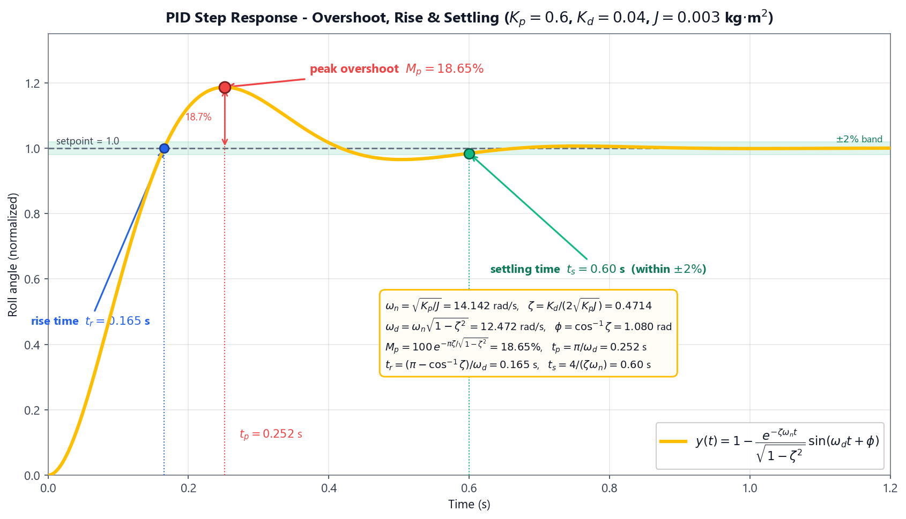
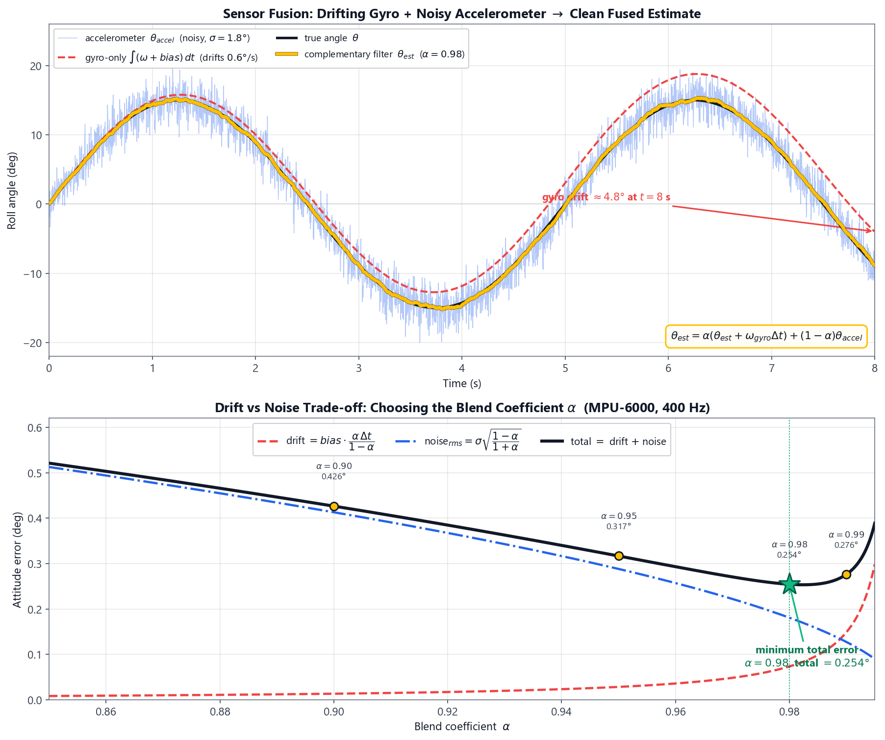
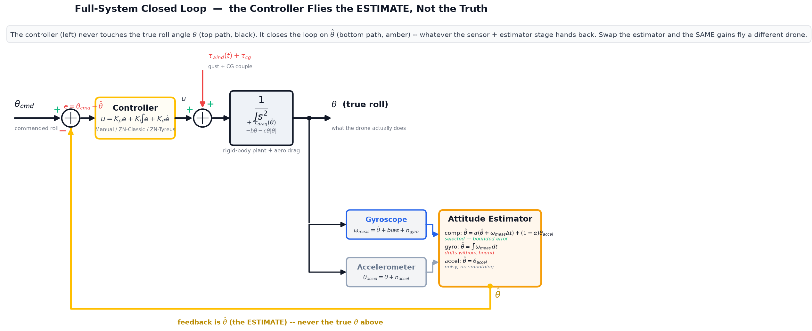

<h1>Theory: Flight Control — PID Tuning, Ziegler&ndash;Nichols, Sensor Fusion &amp; the Full System</h1>

A multirotor is <strong>open-loop unstable</strong>: with no active control a quadcopter cannot hold its attitude, because the smallest disturbance torque integrates unchecked into a tumble. Stable flight is therefore created entirely by the <strong>flight-control loop</strong> running on the autopilot — it reads the vehicle's attitude many hundreds of times per second, compares it with the pilot's command, and continuously trims the four motor thrusts to drive the error to zero.

This experiment builds that loop across <strong>four tabs</strong>: <strong>PID Tuning</strong> builds the controller by hand; <strong>Ziegler&ndash;Nichols</strong> tunes it autonomously against the real plant lags (and, against real aerodynamic drag and wind); <strong>Sensor Fusion</strong> builds the attitude <i>estimate</i> the controller depends on; and <strong>Full System</strong> closes all three into one loop and lets you hunt, combination by combination, for the best flight controller.

<blockquote>

<strong>The one idea every tab but the last hides.</strong> Tabs 1&ndash;3 each study one piece of the loop in isolation — the plant, the tuning method, the filter — with the <i>true</i> attitude drawn on screen for clarity. A real autopilot never has that luxury: the controller only ever sees the <strong>estimate</strong> <i>&theta;&#770;</i> that the sensor + filter stage hands it. Section 8 makes the aerodynamics honest; Section 9 puts the estimator <i>inside</i> the loop and shows why the choice of estimator is a control decision, not a display option.

</blockquote>

Before working through the underlying physics, the animation below walks through the full flight-control story — from the unstable double-integrator plant and the three PID terms, through the second-order step response and the overshoot-versus-gain trade-off, to the Ziegler&ndash;Nichols tuning procedure and the complementary filter that supplies the attitude estimate both loops feed on.

  <video controls playsinline preload="metadata" width="100%" style="max-width: 860px; border-radius: 8px;">
    <source src="./videos/flight_control_system.mp4" type="video/mp4">
    Your browser does not support the HTML5 video tag. You can
    <a href="./videos/flight_control_system.mp4">download the video</a> instead.
  </video>

<h2>1. The Attitude Control Problem</h2>

Consider rotation about a single axis — the <strong>roll</strong> axis. Newton's second law for rotation states that the net torque equals the moment of inertia times the angular acceleration:

<i>&tau;</i> = <i>J</i> &middot; <i>&theta;&#776;</i>

where <i>J</i> is the roll-axis moment of inertia [kg&middot;m2] and <i>&theta;</i> is the roll angle [rad]. Rearranging, the angle is the <strong>double integral</strong> of the applied torque:

<i>&theta;</i>(<i>s</i>) / <i>&tau;</i>(<i>s</i>) = 1 / (<i>J s</i>2)

This plant — a <strong>double integrator</strong> — is the root of the instability. It has two poles at the origin, so any constant disturbance torque produces an angle that grows without bound. The controller's job is to manufacture a restoring torque that pulls the two poles into the stable left-half plane.

Real autopilots use a <strong>cascaded</strong> structure: an outer <strong>angle loop</strong> (commanding a desired angular rate from the attitude error) wrapped around an inner <strong>rate loop</strong> (commanding motor torque from the rate error). Sections 2&ndash;4 analyse the angle loop's closed-loop response (<strong>PID Tuning</strong> tab); Sections 5&ndash;6 tune the inner rate loop with Ziegler&ndash;Nichols against real drag and wind (<strong>Ziegler&ndash;Nichols</strong> tab); Section 7 builds the attitude estimate both loops feed on (<strong>Sensor Fusion</strong> tab); Sections 8&ndash;9 put the estimator <i>inside</i> the loop and score every controller-estimator combination against each other (<strong>Full System</strong> tab).

<h2>2. The PID Controller &amp; the Second-Order Closed Loop</h2>

The Proportional&ndash;Integral&ndash;Derivative controller forms the corrective torque from three terms of the error <i>e</i> = <i>&theta;</i>cmd &minus; <i>&theta;</i>:

<i>C</i>(<i>s</i>) = <i>K</i>p + <i>K</i>i / <i>s</i> + <i>K</i>d <i>s</i>

<ul>
<li><strong>Proportional</strong> (<i>K</i>p): torque proportional to the present error — the main restoring spring.</li>
<li><strong>Integral</strong> (<i>K</i>i): torque proportional to the accumulated past error — eliminates steady offsets.</li>
<li><strong>Derivative</strong> (<i>K</i>d): torque proportional to the rate of change of error — electronic damping that tames overshoot.</li>
</ul>

With proportional + derivative action on the inertia plant, the closed loop becomes the textbook <strong>second-order prototype</strong> <i>s</i>2 + 2<i>&zeta;&omega;</i>n<i>s</i> + <i>&omega;</i>n2, where the two design quantities map directly onto the gains:

<i>&omega;</i>n = &radic;(<i>K</i>p / <i>J</i>) &nbsp;&nbsp;&nbsp; <i>&zeta;</i> = <i>K</i>d / (2&radic;(<i>K</i>p <i>J</i>))

<i>&omega;</i>n is the <strong>natural frequency</strong> (how fast the loop responds) and <i>&zeta;</i> is the <strong>damping ratio</strong> (how oscillatory it is). Raising <i>K</i>p speeds the loop but reduces damping; raising <i>K</i>d adds damping.

<h3>Where does <i>J</i> come from? — the assembled airframe</h3>

The moment of inertia is not a free parameter; it follows from the airframe you assembled. Modelling an X-quad as its four motors lumped at the arm radius <i>L</i>, each 45&deg; from the roll axis (perpendicular distance <i>L</i>/&radic;2):

<i>J</i> = 4 &middot; (<i>m</i>/4) &middot; (<i>L</i>/&radic;2)2 = <i>m L</i>2 / 2

<h3>Worked Example — Roll Inertia of the 5&Prime; Reference Airframe</h3>

Taking the take-off mass <i>m</i> = 0.5 kg and arm length <i>L</i> = 110 mm = 0.110 m for the reference 5&Prime; build (X-Quad 5&Prime; chassis with its default motor, battery, ESC, controller and receiver):

<i>J</i> = (0.5 &times; 0.1102) / 2 = (0.5 &times; 0.0121) / 2 = <b>0.00303 kg&middot;m2</b> &asymp; 0.003 kg&middot;m2

Every worked example below uses this <i>J</i> = 0.003 kg&middot;m2. A heavier or larger airframe raises <i>J</i> sharply — both the arm length and the mass grow together on a 10&Prime; Cine-Lifter build with proportionally larger motors and battery, so <i>J</i> can end up an order of magnitude or more above the 5&Prime; reference — which slows the loop for the same gains.

<h3>Worked Example — Natural Frequency &amp; Damping at the Default Gains</h3>

With <i>K</i>p = 0.6 N&middot;m/rad, <i>K</i>d = 0.04 N&middot;m&middot;s/rad and <i>J</i> = 0.003 kg&middot;m2:

<i>&omega;</i>n = &radic;(0.6 / 0.003) = &radic;200 = <b>14.14 rad/s</b>

<i>&zeta;</i> = 0.04 / (2&radic;(0.6 &times; 0.003)) = 0.04 / (2 &times; 0.04243) = <b>0.471</b>

A damping ratio of 0.47 is moderately underdamped — fast, with a modest overshoot we quantify next.

<h2>3. Step-Response Metrics</h2>

When the pilot commands a step change in attitude, the closed-loop response is judged by four numbers, each a closed-form function of <i>&omega;</i>n and <i>&zeta;</i>:

<table>
<thead>
<tr><th>Metric</th><th>Formula</th><th>Meaning</th></tr>
</thead>
<tbody>
<tr><td>Peak overshoot</td><td><i>M</i>p = 100 &middot; <i>e</i>&minus;&pi;&zeta;/&radic;(1&minus;&zeta;2) %</td><td>how far past the target it swings</td></tr>
<tr><td>Peak time</td><td><i>t</i>p = &pi; / (<i>&omega;</i>n&radic;(1&minus;&zeta;2))</td><td>when the first peak occurs</td></tr>
<tr><td>Rise time</td><td><i>t</i>r = (&pi; &minus; cos&minus;1<i>&zeta;</i>) / (<i>&omega;</i>n&radic;(1&minus;&zeta;2))</td><td>0&rarr;100% of the first rise</td></tr>
<tr><td>Settling time (2%)</td><td><i>t</i>s = 4 / (<i>&zeta;&omega;</i>n)</td><td>when it stays within &plusmn;2%</td></tr>
</tbody>
</table>

<h3>Worked Example — Metrics at <i>K</i>p = 0.6, <i>K</i>d = 0.04</h3>

Using <i>&omega;</i>n = 14.14 rad/s and <i>&zeta;</i> = 0.471:

<i>M</i>p = 100 <i>e</i>&minus;&pi;&times;0.471/&radic;(1&minus;0.4712) = 100 <i>e</i>&minus;1.680 = <b>18.65 %</b>

<i>t</i>p = &pi; / (14.14 &times; 0.882) = <b>0.252 s</b> &nbsp;&nbsp; <i>t</i>r = <b>0.165 s</b> &nbsp;&nbsp; <i>t</i>s = 4 / (0.471 &times; 14.14) = <b>0.60 s</b>

<h3>The <i>K</i>p-Overshoot Trade-Off</h3>

Holding <i>K</i>d = 0.04 fixed and sweeping <i>K</i>p reveals the central tuning tension — more proportional gain is faster but rings harder:

<table>
<thead>
<tr><th><i>K</i>p</th><th><i>&omega;</i>n (rad/s)</th><th><i>&zeta;</i></th><th>Overshoot</th><th>Settling <i>t</i>s</th></tr>
</thead>
<tbody>
<tr><td>0.2</td><td>8.16</td><td>0.816</td><td>1.18 %</td><td>0.60 s</td></tr>
<tr><td>0.4</td><td>11.55</td><td>0.577</td><td>10.85 %</td><td>0.60 s</td></tr>
<tr><td>0.6</td><td>14.14</td><td>0.471</td><td>18.65 %</td><td>0.60 s</td></tr>
<tr><td>0.8</td><td>16.33</td><td>0.408</td><td>24.54 %</td><td>0.60 s</td></tr>
<tr><td>1.0</td><td>18.26</td><td>0.365</td><td>29.16 %</td><td>0.60 s</td></tr>
</tbody>
</table>

Overshoot climbs past the <strong>25% comfort limit</strong> near <i>K</i>p = 0.8. A subtle but important result: the <strong>settling time is constant at 0.60 s</strong> across the whole sweep, because the decay rate <i>&zeta;&omega;</i>n = <i>K</i>d/(2<i>J</i>) = 0.04/(2&times;0.003) = 6.67 s&minus;1 depends only on <i>K</i>d and <i>J</i>, not on <i>K</i>p. To settle faster you must raise the derivative gain, not the proportional gain.

<h2>4. Steady-State Error &amp; the Role of Integral Action</h2>

A perfectly trimmed quad still tilts under a <strong>constant disturbance torque</strong> — an off-centre payload, a shifted battery, or a steady crosswind. A horizontal centre-of-gravity offset <i>d</i> under gravity creates the couple:

<i>&tau;</i>d = <i>m</i> &middot; <i>g</i> &middot; <i>d</i>

With proportional control alone, the loop can only hold a counter-torque by accepting a permanent angle error — the <strong>steady-state error</strong>:

<i>e</i>ss = <i>&tau;</i>d / <i>K</i>p

<h3>Worked Example — Droop from an Assumed CG Offset</h3>

The <strong>Disturbance torque</strong> switch in the simulator applies a fixed reference CG offset of <i>d</i> = 3.57 mm — representative of a slightly off-centre battery or payload — so on the 0.5 kg airframe:

<i>&tau;</i>d = 0.5 &times; 9.807 &times; 0.00357 = <b>0.0175 N&middot;m</b>

The resulting steady tilt shrinks as <i>K</i>p rises:

<table>
<thead>
<tr><th><i>K</i>p</th><th><i>e</i>ss (rad)</th><th><i>e</i>ss (deg)</th></tr>
</thead>
<tbody>
<tr><td>0.2</td><td>0.0875</td><td>5.01&deg;</td></tr>
<tr><td>0.6</td><td>0.0292</td><td>1.67&deg;</td></tr>
<tr><td>1.0</td><td>0.0175</td><td>1.00&deg;</td></tr>
</tbody>
</table>

Higher <i>K</i>p reduces the droop but, from Section 3, worsens overshoot — you cannot win on both with proportional gain alone.

The escape is the <strong>integral term</strong>. Because <i>K</i>i/<i>s</i> keeps accumulating as long as any error remains, it injects an ever-growing counter-torque until the error is driven to <strong>exactly zero</strong>. Adding even a small <i>K</i>i nulls the steady-state tilt while <i>K</i>p and <i>K</i>d set the transient — the reason every real attitude loop is a full PID, not just PD.

<h2>5. Ziegler&ndash;Nichols Auto-Tuning</h2>

Choosing three gains by hand is tedious. The <strong>Ziegler&ndash;Nichols ultimate-cycle method</strong> finds a starting set from a single experiment: raise the proportional gain until the loop <strong>oscillates with constant amplitude</strong>; record that gain as the <strong>ultimate gain</strong> <i>K</i>u and the oscillation period as the <strong>ultimate period</strong> <i>P</i>u; then read the gains from a table.

<h3>Why the Method Needs the Real Plant Lags</h3>

A pure inertia plant 1/(<i>J s</i>2) under proportional control has its poles sitting <strong>exactly on the imaginary axis at every gain</strong> — it oscillates at all <i>K</i>p, so <i>K</i>u is undefined. The ultimate-gain method only works because the real inner rate loop carries additional <strong>first-order lags</strong>: the rotational/mechanical lag <i>&tau;</i>m, the motor + ESC actuator lag <i>&tau;</i>a, and the gyro/filter lag <i>&tau;</i>s. The rate-loop plant is therefore a Type-0 chain:

<i>P</i>(<i>s</i>) = 1 / [(<i>&tau;</i>m<i>s</i> + 1)(<i>&tau;</i>a<i>s</i> + 1)(<i>&tau;</i>s<i>s</i> + 1)]

Routh's criterion on this third-order loop gives closed-form crossing conditions:

<i>&omega;</i>u = &radic;[ (<i>&tau;</i>m+<i>&tau;</i>a+<i>&tau;</i>s) / (<i>&tau;</i>m<i>&tau;</i>a<i>&tau;</i>s) ] &nbsp;&nbsp;&nbsp; <i>P</i>u = 2&pi; / <i>&omega;</i>u

<i>K</i>u = [ (<i>&tau;</i>m<i>&tau;</i>a + <i>&tau;</i>m<i>&tau;</i>s + <i>&tau;</i>a<i>&tau;</i>s)(<i>&tau;</i>m+<i>&tau;</i>a+<i>&tau;</i>s) / (<i>&tau;</i>m<i>&tau;</i>a<i>&tau;</i>s) &minus; 1 ] / <i>K</i>

<h3>Worked Example — Ultimate Gain &amp; Period (5&Prime; Airframe)</h3>

With <i>&tau;</i>m = 0.05 s, <i>&tau;</i>a = 0.02 s, <i>&tau;</i>s = 0.005 s and unit DC gain:

<i>&omega;</i>u = &radic;(0.075 / 5&times;10&minus;6) = &radic;15000 = <b>122.5 rad/s</b> &rarr; <i>P</i>u = 2&pi;/122.5 = <b>0.0513 s</b>

<i>K</i>u = (0.00135 &times; 0.075 / 5&times;10&minus;6) &minus; 1 = 20.25 &minus; 1 = <b>19.25</b>

The <strong>classic Ziegler&ndash;Nichols PID table</strong> then prescribes:

<i>K</i>p = 0.6 <i>K</i>u &nbsp;&nbsp; <i>T</i>i = 0.5 <i>P</i>u &nbsp;&nbsp; <i>T</i>d = 0.125 <i>P</i>u

with <i>K</i>i = <i>K</i>p/<i>T</i>i and <i>K</i>d = <i>K</i>p<i>T</i>d.

<h3>Worked Example — Classic Z-N Gains</h3>

<i>K</i>p = 0.6 &times; 19.25 = <b>11.55</b> &nbsp;&nbsp; <i>K</i>i = 11.55 / (0.5&times;0.0513) = <b>450.3</b> &nbsp;&nbsp; <i>K</i>d = 11.55 &times; (0.125&times;0.0513) = <b>0.0741</b>

<h2>6. Refining the Tune — Classic vs Robust</h2>

Ziegler&ndash;Nichols is fast, but it is <strong>deliberately aggressive</strong>: the classic table targets a <i>quarter-amplitude decay</i>, which on this plant produces a large first overshoot.

<blockquote>

<strong>Observed in the simulation — classic Z-N step response.</strong> Applying <i>K</i>p = 11.55, <i>K</i>i = 450.3, <i>K</i>d = 0.074 to the rate loop gives roughly <strong>68% overshoot</strong> with zero steady-state error — fast, but far past the 25% comfort limit. (A widely repeated claim that classic Z-N yields ~20% overshoot is incorrect for this kind of plant; the honest simulated value is reported here.)

</blockquote>

The practical workflow is to treat Z-N as a <i>starting point</i> and then <strong>detune for robustness</strong>. The classic table's overshoot comes mostly from its very high integral gain (<i>T</i>i = 0.5<i>P</i>u). The <strong>Tyreus&ndash;Luyben</strong> table raises <i>T</i>i and lowers <i>K</i>p:

<i>K</i>p = 0.45 <i>K</i>u &nbsp;&nbsp; <i>T</i>i = 2.2 <i>P</i>u &nbsp;&nbsp; <i>T</i>d = <i>P</i>u / 6.3

<h3>Worked Example — Tyreus&ndash;Luyben Gains &amp; Response</h3>

<i>K</i>p = 0.45 &times; 19.25 = <b>8.66</b> &nbsp;&nbsp; <i>K</i>i = 8.66 / (2.2&times;0.0513) = <b>76.8</b> &nbsp;&nbsp; <i>K</i>d = 8.66 &times; (0.0513/6.3) = <b>0.0705</b>

The integral gain drops from 450 to 77 — a much gentler integrator. The simulated step now overshoots about <strong>15%</strong> (under the 25% target) while keeping zero steady-state error. The cost is a slightly slower rise; the benefit is a calm, robust loop.

<h2>7. Sensor Fusion — the Complementary Filter</h2>

Both control loops depend on a clean attitude measurement, but neither inertial sensor gives one alone:

<ul>
<li>The <strong>gyroscope</strong> measures angular <i>rate</i>; integrating it gives a smooth, low-noise angle that <strong>drifts</strong> because the small constant bias accumulates without bound.</li>
<li>The <strong>accelerometer</strong> measures the gravity direction, giving an absolute tilt that <strong>does not drift</strong> but is <strong>buried in vibration noise</strong>.</li>
</ul>

The <strong>complementary filter</strong> fuses them — a high-pass on the gyro path and a low-pass on the accel path that sum to unity:

<i>&theta;</i>est = <i>&alpha;</i> &middot; (<i>&theta;</i>est,prev + <i>&omega;</i>gyro &middot; &Delta;<i>t</i>) + (1 &minus; <i>&alpha;</i>) &middot; <i>&theta;</i>accel

The single blending coefficient <i>&alpha;</i> sets the crossover <strong>time constant</strong>, and through it the two competing error sources:

<i>&tau;</i>f = <i>&alpha;</i> &middot; &Delta;<i>t</i> / (1 &minus; <i>&alpha;</i>)

drift = bias &middot; <i>&tau;</i>f &nbsp;&nbsp;&nbsp; noiserms = <i>&sigma;</i>accel &middot; &radic;[(1 &minus; <i>&alpha;</i>) / (1 + <i>&alpha;</i>)]

A <strong>higher</strong> <i>&alpha;</i> trusts the gyro longer (more drift, less noise); a <strong>lower</strong> <i>&alpha;</i> trusts the accelerometer more (less drift, more noise). The best <i>&alpha;</i> minimises the <i>combined</i> error.

<h3>Worked Example — Choosing <i>&alpha;</i> for the Reference IMU</h3>

With a gyro bias of 0.6&deg;/s, accelerometer angle noise <i>&sigma;</i> = 1.8&deg;, and the estimator at &Delta;<i>t</i> = 2.5 ms (400 Hz):

<table>
<thead>
<tr><th><i>&alpha;</i></th><th><i>&tau;</i>f (s)</th><th>drift (&deg;)</th><th>noise (&deg;)</th><th>total (&deg;)</th></tr>
</thead>
<tbody>
<tr><td>0.90</td><td>0.0225</td><td>0.014</td><td>0.413</td><td>0.426</td></tr>
<tr><td>0.95</td><td>0.0475</td><td>0.029</td><td>0.288</td><td>0.317</td></tr>
<tr><td><b>0.98</b></td><td><b>0.1225</b></td><td><b>0.074</b></td><td><b>0.181</b></td><td><b>0.254</b></td></tr>
<tr><td>0.99</td><td>0.2475</td><td>0.149</td><td>0.128</td><td>0.276</td></tr>
</tbody>
</table>

The total error is smallest at <strong><i>&alpha;</i> = 0.98</strong>. For contrast, <i>pure</i> gyro integration (<i>&alpha;</i> = 1) drifts by 0.6&deg;/s &times; 30 s = <strong>18&deg;</strong> after just half a minute — the unbounded error the accelerometer reference exists to stop.

<h2>8. Air Resistance &amp; Wind — Real Aerodynamic Damping</h2>

Every rotation through air meets a resisting torque. The <strong>Ziegler&ndash;Nichols</strong> tab lets you dial in an "air resistance" percentage and a wind-gust torque, both acting on the <i>same</i> rate-loop plant as Section 5 — not as a separate toy, but as the physical damping and disturbance a real airframe actually feels.

<i>&tau;</i>drag(<i>&omega;</i>) = &minus;<i>b&omega;</i> &minus; <i>c&omega;</i>|<i>&omega;</i>|

The <strong>linear</strong> term (coefficient <i>b</i>) dominates at the modest rates an attitude step involves and folds directly into the loop's damping; the <strong>quadratic</strong> term (coefficient <i>c</i>) only matters at high angular rate (aggressive manoeuvres) and is carried alongside it for completeness. Both scale with air density and with the cube of the airframe's arm length (bigger blades, bigger disc area, more drag):

<i>b</i> = 0.0667 &middot; (air% / 100) &middot; (<i>L</i>/0.11)3 &middot; (&rho;/1.225)

Because the linear drag term opposes rotation exactly like the derivative gain does, it folds directly into the loop's <strong>effective damping</strong>:

<i>&zeta;</i>eff = (<i>K</i>d + <i>b</i>) / (2&radic;(<i>K</i>p <i>J</i>))

<h3>Worked Example — Air Resistance Calms the PID Loop (5&Prime; Reference, <i>K</i>p=0.6, <i>K</i>d=0.04, <i>J</i>=0.003)</h3>

<table>
<thead>
<tr><th>Air resistance</th><th><i>b</i> (N&middot;m&middot;s/rad)</th><th><i>&zeta;</i>eff</th><th>Overshoot</th></tr>
</thead>
<tbody>
<tr><td>0% (vacuum)</td><td>0</td><td>0.471</td><td>18.65%</td></tr>
<tr><td>30%</td><td>0.0200</td><td>0.707</td><td>4.32%</td></tr>
<tr><td>70%</td><td>0.0467</td><td>1.022</td><td>0.00% (critically damped)</td></tr>
</tbody>
</table>

The same electronic gains fly a visibly calmer drone as air resistance rises — drag is <i>free</i> damping the controller doesn't have to supply. This is also why the Ziegler&ndash;Nichols ultimate gain shifts with air resistance: more drag means the rate loop needs a <i>higher</i> proportional gain before it sustains oscillation.

<h3>Worked Example — Drag Tames Even the Aggressive Classic Z-N Tune</h3>

Applying <i>K</i>p=11.55, <i>K</i>i=450.3, <i>K</i>d=0.0741 to the rate loop (Section 5) at increasing air resistance:

<table>
<thead>
<tr><th>Air resistance</th><th><i>b</i></th><th>Overshoot</th><th>Settling</th></tr>
</thead>
<tbody>
<tr><td>0%</td><td>0</td><td>68.0%</td><td>0.184 s</td></tr>
<tr><td>30%</td><td>0.0200</td><td>57.4%</td><td>0.122 s</td></tr>
<tr><td>70%</td><td>0.0467</td><td>44.8%</td><td>0.109 s</td></tr>
</tbody>
</table>

Real air resistance is doing part of the job the Tyreus&ndash;Luyben retune (Section 6) does on paper — both reduce overshoot, one by physics, one by re-gaining.

A <strong>wind gust</strong> is modelled as a torque disturbance riding on top of the CG-offset couple already in Section 4:

<i>&tau;</i>wind(<i>t</i>) = <i>A</i> &middot; (0.6 + 0.4 sin(2&pi; &middot; 0.8<i>t</i>))

a steady push (0.6<i>A</i>) with a slower 0.8 Hz gust riding on top (up to 1.0<i>A</i>) — enough disturbance that only integral action (Section 4) can null it in steady state; proportional and derivative action alone leave a wandering residual error that tracks the gust.

<h2>9. The Full System — Closing the Loop on the ESTIMATE, Not the Truth</h2>

Sections 2&ndash;7 each isolated one stage of the flight controller and, for clarity, let you <i>see</i> the true attitude directly. A real autopilot cannot do that: the only signal available to the controller is whatever the sensor-and-estimator stage hands it. The <strong>Full System</strong> tab removes the training wheel and closes the actual loop:

<i>e</i> = <i>&theta;</i>cmd &minus; <i>&theta;&#770;</i> &nbsp;&nbsp;&nbsp; (never <i>&theta;</i>cmd &minus; <i>&theta;</i>)

Three estimator modes are available, matching the extremes and the middle ground of Section 7:

<table>
<thead>
<tr><th>Estimator</th><th>Formula</th><th>Behaviour in the loop</th></tr>
</thead>
<tbody>
<tr><td><strong>Complementary</strong> (<i>&alpha;</i>)</td><td><i>&theta;&#770;</i> = <i>&alpha;</i>(<i>&theta;&#770;</i> + <i>&omega;</i>meas&Delta;<i>t</i>) + (1&minus;<i>&alpha;</i>)<i>&theta;</i>accel</td><td>Bounded error — the controller tracks the true attitude closely</td></tr>
<tr><td><strong>Gyro-only</strong> (<i>&alpha;</i>=1)</td><td><i>&theta;&#770;</i> = &int;<i>&omega;</i>meas <i>dt</i></td><td>Drifts without bound — the controller slowly chases a phantom tilt</td></tr>
<tr><td><strong>Accelerometer-only</strong></td><td><i>&theta;&#770;</i> = <i>&theta;</i>accel</td><td>No drift, but every noise sample perturbs the command directly</td></tr>
</tbody>
</table>

Three controllers (Manual, ZN-Classic, ZN-Tyreus) can be combined with any of the three estimators — <strong>nine flight-control systems in total</strong> — each flown against the same commanded attitude, air resistance, wind and IMU, and scored on:

tracking RMS (true <i>&theta;</i> vs command) &nbsp;+&nbsp; estimator RMS (true <i>&theta;</i> vs <i>&theta;&#770;</i>) &nbsp;+&nbsp; overshoot &nbsp;+&nbsp; settling time &nbsp;+&nbsp; actuator saturation

<h3>Worked Example — The Same Manual PID Gains, Three Estimators (Reference Build, MPU-6000, 20&deg; Command)</h3>

<table>
<thead>
<tr><th>Estimator</th><th>Tracking RMS</th><th>Estimator RMS</th><th>Overshoot</th><th>Settling</th><th>Score</th></tr>
</thead>
<tbody>
<tr><td>Complementary (<i>&alpha;</i>=0.98)</td><td>0.18&deg;</td><td>0.07&deg;</td><td>3%</td><td>0.22 s</td><td><b>98</b></td></tr>
<tr><td>Accelerometer-only</td><td>0.26&deg;</td><td>0.77&deg;</td><td>3%</td><td>0.22 s</td><td>93</td></tr>
<tr><td>Gyro-only</td><td>1.82&deg;</td><td>2.11&deg;</td><td>2%</td><td>4.00 s (never settles)</td><td>58</td></tr>
</tbody>
</table>

<strong>The gains never changed.</strong> Only the estimator did — and the same electronics that fly cleanly on the complementary filter chase a drifting phantom on gyro-only, tripling the tracking error and blowing the 2&deg; settling band open for the full 4 s window. This is the sentence in Section 1 made concrete: <i>the controller does not fly the drone — it flies whatever the sensors and the filter tell it the drone is doing.</i>

Across the full 3&times;3 matrix on this build, every complementary-filter combination scores 98&ndash;99 and every gyro-only combination collapses to the mid-50s regardless of which controller drives it — the estimator choice dominates the controller choice. This is the leaderboard's central lesson: tuning gains you cannot trust perfectly is worse than modest gains you can.

The <strong>Uncalibrated ESC</strong> switch on this tab programs the same kind of fault Experiment 4 studies directly — a fixed actuation offset that the command path must trim through — into this loop. Enabling it visibly makes the integral term work harder, because the dead-band assumed by the flight controller no longer matches the ESC's true response.

<h2>Modelling Assumptions &amp; Limitations</h2>

<ol>
<li><strong>Lumped inertia is an upper bound.</strong> <i>J</i> = <i>m L</i>2/2 assumes all mass sits at the motor positions. Real builds carry the battery and stack near the centre, so the true inertia is somewhat lower and the loop is a little faster than predicted.</li>
<li><strong>The prototype 2nd-order model is idealised.</strong> The metric formulas of Section 3 neglect the zero introduced by the PD term and the extra phase lag of the actuator, both of which add a little real-world overshoot beyond the table values.</li>
<li><strong>Classic Ziegler&ndash;Nichols is intentionally aggressive.</strong> It targets quarter-amplitude decay, not a gentle response — hence the ~68% overshoot. It is a <i>starting point</i> to be refined (Section 6), not a final tune.</li>
<li><strong>The complementary filter assumes a constant gyro bias.</strong> Real bias wanders slowly with temperature, so a fixed <i>&alpha;</i> is itself a compromise; production systems re-estimate the bias online (a Kalman filter generalises exactly this fusion).</li>
<li><strong>Single-axis analysis.</strong> Roll, pitch and yaw are treated independently here; a real airframe has small cross-axis coupling that a full controller accounts for.</li>
<li><strong>The drag model (Section 8) is a lumped rotational damping, not full aerodynamics.</strong> Real blade-element aerodynamics depend on advance ratio and blade pitch; the linear+quadratic torque law here captures the right <i>qualitative</i> behaviour (drag rises with air resistance and with rate) without claiming CFD-level accuracy.</li>
<li><strong>The Full-System leaderboard (Section 9) compares estimator architectures, not IMU hardware.</strong> All nine combinations share one IMU's noise/bias figures at a time; switching the IMU preset re-ranks the same nine systems rather than adding a fourth axis to the matrix.</li>
</ol>
