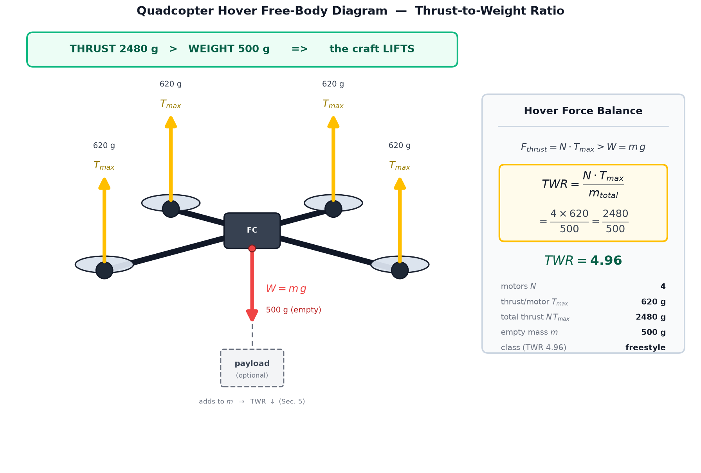
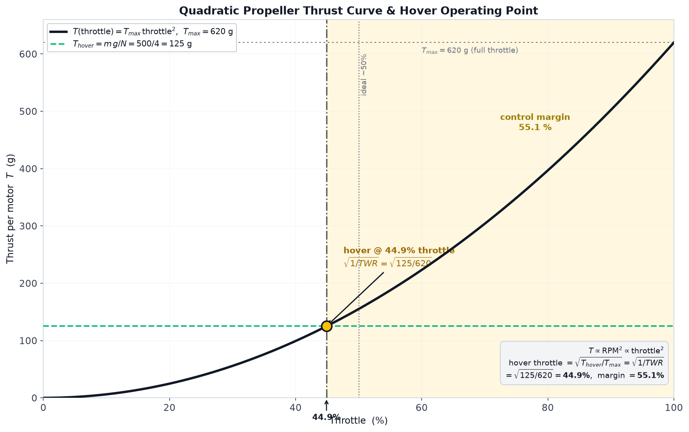
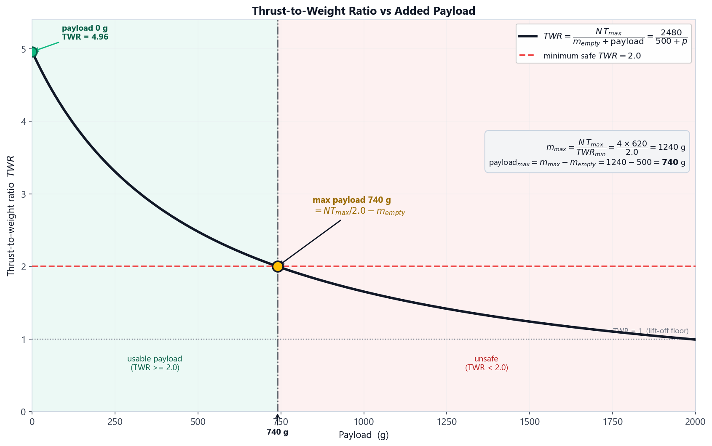
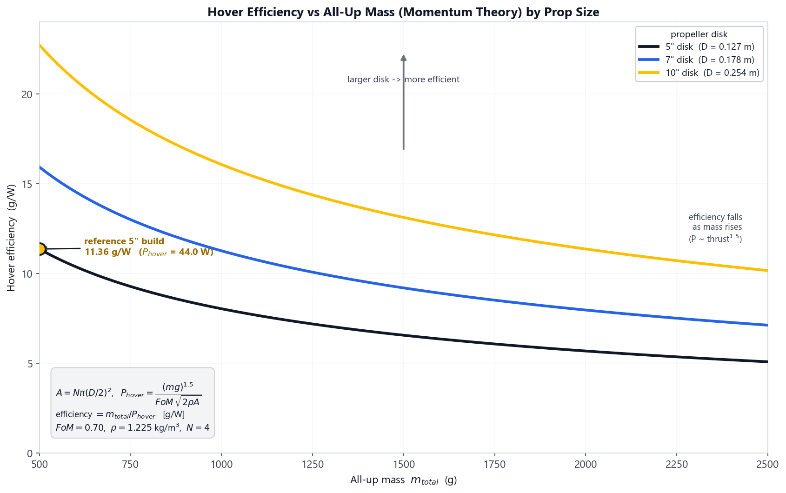

# Lab Procedure: Thrust-to-Weight, Hover Throttle, Control Margin & Payload

Everything the aircraft can and cannot do comes out of one ratio, and this experiment measures it two ways. Both sub-experiments sit under a single module, and you switch between them with the tabs under the viewport.

| Sub-experiment | Reports |
|---|---|
| Hover & Control Margin | hover throttle and remaining authority, in % |
| Payload Envelope | maximum payload, in g |

The build comes in from the earlier experiments — empty mass from the frame work, propulsion from the propulsion work — and everything on the page recomputes from it live. The session saves itself.

---

## Reading the page

The **Calculations** chips under the viewport carry the whole result set, and they update as you touch anything:

- **T / W** — thrust-to-weight, with a `(fwd)` tag when forward flight is on
- **Hover throttle** — where the craft sits to hold height
- **Control margin** — two numbers, `% paper` and `% eff`. The paper figure is simply what is left above the hover throttle. The effective figure accounts for the fact that thrust goes with the square of throttle, so the top of the stick is worth less than the bottom. Trust the second one.
- **Thrust eff.** — grams per watt
- **Max payload** — `safe` at TWR 1.5, and `max` at the absolute lift limit

The **Diagnostics Log** below them refuses to start a run while there is a blocking error, and the run button greys out to say so.

---

## Hover & Control Margin

### Objective

Find the throttle the aircraft actually hovers at, and how much authority is left above it.

1. Check the inherited build in the left panel — empty mass, and the propulsion package seeded from your earlier motor choice. Change the propulsion selector and the per-motor maximum thrust and propeller diameter update immediately.

2. Read the thrust-to-weight ratio before you fly anything. TWR = N × T_max / m_total, and the class band next to it tells you what kind of aircraft you have built.

3. Look at the centre view. Four thrust arrows scale against the weight vector, and the halo under the airframe goes green when the build is comfortably flight-ready.

4. Press **▶ Run Sim** and fly it. Trim the throttle until the aircraft holds a steady height — the verdict will not settle until it actually does.

5. A good result reads *"Stable hover — throttle X%, control margin Y%"*. If the effective margin is thin the verdict calls the build **twitchy** and tells you to add thrust or shed payload. If the run never settles, it says so and asks you to re-fly rather than pretending you passed.

6. Now turn on **forward flight**. The airframe pitches to 30°, which means only cos 30° of each motor's thrust is holding you up. Watch the effective T/W drop and the margin shrink. A build that hovers comfortably can still fail here, and that is the honest number for anything that has to go somewhere.

### What to aim for

Hovering near 50% throttle is the sweet spot. Much lower and the aircraft is over-powered and twitchy on the stick; much higher and there is nothing left for a gust. Try a high-thrust 6S combination and watch the hover throttle fall toward 30% — plenty of margin on paper, unpleasant to fly.

---

## Payload Envelope

### Objective

Work out how much cargo the aircraft can carry before its thrust-to-weight ratio drops through the floor.

1. Switch to the **Payload Envelope** tab and drag the **Payload** slider up from zero.

2. Watch three things move together: TWR falls, hover throttle climbs, and the control margin shrinks. They are the same fact seen three ways.

3. The chips show two payload limits. The **safe** figure is where TWR hits 1.5 — the point past which there is no useful authority left. The **max** figure is where the aircraft simply cannot lift, at TWR 1.0.

4. Fly it at increasing payloads. Inside the envelope the verdict reports the practical maximum. Between the two limits it calls the build **overloaded** and names the unusable band. Past the absolute maximum it reports *"Cannot lift"* with the payload figure that would have worked.

5. Two other failures are worth provoking. An oversized propeller stalls the motor before it ever leaves the pad. A build that draws too much current for too long burns the powertrain out mid-flight and drops — the verdict gives you the motor and ESC temperatures that did it.

---

## Thrust efficiency

The **Thrust eff.** chip reports grams-force per watt, measured at full throttle: maximum thrust in grams divided by the electrical power it took to make it. Step 7 of the **Calculations** card shows it next to the peak motor efficiency, labelled `g/W @ full`.

Read it as a property of the propulsion package, not of the loadout. Payload does not move it at all — payload changes what you ask the aircraft to lift, not how efficiently the motor and propeller convert watts into thrust.

What does move it is disk area. Sweeping the propeller selector on the reference build:

| Propeller | Thrust efficiency |
|---|---|
| 5″ tri | 2.65 g/W |
| 8″ bi | 2.99 g/W |
| 10″ bi | 3.62 g/W |
| 13″ bi | 3.93 g/W |
| 16″ bi | 4.00 g/W |

A bigger disk moves more air more slowly for the same thrust, and slow air is cheap air. Notice also that the gain flattens: going 5″ to 10″ buys 0.97 g/W, and 10″ to 16″ buys only another 0.38 g/W. The chip turns amber below 3 g/W and green at 6 and above, so most small-prop builds sit in the middle band by design.

---

Clear both sub-experiments and the reward component unlocks in **Components Unlocked**, with the full performance envelope — TWR, hover throttle, control margin, maximum payload and hover efficiency — recorded for the aircraft you have assembled across the series.
