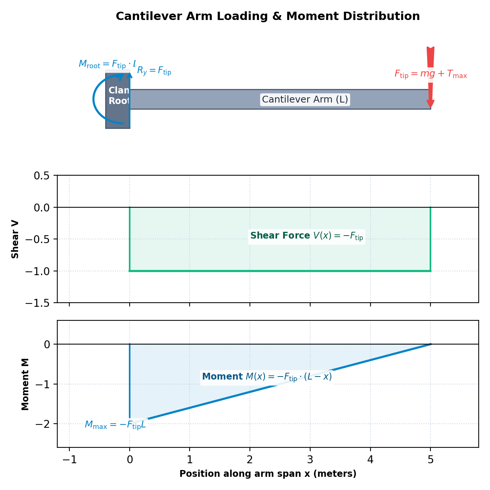

# Experiment Procedure — Frame Structural Integrity

This guide outlines the step-by-step procedure for balancing the drone's center of gravity and conducting cantilever beam stress tests to evaluate the structural integrity of the airframe.

---

## 1. Custom Technical Diagram: Arm Loading
The mechanical setup of the structural test bench is represented below:

---

## 2. Step-by-Step Procedure

### Stage 1: Airframe Mass Balancing (Module 1)
1. **Load the Simulation**: Open `index.html` in your web browser. You will see the 3D balancing deck displaying the drone sitting on a central pivot ball joint.
2. **Select Hardware Size**:
   * Under the **1. Select Frame** section in the left panel, choose a wheelbase (e.g., 450 mm). This defines the deck dimensions and the length of the diagonal arms.
   * Select a **Battery Pack** (e.g., LiPo 4S 4500 mAh) and a **Payload** (e.g., Action Camera with Gimbal) from the option tiles.
3. **Locate Initial CG**:
   * Observe the **Mass Distribution Budget** table in the right panel to see the contribution of each component to the total mass.
   * Observe the **2D CG Offset Envelope** scatter plot in the right panel. The center green circle represents the 10 mm safe balancing boundary. Note that the target CG dot is outside this circle, causing the 3D model of the drone in the viewport to tilt.
4. **Coordinate Placement**:
   * Use your mouse to click and drag the **Red Battery Block** (top deck) and the **Blue Payload Cylinder** (bottom deck) along the airframe.
   * Alternatively, adjust the **Lateral X Offset** and **Longitudinal Y Offset** sliders in the left panel to move the components along the axes.
5. **Lock the Balance Point**:
   * Adjust the coordinates until the **CG Center Offset** checklist item turns green (meaning the offset magnitude is less than 10 mm).
   * Once balanced, the drone model will sit perfectly horizontal on the pivot ball joint, and the **Proceed to Module 2** button will unlock. Click it to navigate to `index1.html`.

---

### Stage 2: Cantilever Arm Stress Sweeps (Module 2)
1. **Load Module 2**: Verify the active hardware selections (Motor, Propeller, Battery) are loaded from your Experiment 1 completion state in the left panel status badge.
2. **Setup Test Profile**:
   * In the left panel, select **Carbon Fibre T700** under the materials section, and select the **150 mm** arm length.
3. **Conduct the Stress Sweep**:
   * Click the **Run Stress Test** button under the 3D viewport.
   * Watch the simulation load force increase from 0 to 100%. Note that the 3D arm deforms (flexes) downwards and changes color (from green to yellow/red) representing the concentration of flexural stress near the root clamp.
   * Once the sweep completes, record the **Safety Factor (SF)** and the maximum bending stress.
4. **Populate the 3x3 Safety Matrix**:
   * Click another cell in the **Safety Factor Matrix** (in the right panel) to switch parameters, or select them from the left panel.
   * Repeat the stress sweep for all **9 combinations** (3 materials: Carbon Fibre, Aluminium, Nylon × 3 lengths: 150 mm, 250 mm, 350 mm).
   * Note the structural behavior: Nylon arms will yield and **snap** (<i>SF</i> &lt; 1.0) when tested at longer lengths.
5. **Verify Design and Lock**:
   * Observe the **Bending Stress vs. Yield Strength** bar chart to compare the applied stress against the limits of the materials side-by-side.
   * Once all 9 cells are populated, the **Lock Design & Finish Lab** button will unlock. Click it to save your optimal frame construction parameters.
