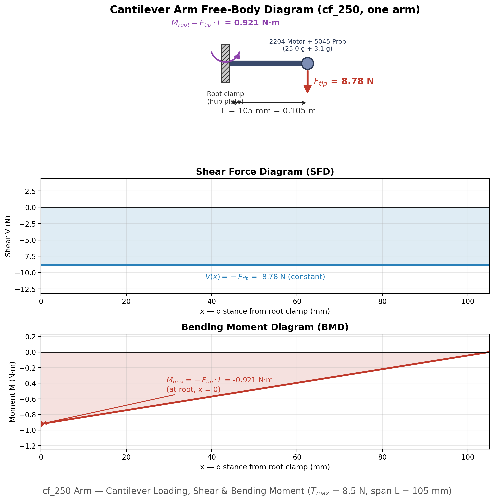

<h1>Lab Procedure: Frame Structural Integrity</h1>

Two things get tested here, in order. First you balance the airframe on a pin stand and try to hover it; then you load its arms until something bends or breaks. Module 2 stays locked until the balancing run passes &mdash; there is no point stress-testing a frame that cannot fly level.

<table>
<thead><tr><th>Module</th><th>Sub-experiment</th><th>What it reports</th></tr></thead>
<tbody>
<tr><td>Module 1 &middot; Assembly &amp; CoG Balancing</td><td>Assemble &amp; Balance</td><td>CoG offset r_cg, in mm</td></tr>
<tr><td>Module 2 &middot; Cantilever Arm Stress</td><td>Bending &amp; Yield</td><td>Safety factor SF</td></tr>
</tbody>
</table>

The layout is the same three columns as the rest of the lab: component tiles and the mass budget on the left, the 3D bench with its module and sub-experiment tabs in the middle, and the outputs on the right. <strong>&#9654; Run Sim</strong>, <strong>Reset</strong> and the progress counter sit under the viewport, with the <strong>Calculations</strong> card and the <strong>Diagnostics Log</strong> below them.

<h2>Module 1 &middot; Assemble &amp; Balance</h2>

<h3>Objective</h3>

Move the heavy parts around until the centre of gravity sits close enough to the geometric centre for the aircraft to hover level.

<ol>
<li>Pick a chassis, a battery and a payload from the component tiles. Each build drops the movable parts at their authored mount points, and those starting positions are not always centred.</li>
<li>Read the telemetry strip on the viewport: all-up weight, CoG X, CoG Y, the offset magnitude r_cg, and the load on the worst-off arm. The verdict chip alongside them says whether the frame is balanced yet.</li>
<li>Open the <strong>Placement</strong> panel (the floating control at the edge of the viewport) and slide the battery and payload along each axis. The drone on the pin stand tilts in real time toward whichever side is heavy.</li>
<li>Get r_cg inside the model's tolerance. The <strong>Calculations</strong> card shows the pass condition and how far over you currently are, in millimetres.</li>
<li>Press <strong>&#9654; Run Sim</strong> to fly it. The run goes through spool-up, lift-off and hover, and ends one of three ways: <em>hovers level</em>, <em>leans</em> toward a named arm, or topples off the stand entirely.</li>
</ol>

A balanced hover passes the module and unlocks Module 2. An off-centre CoG does not just look untidy &mdash; it loads one arm harder than the other three, and that arm is the one Module 2 is about to bend.

<h2>Module 2 &middot; Bending &amp; Yield</h2>

<h3>Objective</h3>

Load each arm as a cantilever beam and find out which material and length combinations survive with margin to spare.

The centrepiece is a 3&times;3 matrix: three materials against three arm lengths.

<table>
<thead><tr><th>Material</th><th>Yield</th><th>Young's modulus</th><th>Density</th></tr></thead>
<tbody>
<tr><td>Carbon Fibre T700</td><td>600 MPa</td><td>70 GPa</td><td>1600 kg/m&sup3;</td></tr>
<tr><td>Aluminium 6061-T6</td><td>270 MPa</td><td>69 GPa</td><td>2700 kg/m&sup3;</td></tr>
<tr><td>Nylon PA66</td><td>50 MPa</td><td>3 GPa</td><td>1140 kg/m&sup3;</td></tr>
</tbody>
</table>

<ol>
<li>Switch to Module 2. The material picker and the safety-factor matrix replace the placement controls, and the structural charts appear in the Outputs column.</li>
<li>Tap any cell in the matrix &mdash; a material against 150, 250 or 350 mm &mdash; and that combination runs straight away. Untested cells show a predicted SF; tested ones get a tick and the measured value.</li>
<li>Watch the arm during the load ramp. It flexes downward and changes colour as stress concentrates at the root clamp, which is where a real arm cracks.</li>
<li>Fill in all nine cells. The line under the matrix keeps track of the best material so far, and switches to a recommendation once one of them clears SF &ge; 2 at every length.</li>
<li>Read the charts on the right: bending moment and shear force along the arm, tip deflection and safety factor against length, and root stress against each material's yield strength.</li>
</ol>

The pattern is worth sitting with. Nylon at 350 mm fails outright &mdash; SF below 1 means the arm has already yielded. Aluminium survives but sags, because its modulus is barely a fifth of what its density costs you. Carbon fibre wins on both counts, which is why almost every real airframe uses it. Aim for SF &ge; 2; anything between 1 and 2 is flying on the tolerance stack of your worst part.

Once the matrix is complete and the frame passes, <strong>Components Unlocked</strong> opens with a qualified airframe drawn from the catalogue.

