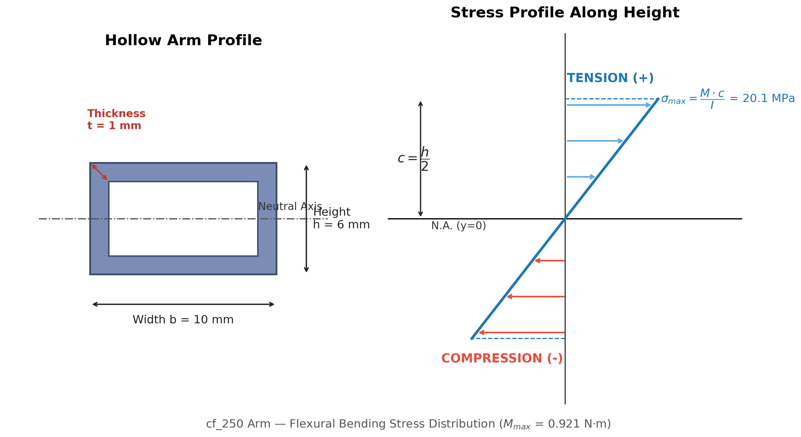

<h1>Theoretical Derivations — Frame Structural Integrity</h1>

This document details the governing physical principles, centroid math, and beam mechanics equations used to evaluate drone balancing and structural load limits.

Before working through the derivations, the animation below walks through the structural story — locating the center of gravity, treating each arm as a loaded cantilever, and tracing how bending moment, stress, safety factor, and stiffness keep the frame intact.

  <video controls playsinline preload="metadata" width="100%" style="max-width: 860px; border-radius: 8px;">
    <source src="./videos/frame_structural_integrity.mp4" type="video/mp4">
    Your browser does not support the HTML5 video tag. You can
    <a href="./videos/frame_structural_integrity.mp4">download the video</a> instead.
  </video>

<blockquote>

<strong>Note on real-world part variance.</strong> The catalog's material yield strengths are clean
nominal spec-sheet values, but real composite layups and extrusions vary batch-to-batch.
The simulator draws each material's <em>as-manufactured</em> yield strength from a seeded
&plusmn;10% tolerance (deterministic per material, so the same build always gets the same
value, but different sessions see genuine part-to-part variance) — the Safety Factor
Matrix and live stress readouts use this seeded value, not the flat catalog number, so
two students selecting "Carbon Fibre T700" will not see bit-identical safety factors.

</blockquote>

<h2>1. Centroid &amp; Center of Gravity (Sub-Calc A)</h2>

To ensure hover stability, the drone's center of mass must align with its geometric center (origin). In a Cartesian coordinate system, the Center of Gravity (CG) coordinates along the lateral (<i>x</i>) and longitudinal (<i>y</i>) axes are calculated using the centroid equations:

<i>x</i>CG = &Sigma;<i>i</i>=1<i>n</i> (<i>m</i><i>i</i> &middot; <i>x</i><i>i</i>) &frasl; &Sigma;<i>i</i>=1<i>n</i> <i>m</i><i>i</i>

<i>y</i>CG = &Sigma;<i>i</i>=1<i>n</i> (<i>m</i><i>i</i> &middot; <i>y</i><i>i</i>) &frasl; &Sigma;<i>i</i>=1<i>n</i> <i>m</i><i>i</i>

Where:

<ul>
<li><i>mi</i> is the mass of the individual component (g or kg).</li>
<li><i>xi</i>, <i>yi</i> are the coordinates of the component's center of mass relative to the geometric center (mm or m).</li>
</ul>

The total radial offset of the center of gravity (<i>r</i>CG) from the datum origin is solved using the Euclidean distance:

<i>r</i>CG = &radic;(<i>x</i>CG2 + <i>y</i>CG2)

To prevent asymmetric motor heating and hover drift, we enforce the safety envelope:

<i>r</i>CG &le; 10 mm

<blockquote>

<strong>Worked example — CG offset of the reference 5&Prime; build (cf_250 frame, 2204 motor, 5045 prop, 4S 3300 mAh battery).</strong>
The four 2204 motors (25.0 g each), four 5045 props (3.1 g each), four 30 A ESCs (9.5 g each), the cf_250 frame (68.2 g), the F7 stack (7.5 g) and the ELRS receiver (3.5 g) all sit on the geometric centre, contributing 229.6 g with zero net moment. Three off-centre items break the symmetry: the 4S 3300 mAh battery (320.0 g) mounted 12 mm rear (<i>y</i> = &minus;12 mm), the M9N GPS (24.5 g) 45 mm forward (<i>y</i> = +45 mm), and the 915 MHz telemetry radio (18.3 g) 35 mm to the right (<i>x</i> = +35 mm). The total mass is &Sigma;<i>mi</i> = 592.4 g.

<i>x</i>CG = (18.3 &middot; 35) &frasl; 592.4 = 640.5 &frasl; 592.4 = <b>1.081 mm</b>

<i>y</i>CG = (320.0 &middot; (&minus;12) + 24.5 &middot; 45) &frasl; 592.4 = &minus;2737.5 &frasl; 592.4 = <b>&minus;4.621 mm</b>

<i>r</i>CG = &radic;(1.0812 + 4.6212) = &radic;22.53 = <b>4.75 mm</b>

The center of gravity lies 4.75 mm from the geometric centre — comfortably inside the <i>r</i>CG &le; 10 mm envelope — so the build is balanced and the flight controller will not need to bias motor thrust to stay level.

</blockquote>

The top-down coordinate offset and balancing layout is represented in the diagram below:

<h2>2. Cantilever Beam Bending Moment (Sub-Calc B)</h2>

Each of the four arms of the quadcopter acts as a cantilever beam—fixed at the central hub plate (root clamp) and free at the outer motor end (tip load). Under hover or full-throttle conditions, the forces acting on the arm tip (<i>F</i>tip) are composed of:

<ol>
<li><strong>Gravitational Weight:</strong> The combined mass of the motor (<i>M</i>motor) and propeller (<i>M</i>prop).</li>
<li><strong>Aerodynamic Thrust:</strong> The upward reaction force (<i>T</i>max) generated by the propeller.</li>
</ol>

<i>F</i>tip = (<i>M</i>motor + <i>M</i>prop) &middot; <i>g</i> + <i>T</i>max

Where <i>g</i> = 9.80665 m/s2 is the acceleration due to gravity.

The bending moment <i>M</i>(<i>x</i>) at any distance <i>x</i> from the root clamp is the product of the force and the remaining span length:

<i>M</i>(<i>x</i>) = -<i>F</i>tip &middot; (<i>L</i> - <i>x</i>)

The maximum bending moment occurs at the clamped root (<i>x</i> = 0):

<i>M</i>max = -<i>F</i>tip &middot; <i>L</i>

<blockquote>

<strong>Worked example — tip force and root moment of one cf_250 arm.</strong>
Each arm carries a 2204 motor (<i>M</i>motor = 25.0 g) and a 5045 prop (<i>M</i>prop = 3.1 g) and develops the simulator's full-throttle thrust <i>T</i>max = 8.5 N over a span <i>L</i> = 105 mm = 0.105 m:

<i>F</i>tip = (0.0250 + 0.0031) &middot; 9.80665 + 8.5 = 0.276 + 8.5 = <b>8.78 N</b>

<i>M</i>max = &minus;8.78 &middot; 0.105 = <b>&minus;0.921 N&middot;m</b>

Aerodynamic thrust dominates the load: gravity contributes only 0.276 N (about 3%) of the 8.78 N tip force. The clamped root therefore experiences a hogging moment of magnitude 0.921 N&middot;m, which Section 3 converts into fibre stress.

</blockquote>

Where <i>L</i> is the total arm span length (meters). The shear force <i>V</i>(<i>x</i>) remains constant along the entire span:

<i>V</i>(<i>x</i>) = -<i>F</i>tip

<h2>3. Flexural Bending Stress (Sub-Calc C)</h2>

The applied bending moment creates tensile stress on the upper fibers of the arm and compression stress on the lower fibers. The normal bending stress (&sigma;) at any vertical distance <i>y</i> from the horizontal Neutral Axis is solved using the flexure formula:

&sigma;(<i>y</i>) = (<i>M</i> &middot; <i>y</i>) &frasl; <i>I</i>

The maximum bending stress (&sigma;max) occurs at the outermost boundary fibers (<i>y</i> = &plusmn;<i>c</i>, where <i>c</i> = <i>h</i>/2):

&sigma;max = (<i>M</i>max &middot; <i>c</i>) &frasl; <i>I</i> = (<i>M</i>max &middot; <i>h</i>) &frasl; 2 <i>I</i>

The cross-section and flexural stress distribution profiles are illustrated below:

<h3>Hollow Rectangular Area Moment of Inertia (<i>I</i>)</h3>

Quadcopter arms are typically manufactured as hollow tubes to save weight while maintaining stiffness. For a hollow rectangular cross-section of width <i>b</i>, height <i>h</i>, and wall thickness <i>t</i>, the area moment of inertia is derived by subtracting the void area from the outer rectangular envelope:

<i>I</i> = <i>I</i>outer - <i>I</i>inner = (<i>b</i> &middot; <i>h</i>3) &frasl; 12 - ((<i>b</i> - 2<i>t</i>) &middot; (<i>h</i> - 2<i>t</i>)3) &frasl; 12

<blockquote>

<strong>Worked example — second moment of area and root stress of the cf_250 arm.</strong>
The cf_250 arm tube has outer width <i>b</i> = 10 mm, height <i>h</i> = 6 mm and wall thickness <i>t</i> = 1 mm, so the inner void measures (<i>b</i> &minus; 2<i>t</i>) = 8 mm by (<i>h</i> &minus; 2<i>t</i>) = 4 mm (all converted to metres):

<i>I</i> = (0.010 &middot; 0.0063) &frasl; 12 &minus; (0.008 &middot; 0.0043) &frasl; 12 = (2.16 &times; 10&minus;9 &minus; 5.12 &times; 10&minus;10) &frasl; 12 = <b>1.373 &times; 10&minus;10 m4</b>

Carrying the root moment |<i>M</i>max| = 0.921 N&middot;m from Section 2 to the outermost fibre (<i>c</i> = <i>h</i>/2 = 0.003 m):

&sigma;max = (0.921 &middot; 0.003) &frasl; 1.373 &times; 10&minus;10 = 2.01 &times; 107 Pa = <b>20.1 MPa</b>

The outer fibres carry 20.1 MPa — tension on the top surface, compression on the bottom — which is far below the T700 carbon yield of 600 MPa, confirming the hollow section is stiff enough for this load.

</blockquote>

<h2>4. Safety Factor &amp; Structural Deflection (Sub-Calc D)</h2>

To determine if the selected arm material will yield under load, the maximum applied stress is compared to the material's yield strength (&sigma;yield). The Safety Factor (<i>SF</i>) is defined as:

<i>SF</i> = &sigma;yield &frasl; &sigma;applied

<ul>
<li><i>SF</i> &ge; 2.0 (Safe): Strong structural headroom.</li>
<li>1.0 &le; <i>SF</i> &lt; 2.0 (Marginal): High risk of structural fatigue or permanent deformation under dynamic flight loads.</li>
<li><i>SF</i> &lt; 1.0 (Fail): The applied stress exceeds the yield point, causing immediate mechanical failure (yielding/fracture).</li>
</ul>

<blockquote>

<strong>Worked example — safety factor of the carbon-fibre arm.</strong>
Comparing the T700 carbon yield strength &sigma;yield = 600 MPa with the applied root stress &sigma;applied = 20.1 MPa from Section 3:

<i>SF</i> = 600 &frasl; 20.1 = <b>29.9</b>

With <i>SF</i> = 29.9 &ge; 2.0 the arm sits firmly in the Safe band with large structural headroom — the carbon arm could withstand roughly 30&times; this thrust load before reaching its yield point.

</blockquote>

<h3>Dynamic Safety Factor &amp; First Bending Mode</h3>

The static safety factor above assumes the tip force is perfectly steady. Real flight is not: aggressive maneuvers, prop-wash turbulence, and hard landings spike the instantaneous load to <i>n</i>dyn &times; the static value, with <i>n</i>dyn typically 1.0&ndash;3.0 (default 1.5). The simulator reports a dynamic safety factor alongside the static one so a design that looks comfortably safe under steady hover load is not mistaken for safe under real maneuvering load:

<i>SF</i>dyn = &sigma;yield &frasl; (<i>n</i>dyn &middot; &sigma;applied)

<blockquote>

<strong>Worked example — dynamic safety factor at the default 1.5&times; load factor.</strong>
Using &sigma;applied = 20.1 MPa from Section 3 and &sigma;yield = 600 MPa:

<i>SF</i>dyn = 600 &frasl; (1.5 &middot; 20.1) = 600 &frasl; 30.15 = <b>19.90</b>

Still comfortably safe here because the static margin (SF = 29.9) is so large — but for a marginal static design (SF close to 2.0), the same 1.5&times; factor can push the dynamic SF below 1.0, which is exactly the caveat the "Dynamic load" fault scenario demonstrates.

</blockquote>

The arm's lowest natural bending frequency (first cantilever mode) also matters: if a motor's rotor-pass frequency lands near it, resonance amplifies vibration and fatigues the arm far faster than the static/dynamic stress numbers alone would suggest. For a uniform cantilever beam (fixed-free), the first mode frequency is:

<i>f</i>n = &beta;12 &frasl; 2&pi; &middot; &radic;((<i>E</i>&middot;<i>I</i>) &frasl; (<i>m</i>&prime; &middot; <i>L</i>4))

Where <i>&beta;</i>1 = 1.875104 is the fixed-free fundamental eigenvalue and <i>m</i>&prime; = &rho;&middot;<i>A</i> is the arm's mass per unit length (&rho; = material density, <i>A</i> = hollow cross-section area from Section 3).

<blockquote>

<strong>Worked example — first bending mode of the cf_250 arm.</strong>
Cross-section area <i>A</i> = (10&times;6 &minus; 8&times;4) mm&sup2; = 28 mm&sup2; = 2.8&times;10&minus;5 m&sup2;; carbon fibre density &rho; = 1600 kg/m&sup3; gives <i>m</i>&prime; = 1600 &times; 2.8&times;10&minus;5 = 0.0448 kg/m. With <i>E</i>&middot;<i>I</i> = 70&times;109 &times; 1.373&times;10&minus;10 = 9.611 N&middot;m&sup2; and <i>L</i> = 0.105 m:

<i>f</i>n = 1.8751042 &frasl; 2&pi; &middot; &radic;(9.611 &frasl; (0.0448 &middot; 0.1054)) &asymp; <b>743.5 Hz</b>

This short, stiff 105 mm arm sits far above any rotor-pass frequency the motor could produce, so resonance is not a concern here. Because <i>f</i>n &prop; 1/<i>L</i>2, longer arms (300&ndash;850 mm class) drop to the 80&ndash;120 Hz range typical of real multi-rotor frames — close enough to rotor-pass frequencies at some throttle settings that resonance becomes a genuine design concern, which is why both numbers (not just static stress) are reported.

</blockquote>

<h3>Elastic Deflection Profile</h3>

The vertical deflection shape of the arm (<i>y</i>(<i>x</i>)) as a function of distance <i>x</i> from the clamp is modeled using the Euler-Bernoulli beam deflection equation:

<i>y</i>(<i>x</i>) = ((<i>F</i>tip &middot; <i>x</i>2) &frasl; (6 <i>E I</i>)) &middot; (3<i>L</i> - <i>x</i>)

<blockquote>

<strong>Worked example — tip deflection of the loaded cf_250 arm.</strong>
Evaluated at the free tip (<i>x</i> = <i>L</i> = 0.105 m) the expression reduces to <i>y</i>(<i>L</i>) = <i>F</i>tip &middot; <i>L</i>3 &frasl; (3<i>EI</i>). Using <i>F</i>tip = 8.78 N, carbon fibre <i>E</i> = 70 GPa = 70 &times; 109 Pa and <i>I</i> = 1.373 &times; 10&minus;10 m4:

<i>y</i>(<i>L</i>) = (8.78 &middot; 0.1053) &frasl; (3 &middot; 70 &times; 109 &middot; 1.373 &times; 10&minus;10) = <b>3.52 &times; 10&minus;4 m &asymp; 0.35 mm</b>

The rigid carbon arm deflects only 0.35 mm at full thrust. Since deflection scales as 1&frasl;<i>E</i>, the same load on a Nylon arm (<i>E</i> = 3.0 GPa) would bend about 23&times; further (&asymp; 8 mm), illustrating why Young's modulus governs flight-frame rigidity.

</blockquote>

Where:

<ul>
<li><i>E</i> is the material's Young's Modulus (GPa), representing stiffness.</li>
<li><i>I</i> is the area moment of inertia (m4).</li>
<li><i>x</i> is the position along the span (0 &le; <i>x</i> &le; <i>L</i>).</li>
</ul>

This equation explains why Nylon (low Young's Modulus <i>E</i> = 3.0 GPa) experiences extreme deflection and yielding compared to Carbon Fibre (<i>E</i> = 70.0 GPa), which remains highly rigid under equivalent loads.

