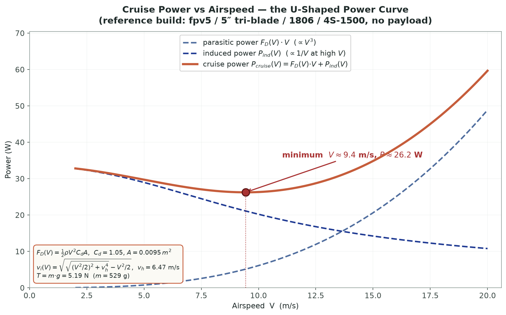
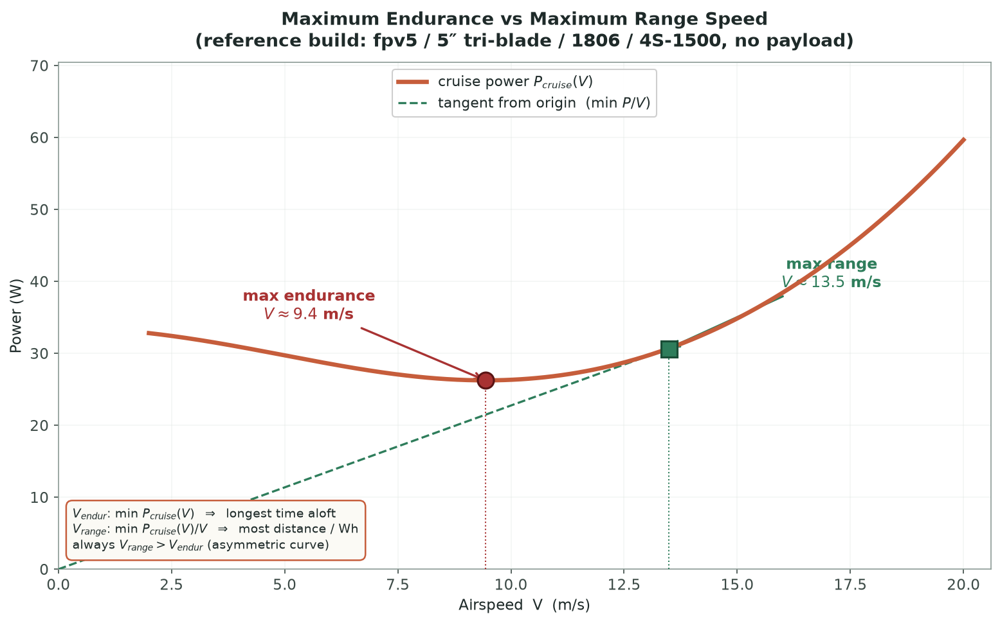
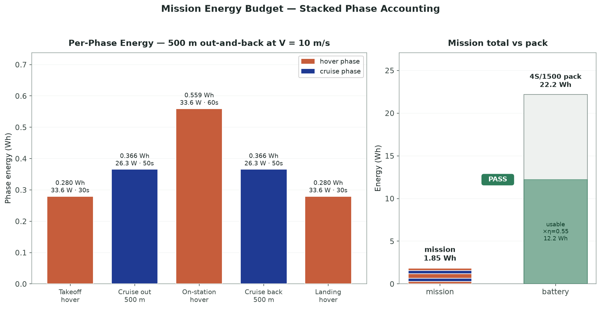
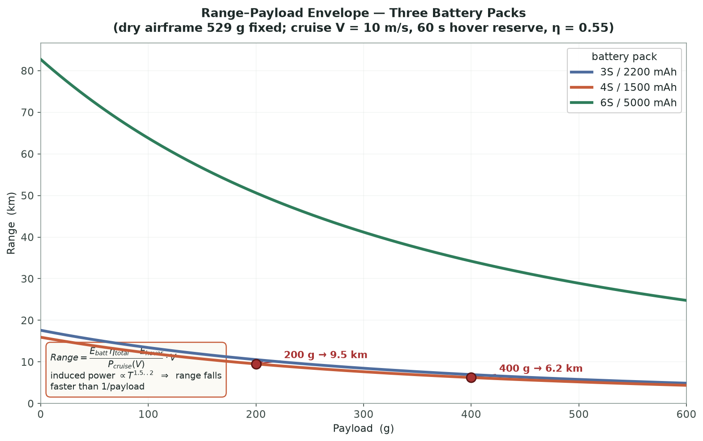

# Lab Procedure: Cruise Power, Endurance, Energy Budget & Range-Payload

This is where the aircraft stops being a set of components and starts being something that can or cannot do a job. Four sub-experiments across two modules, all on one page, all computed live from the assembled build.

| Module | Sub-experiment | Reports |
|---|---|---|
| Module 1 · Power & Speed | Power Profiling | cruise power, W |
| Module 1 · Power & Speed | Endurance Speed | V_endur, m/s |
| Module 2 · Mission & Range | Mission Energy | total energy, Wh |
| Module 2 · Mission & Range | Range–Payload | range, m |

Module 2 starts locked. Both Module 1 sub-experiments have to pass before its tab opens, which is the right order anyway — you cannot budget a mission until you know what the aircraft costs per second of flight.

Two new controls sit alongside the inherited component tiles: **Payload** (0–2000 g) and **Cruise Airspeed**, which has 5 / 10 / 15 m/s preset buttons and a free slider from 2 to 20 m/s underneath them. The telemetry strip carries airspeed, thrust, drag, induced power, cruise power, energy, range and payload.

The **Calculations** card opens the full nine-step derivation — mass, ISA density, parasitic drag, induced power, cruise power, the two optimum speeds, the mission energy budget, the battery comparison, and the resulting range — with your numbers substituted at every step.

---

## Module 1 · Power Profiling

### Objective

Sweep airspeed and watch parasitic drag and induced power trade against each other into the U-shaped power curve.

1. Leave the payload at 0 g for the first run and check the **Diagnostics Log** is clear.

2. Press **▶ Run Sim**. The cursor sweeps airspeed from 2 to 20 m/s while thrust, drag, induced power and cruise power update live, and the live graph draws the curve as it goes.

3. The run passes once the sweep finds a genuine interior minimum — a bottom that is not just the edge of the range. For the reference build (fpv5 / 5″ / 1806 / 4S-1500, no payload) it sits near **9.5 m/s at about 26 W**, comfortably inside the 6–13 m/s band typical of small multirotors.

The shape is the whole story. At low speed, induced power dominates: the rotors are working hard to push air down and getting nothing back from forward motion. At high speed, parasitic drag takes over and grows with V². Somewhere between them is a speed where the total is least, and hovering is nowhere near it.

---

## Module 1 · Endurance Speed

### Objective

Read the bottom of that curve properly, and find the other optimum speed hiding on the same plot.

1. Switch tabs. The simulator computes the full curve in one pass and animates a cursor down to its minimum, dropping a marker at V_endur.

2. Read the endurance speed and the power there. For the reference build, about **9.5 m/s at 26 W**.

3. Now look at the second marker, V_range. That is the speed that minimises power *per unit distance* rather than per unit time — geometrically, the tangent from the origin rather than the bottom of the curve. It is always faster than V_endur; on the reference build it lands near **13.5 m/s**.

4. The verdict reports both together.

These are two different missions. Fly at V_endur and you maximise total airborne time, which is what loiter and surveillance want. Fly at V_range and you maximise ground covered, which is what a delivery wants. Same aircraft, same battery, two answers.

Change the propeller or the battery and re-run. Both speeds move, because both depend on disk area and mass.

---

## Module 2 · Mission Energy

### Objective

Break a real flight into phases and check the pack can actually pay for it.

1. Open the **Calculations** card. While this sub-experiment is active it grows an editable **Mission phase durations** block at the top — takeoff hover, cruise out, hover on station, cruise back, landing hover. Edit any of them. The two cruise legs recompute themselves from distance and airspeed whenever you move the airspeed slider.

2. Run the budget. The simulator adds the phases up one at a time and animates a stacked chart while the telemetry counts the Watt-hours.

3. The mission passes when the pack's usable energy beats the total. Usable is not rated — it is capacity × voltage discounted by the system efficiency, and the derivation shows both numbers side by side, ending in either `PACK HOLDS` or `PACK INSUFFICIENT`.

4. Watch the log as well as the verdict. A shortfall gives you the exact deficit in Wh. A margin thinner than about 30% gets flagged as a warning rather than a pass, because a plan that only works on a fresh pack in still air is not a plan.

5. For the reference build, a 500 m out-and-back at 10 m/s with 30/60/30 s of hover costs roughly **1.85 Wh** against a 4S/1500 pack's **22.2 Wh** rated energy. Comfortable. Now lengthen the leg, add payload, or drop to a smaller pack and watch that margin close.

---

## Module 2 · Range–Payload

### Objective

Map the envelope that decides which missions are possible at all.

1. The run sweeps payload from zero to maximum across three representative packs and plots three live curves. The Charts card holds the finished envelope with a legend.

2. Look at how steeply range falls. At 10 m/s on the 4S/1500 pack, doubling payload from 200 g to 400 g cuts range from about **9.5 km to about 6.2 km** — roughly a third gone. Induced power grows super-linearly with weight, exactly as T^1.5 at hover and steeper still in forward flight, so payload never costs what you expect it to.

3. Compare the packs. A bigger pack lifts the whole curve, because more usable Watt-hours buys range at every payload.

> One honest caveat: the three packs are compared on rated energy alone. The simulator does not add the extra physical mass a larger real pack would carry, so read this as an energy-only comparison rather than a full weight trade-off. The endurance work in the energy-storage experiment is where that trade-off is handled properly.

---

Finish all four and the capstone reward — payload bay and mission spec — unlocks in **Components Unlocked**, with the aircraft's mission envelope recorded: optimal speed, endurance speed, and range-payload limits.
