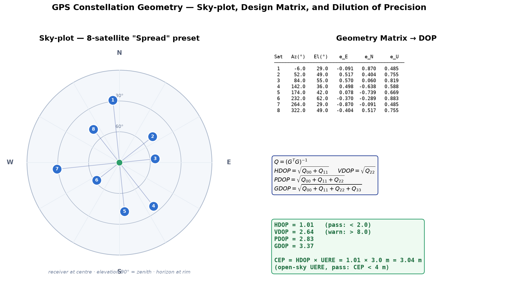
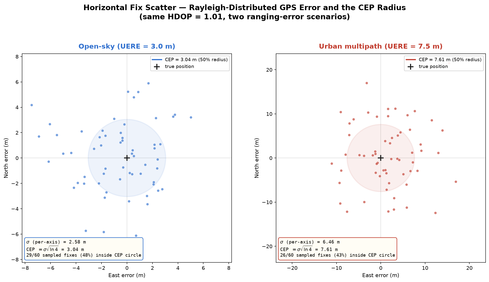
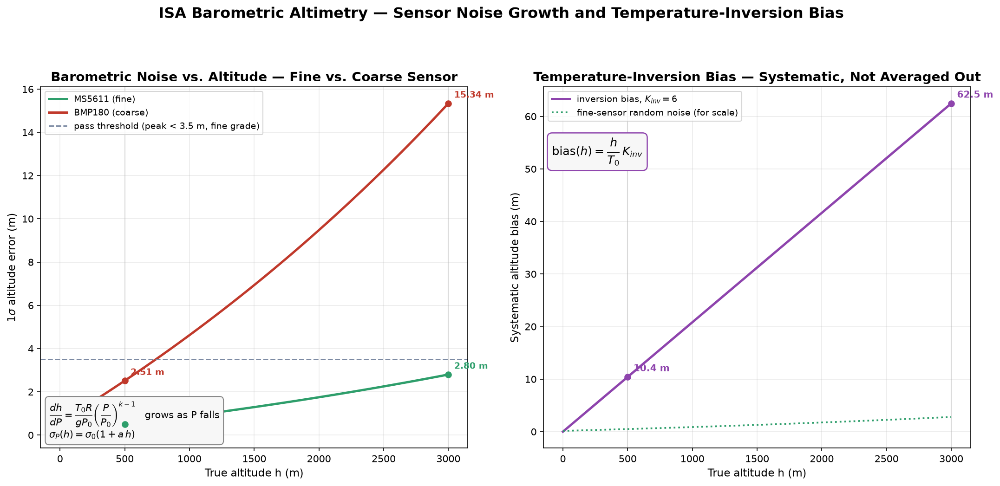
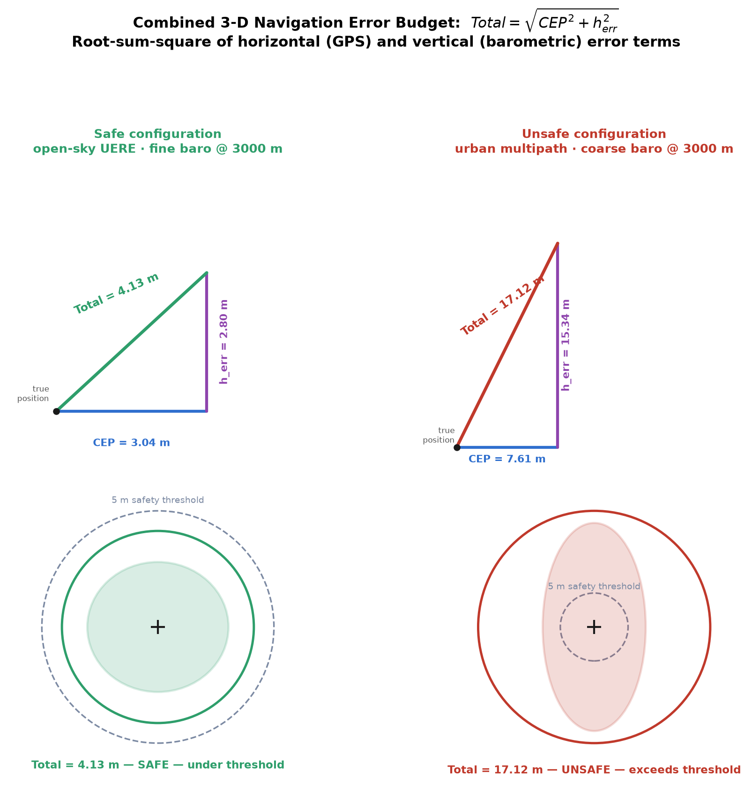

<h1>Theoretical Background: GPS Navigation &amp; Barometric Positioning</h1>

A drone's autopilot has to know where it is before it can decide where to go. That position comes from two largely independent subsystems: a GNSS receiver that fixes horizontal position by trilaterating ranges to orbiting satellites, and a barometer that infers altitude from the local air pressure. Neither sensor reports a single "true" number. Each carries an error that depends on geometry, hardware grade, and the surrounding environment, and a flight controller that ignores this uncertainty will happily fly into an obstacle it thinks it has cleared by five metres.

This experiment builds up that error budget from first principles: how the geometry of the satellites you can see sets a multiplier on ranging noise (dilution of precision), how that multiplier turns into a horizontal accuracy figure with a real statistical meaning (CEP), how a barometer's pressure-to-altitude conversion degrades with height and drifts under a temperature inversion, and finally how the horizontal and vertical error terms combine into the one number that actually matters in operation: is the fix good enough to fly autonomously near an obstacle.

Before we get into the physics, the animation below walks through the full positioning story: how satellite geometry sets the dilution of precision and how that multiplier becomes a CEP figure on the ground, then the barometer's pressure-to-altitude conversion and the drift a temperature inversion puts into it, and finally how the horizontal and vertical terms combine into a single go/no-go accuracy budget.

  <video controls playsinline preload="metadata" width="100%" style="max-width: 860px; border-radius: 8px;">
    <source src="./videos/navigation_positioning.mp4" type="video/mp4">
    Your browser does not support the HTML5 video tag. You can
    <a href="./videos/navigation_positioning.mp4">download the video</a> instead.
  </video>

<h2>1. GPS Constellation Geometry &amp; Dilution of Precision</h2>

A GPS receiver does not measure its position directly. It measures pseudoranges (time-of-flight distances, corrupted by an unknown receiver clock bias) to whichever satellites are above the horizon, then solves a small nonlinear least-squares problem for four unknowns: three position coordinates and the clock bias. How well that solve conditions depends entirely on where the satellites sit in the sky relative to each other and to the receiver, independent of how accurate any single range measurement is. Two satellites directly overlapping in the sky contribute almost the same equation twice; the solver has to divide by something close to zero to separate them, and any small ranging noise gets amplified enormously. Satellites spread wide across azimuth and elevation each pull the solution in a different direction, so the same ranging noise averages out far more effectively. This geometric amplification factor is called Dilution of Precision (DOP), and it is a property of the sky geometry alone, nothing to do with signal quality.

Each visible satellite <i>i</i>, at azimuth Az and elevation El, has a line-of-sight unit vector in the local East-North-Up (ENU) frame:

<b>e</b> = [ cos(El)&middot;sin(Az) , cos(El)&middot;cos(Az) , sin(El) ]

Linearise the pseudorange equations around the receiver's approximate position and you get one row of the geometry (design) matrix <i>G</i> per satellite: the negative line-of-sight components plus a trailing 1 for the clock-bias partial:

row<i>i</i> = [ &minus;<i>e</i><i>E</i> , &minus;<i>e</i><i>N</i> , &minus;<i>e</i><i>U</i> , 1 ]

The covariance of the position/clock-bias solution is proportional to <i>Q</i> = (<i>G</i>T<i>G</i>)&minus;1, a 4&times;4 matrix whose diagonal entries give the dilution-of-precision figures directly:

<i>HDOP</i> = &radic;(<i>Q</i>00+<i>Q</i>11) &nbsp; , &nbsp; <i>VDOP</i> = &radic;<i>Q</i>22 &nbsp; , &nbsp; <i>PDOP</i> = &radic;(<i>Q</i>00+<i>Q</i>11+<i>Q</i>22) &nbsp; , &nbsp; <i>GDOP</i> = &radic;(<i>Q</i>00+<i>Q</i>11+<i>Q</i>22+<i>Q</i>33)

Fewer than four satellites leaves the 4&times;4 system underdetermined, and a near-collinear or single-cone arrangement makes <i>G</i>T<i>G</i> numerically singular. In both cases there is no fix, and HDOP is reported as infinite. Even when a fix exists, a constellation can hide a bad axis: a set of satellites spread wide in azimuth but all sitting high overhead gives a deceptively good HDOP while VDOP quietly balloons, because nothing in the geometry constrains the vertical direction. This experiment treats HDOP &lt; 2 with VDOP also under control as the pass condition, specifically to catch that trap.

<h3>Worked Example: Eight-Satellite Spread Constellation</h3>

Take the simulator's default 8-satellite "spread" layout. A few representative satellites (azimuth, elevation):

<table>
<thead>
<tr><th>Satellite</th><th>Azimuth</th><th>Elevation</th><th>LOS vector <i>e</i> = [sin path]</th></tr>
</thead>
<tbody>
<tr><td>1</td><td>&minus;6.0&deg;</td><td>29.0&deg;</td><td>[&minus;0.0914, 0.8698, 0.4848]</td></tr>
<tr><td>2</td><td>52.0&deg;</td><td>49.0&deg;</td><td>[0.5170, 0.4039, 0.7547]</td></tr>
<tr><td>6</td><td>232.0&deg;</td><td>62.0&deg;</td><td>[&minus;0.3699, &minus;0.2890, 0.8829]</td></tr>
<tr><td>7</td><td>264.0&deg;</td><td>29.0&deg;</td><td>[&minus;0.8698, &minus;0.0914, 0.4848]</td></tr>
</tbody>
</table>

Assemble all 8 rows into <i>G</i>, form <i>G</i>T<i>G</i>, and invert it numerically:

<table>
<thead>
<tr><th>Quantity</th><th>Substitution</th><th>Result</th></tr>
</thead>
<tbody>
<tr><td><i>HDOP</i></td><td>&radic;(<i>Q</i>00+<i>Q</i>11)</td><td>1.01</td></tr>
<tr><td><i>VDOP</i></td><td>&radic;<i>Q</i>22</td><td>2.64</td></tr>
<tr><td><i>PDOP</i></td><td>&radic;(<i>Q</i>00+<i>Q</i>11+<i>Q</i>22)</td><td>2.83</td></tr>
<tr><td><i>GDOP</i></td><td>&radic;(<i>Q</i>00+<i>Q</i>11+<i>Q</i>22+<i>Q</i>33)</td><td>3.37</td></tr>
</tbody>
</table>

HDOP = 1.01 is comfortably under the 2.0 pass threshold and VDOP = 2.64 is nowhere near the 8.0 vertical-dilution warning line, so this constellation locks a clean 3-D fix. Cluster those same eight satellites into one 38&deg;-wide sky cone instead, and the azimuth spread collapses to nothing usable: HDOP climbs past 4 and the fix wanders visibly, which is exactly the failure the "Clustered" preset in the simulator is built to show.

<h2>2. Horizontal Accuracy: CEP &amp; the Rayleigh Distribution</h2>

DOP on its own is not a distance, it is a dimensionless amplification factor. To turn it into a metric the pilot actually cares about, multiply it by the receiver's ranging error, the User-Equivalent Range Error (UERE), which folds satellite clock/ephemeris error, atmospheric delay, and multipath into a single 1&sigma; pseudorange uncertainty:

<i>CEP</i> = <i>HDOP</i> &middot; <i>UERE</i>

Why a circular radius rather than a plain standard deviation? A GPS fix's horizontal error is really two roughly independent, zero-mean Gaussian components, one in East, one in North, each with the same 1&sigma; magnitude &sigma; (the position-domain noise after DOP amplification). The magnitude of a 2-D vector whose components are independent zero-mean Gaussians follows a Rayleigh distribution, not a Gaussian one, because distance cannot go negative and the probability mass gets swept outward into an annulus. Circular Error Probable (CEP) is the radius of the circle that contains 50% of fixes, the median of that Rayleigh distribution, which for a Rayleigh-distributed radius works out to:

<i>CEP</i> = &sigma; &middot; &radic;(ln&thinsp;4) &nbsp; &nbsp; (&radic;(ln&thinsp;4) &asymp; 1.1774)

So a fix cloud with CEP = 4 m has an underlying per-axis &sigma; &asymp; 3.4 m, and half of all fixes over time fall inside a 4 m radius circle around the true position while the other half fall outside it. CEP describes a statistical spread, not a hard bound. This experiment models two ranging environments: open-sky (UERE = 3.0 m), for unobstructed conditions, and urban-canyon multipath (UERE = 7.5 m), where signals reflected off buildings corrupt the direct-path range measurement.

<h3>Worked Example: CEP Under Open-Sky and Urban Conditions</h3>

Carry forward HDOP = 1.01 from Section 1:

<table>
<thead>
<tr><th>Quantity</th><th>Substitution</th><th>Result</th></tr>
</thead>
<tbody>
<tr><td><i>CEP</i>nominal</td><td>1.01 &middot; 3.0 m</td><td>3.04 m</td></tr>
<tr><td>&sigma; (per-axis)</td><td>3.04 &frasl; 1.1774</td><td>2.58 m</td></tr>
<tr><td>check: &sigma;&middot;&radic;(ln&thinsp;4)</td><td>2.58 &middot; 1.1774</td><td>3.04 m &check;</td></tr>
<tr><td><i>CEP</i>urban</td><td>1.01 &middot; 7.5 m</td><td>7.61 m</td></tr>
</tbody>
</table>

Under open sky the 3.04 m CEP clears the 4 m pass threshold with room to spare ("FIX LOCKED" in the simulator's telemetry). Switch the ranging scenario to urban multipath with the same constellation and CEP more than doubles to 7.61 m, well outside spec, because the horizontal error scales linearly with UERE for a fixed geometry: bad geometry and bad ranging conditions compound rather than substitute for each other.

<h2>3. Barometric Altimetry &amp; the ISA Atmosphere Model</h2>

A barometric altimeter does not measure height directly. It measures static air pressure and infers altitude by assuming the atmosphere follows a known reference profile. The International Standard Atmosphere (ISA) models the troposphere as a linear temperature lapse against height, which integrates to a closed-form pressure-altitude relationship:

<i>P</i>(<i>h</i>) = <i>P</i>0 &middot; (1 &minus; <i>Lh</i>&frasl;<i>T</i>0)1/<i>k</i> &nbsp; &nbsp; <i>h</i>(<i>P</i>) = <i>T</i>0&frasl;<i>L</i> &middot; [1 &minus; (<i>P</i>&frasl;<i>P</i>0)<i>k</i>] &nbsp; &nbsp; <i>k</i> = <i>RL</i>&frasl;<i>g</i>

with sea-level reference pressure <i>P</i>0 = 101,325 Pa, sea-level reference temperature <i>T</i>0 = 288.15 K, lapse rate <i>L</i> = 0.0065 K/m, specific gas constant for dry air <i>R</i> = 287 J/(kg&middot;K), and <i>g</i> = 9.81 m/s2, which gives the exponent <i>k</i> = <i>RL</i>/<i>g</i> &asymp; 0.1902.

The altimeter's precision depends on how sensitive this inversion is: how much altitude uncertainty a fixed pressure-measurement noise <i>&sigma;</i><i>P</i> produces. That sensitivity is the derivative <i>dh</i>/<i>dP</i>:

<i>dh</i>&frasl;<i>dP</i> = (<i>T</i>0<i>R</i>)&frasl;(<i>gP</i>0) &middot; (<i>P</i>&frasl;<i>P</i>0)<i>k</i>&minus;1

Because pressure falls with altitude and the exponent <i>k</i> &minus; 1 is negative, this derivative <i>grows</i> as <i>P</i> drops: the same 1 Pa of sensor noise maps to a bigger altitude error at 3000 m than at 500 m. That is the physical reason every barometric altimeter gets noisier the higher it climbs, no matter the sensor quality; it is a property of the pressure-altitude curve itself, not a manufacturing defect. On top of that geometric effect, a coarser MEMS sensor has a larger raw pressure noise floor to begin with, which this experiment models as a per-grade &sigma;<i>P</i> that itself grows mildly with altitude:

&sigma;<i>P</i>(<i>h</i>) = &sigma;0 &middot; (1 + <i>a</i>&middot;<i>h</i>)

The simulator ships two sensor grades: a fine MS5611-class sensor (&sigma;0 = 1.877 Pa, <i>a</i> = 0.0041 /m) and a coarse BMP180-class sensor (&sigma;0 = 7.20 Pa, <i>a</i> = 0.0060 /m). The resulting 1&sigma; altitude noise is <i>dh</i>/<i>dP</i> &middot; &sigma;<i>P</i>(<i>h</i>).

<h3>Temperature Inversion Bias</h3>

The lapse-rate model above assumes the reference temperature <i>T</i>0 everywhere. A temperature inversion, a warmer, denser layer of air sitting near the ground instead of the normal cooling-with-height profile, breaks that assumption. The sensor still computes altitude as if <i>T</i>0 held, so it picks up a systematic (not random) offset that grows with height:

bias(<i>h</i>) = <i>h</i>&frasl;<i>T</i>0 &middot; <i>K</i>inv

with <i>K</i>inv = 6 in this experiment's inversion model. Unlike sensor noise, this bias does not average out over repeated readings: every sample is wrong in the same direction by roughly the same amount, which is what makes an inversion the more dangerous failure in operation. You can filter noise; you cannot filter bias.

<h3>Worked Example: ISA Altitude Error Sweep</h3>

Sweep true altitude from 500 m to 3000 m with the fine (MS5611) sensor, no inversion:

<table>
<thead>
<tr><th>Quantity</th><th>Substitution (at <i>h</i> = 500 m)</th><th>Result</th></tr>
</thead>
<tbody>
<tr><td><i>P</i>(500)</td><td>101325&middot;(1&minus;0.0065&middot;500/288.15)1/0.1902</td><td>95,458 Pa</td></tr>
<tr><td><i>dh</i>/<i>dP</i></td><td>(288.15&middot;287)/(9.81&middot;101325) &middot; (95458/101325)&minus;0.8098</td><td>0.0873 m/Pa</td></tr>
<tr><td>&sigma;<i>P</i>(500)</td><td>1.877&middot;(1+0.0041&middot;500)</td><td>5.72 Pa</td></tr>
<tr><td>&sigma;alt(500)</td><td>0.0873 &middot; 5.72</td><td>&asymp; 0.50 m</td></tr>
</tbody>
</table>

Repeat at <i>h</i> = 3000 m: <i>P</i>(3000) &asymp; 70,095 Pa, <i>dh</i>/<i>dP</i> &asymp; 0.1121 m/Pa, &sigma;<i>P</i>(3000) = 1.877&middot;(1+0.0041&middot;3000) &asymp; 24.96 Pa, so &sigma;alt(3000) = 0.1121 &middot; 24.96 &asymp; <b>2.80 m</b>, more than five times the 500 m error, entirely from the growing pressure-to-altitude sensitivity plus the mildly growing noise floor. Both figures sit under the 3.5 m peak-error pass threshold, so a fine sensor clears the full sweep. Switch to the coarse BMP180 grade and the same two points read &asymp; 2.52 m at 500 m and &asymp; 15.3 m at 3000 m; the coarse sensor alone blows through the pass threshold above roughly 1000 m. Enable the temperature inversion instead (fine sensor) and a systematic bias of (3000/288.15)&middot;6 &asymp; <b>62.5 m</b> appears at 3000 m, an order of magnitude worse than either sensor's random noise, because a bias grows linearly with height with no averaging-out.

<h2>4. Combined 3-D Position Error Budget</h2>

A drone does not fly in one axis at a time: a navigation solution that is accurate horizontally but has no idea how high it is (or the reverse) can still hit an obstacle. The horizontal fix error (CEP, from Section 2) and the vertical altitude error (<i>h</i>err, from Section 3) come from physically unrelated sensors, a GNSS receiver and a barometer, so to first order they are statistically independent. Independent error sources combine not by simple addition but by root-sum-square (RSS), treating CEP and <i>h</i>err as the semi-axes of a 3-D error ellipsoid and reducing it to a single worst-case-typical radius:

<i>Total</i> = &radic;(<i>CEP</i>2 + <i>h</i>err2)

RSS combination is the reason a drone can pass its horizontal-accuracy check and its barometer check on their own and still fail the combined budget: two error terms that are each individually "fine" at 3-4 m still RSS to something noticeably larger than either alone, because neither error is guaranteed to point away from the obstacle. This experiment treats a combined radius under 5 m as safe for autonomous flight near an obstacle, and 5 m or more as unsafe.

<h3>Worked Example: Safe vs Unsafe Error Budgets</h3>

Combine the good-geometry, open-sky CEP from Section 2 with the fine-sensor, no-inversion altitude error at 3000 m from Section 3:

<table>
<thead>
<tr><th>Quantity</th><th>Substitution</th><th>Result</th></tr>
</thead>
<tbody>
<tr><td><i>CEP</i></td><td>(from &sect;2, open sky)</td><td>3.04 m</td></tr>
<tr><td><i>h</i>err</td><td>(from &sect;3, fine sensor @ 3000 m)</td><td>2.80 m</td></tr>
<tr><td><i>Total</i></td><td>&radic;(3.042 + 2.802)</td><td><b>4.13 m</b>, safe</td></tr>
</tbody>
</table>

4.13 m clears the 5 m safety threshold, so this configuration is cleared for autonomous flight near an obstacle. Now degrade both subsystems at once, urban multipath ranging (CEP = 7.61 m) and a coarse barometer at 3000 m (<i>h</i>err &asymp; 15.3 m):

<i>Total</i> = &radic;(7.612 + 15.32) &asymp; 17.1 m

17.1 m is more than three times the safety threshold. This fix is unsafe, and it fails for two independent reasons at once rather than one, which is exactly what an RSS budget is designed to expose. In the simulator this shows as a growing error ellipsoid drifting toward the obstacle marker instead of settling into a tight, stable envelope.

