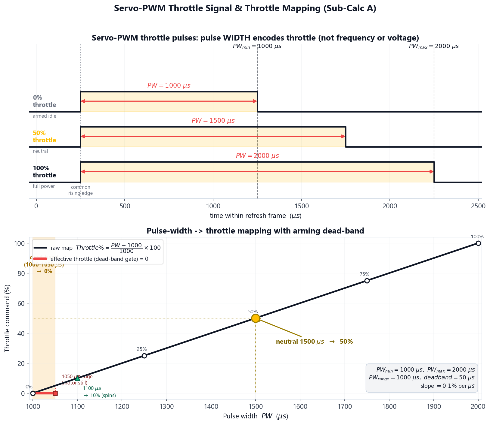
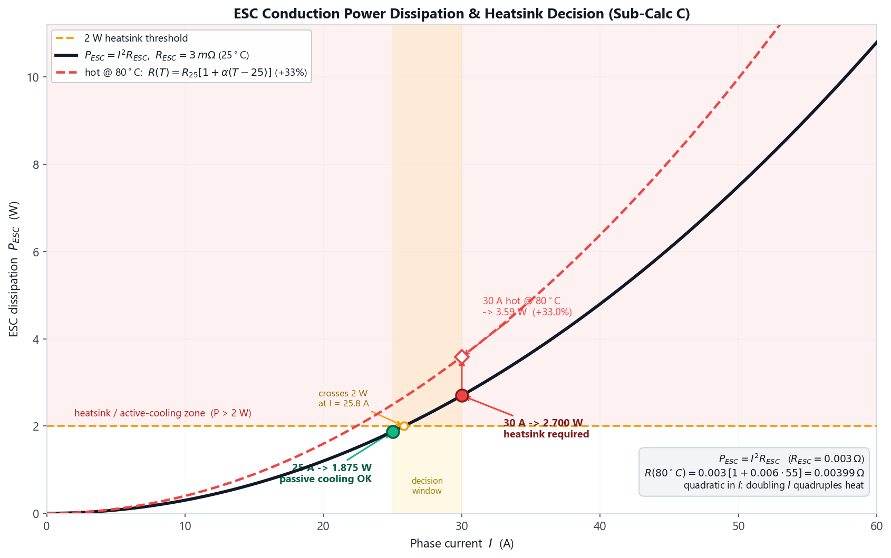

# Theoretical Background: ESC Power Electronics & PWM Control

The Electronic Speed Controller (ESC) is the power-electronic bridge between the flight controller's small digital command signal and the high-current three-phase power that spins a brushless DC (BLDC) motor. This experiment treats the ESC as both a **signal-processing device** (how a throttle command is encoded, quantised and refreshed) and a **power-conversion device** (how much of the battery energy it turns into waste heat). Getting either wrong is a direct cause of failed arming, sluggish control, or in-flight thermal failure. The experiment follows the ESC from the inside out: a **component explorer** (the board's anatomy), a **calibrate-and-commission** stage that maps the real pulse&rarr;throttle response against the ideal (Expected vs Obtained), a **protocol-and-latency** stage that makes command delay visible, and a **thermal sweep** that sizes the cooling.

Before working through the underlying physics, the animation below walks through the full ESC story — from the board's anatomy and the servo-PWM throttle pulse, through the arming dead-band, the resolution-versus-latency distinction and the DShot digital protocol, to the <i>I</i>2<i>R</i> conduction loss and the thermal limit that decides whether a heatsink is needed.

  <video controls playsinline preload="metadata" width="100%" style="max-width: 860px; border-radius: 8px;">
    <source src="./videos/power_electronics_esc.mp4" type="video/mp4">
    Your browser does not support the HTML5 video tag. You can
    <a href="./videos/power_electronics_esc.mp4">download the video</a> instead.
  </video>

---

## **1. The Servo-PWM Throttle Signal (Sub-Calc A)**

Classic ESCs accept a **pulse-width-modulated (PWM)** servo signal. Every refresh period the flight controller raises the signal line high for a short interval; the **width** of that high pulse — not its frequency or voltage — encodes the throttle command. By the long-standing RC convention:

* A **1000 &micro;s** (1.0 ms) pulse = **0% throttle** (motor idle / armed).
* A **2000 &micro;s** (2.0 ms) pulse = **100% throttle** (full power).

The linear map from pulse width (<i>PW</i>) to throttle command is therefore:

<b>Throttle% = (<i>PW</i> - <i>PW</i>min) &frasl; (<i>PW</i>max - <i>PW</i>min) &times; 100</b>

Where:
* <i>PW</i> is the measured pulse width [&micro;s].
* <i>PW</i>min = 1000 &micro;s and <i>PW</i>max = 2000 &micro;s are the calibrated throttle endpoints.
* <i>PW</i>range = <i>PW</i>max &minus; <i>PW</i>min = 1000 &micro;s is the active control band.

**Calibration** is the one-time procedure of teaching the ESC exactly which pulse widths correspond to 0% and 100%, so that every ESC on the aircraft responds identically to the same stick position. An un-calibrated or mis-calibrated ESC is the root cause of the two classic failures: *"a motor refuses to arm"* (its <i>PW</i>min is set above the controller's idle pulse) and *"a motor spins up to full power the instant the battery is plugged in"* (its endpoints are inverted or unset).

### **Worked Example — Throttle-to-PWM Mapping**

A flight controller running standard servo PWM emits the five calibration pulses 1000, 1250, 1500, 1750 and 2000 &micro;s into a freshly calibrated 30 A ESC (<i>PW</i>min = 1000 &micro;s, <i>PW</i>max = 2000 &micro;s). Applying the mapping formula at each point:

| Pulse Width <i>PW</i> (&micro;s) | Substitution | Throttle% |
|--------|--------------|-----------|
| 1000 | (1000 &minus; 1000) / 1000 &times; 100 | **0%** |
| 1250 | (1250 &minus; 1000) / 1000 &times; 100 | **25%** |
| 1500 | (1500 &minus; 1000) / 1000 &times; 100 | **50%** |
| 1750 | (1750 &minus; 1000) / 1000 &times; 100 | **75%** |
| 2000 | (2000 &minus; 1000) / 1000 &times; 100 | **100%** |

The neutral 1500 &micro;s pulse maps to exactly <b>50%</b> throttle, confirming the calibration is symmetric. The inverse relation, <i>PW</i> = <i>PW</i>min + (Throttle%/100) &middot; <i>PW</i>range, lets the controller convert a desired throttle back to a pulse — e.g. a 75% command becomes a 1750 &micro;s pulse. This linear, monotone map is the contract every ESC on the aircraft must honour after calibration.

---

## **2. The Arming Dead-Band & Real Calibration Errors (Sub-Calc A)**

A real ESC does not begin spinning the motor the instant the pulse rises above 1000 &micro;s. A small **dead-band** is enforced at the bottom of the throttle range so that signal jitter, electrical noise, or a transmitter trim a few microseconds off-zero cannot creep the propeller while the aircraft is armed on the ground. By convention the dead-band spans the first ~50 &micro;s:

Throttleeffective = 0 &nbsp; for &nbsp; <i>PW</i> &le; (<i>PW</i>min + <i>PW</i>deadband) = 1050 &micro;s

Throttleeffective = (<i>PW</i> - <i>PW</i>min) &frasl; <i>PW</i>range &times; 100 &nbsp; for &nbsp; <i>PW</i> &gt; 1050 &micro;s

The raw *linear* mapping of Section 1 still applies above the dead-band; the dead-band is a separate safety gate that forces the lowest 5% of the commanded range to a guaranteed zero-spin idle.

### **Worked Example — Dead-Band Verification**

The same ESC is now probed with pulses inside and just above the dead-band:

| Pulse Width <i>PW</i> (&micro;s) | Raw map (Section 1) | Dead-band gate | Effective Throttle% |
|--------|--------------|------|-----------|
| 1000 | 0% | &le; 1050 &rarr; 0 | **0%** (armed, still) |
| 1025 | 2.5% | &le; 1050 &rarr; 0 | **0%** (still) |
| 1050 | 5.0% | &le; 1050 &rarr; 0 | **0%** (dead-band edge) |
| 1100 | 10.0% | &gt; 1050 &rarr; pass | **10%** (motor spins) |

Every pulse from 1000 &micro;s up to and including 1050 &micro;s yields **0% effective throttle** — the rotor stays stationary. The motor only begins to turn once the pulse clears the 1050 &micro;s dead-band edge. This 50 &micro;s guard band is exactly what prevents an armed, idling quadcopter from creeping its propellers, and verifying it is a mandatory pre-flight safety check.

### **Expected vs Obtained — Why the Real Curve Deviates**

A calibration is only trustworthy once you have *seen* how the **real** ESC response compares with the **ideal** linear map. Plotting both — the assumed straight line (**Expected**) and the measured pulse&rarr;throttle points (**Obtained**) — exposes the real-world departures the calibrate-and-commission stage lets you reproduce:

* **Dead-band (always present).** As derived above, the first ~50 &micro;s above idle map to a flat 0%. On the Expected-vs-Obtained chart this is the segment where the Obtained curve hugs zero while the ideal line has already lifted off — the dominant deviation near idle, and a *correct* one.
* **Inverted endpoints.** If the endpoints are stored backwards (<i>PW</i>min = 2000 &micro;s, <i>PW</i>max = 1000 &micro;s — the stick held the wrong way during the teach-in), the map runs backwards: a 1000 &micro;s idle pulse now reads **100%**. The Obtained curve slopes opposite to the ideal — the classic "motor spins to full the instant the battery is plugged in" hazard.
* **Minimum endpoint too high.** If the stored minimum sits above the receiver's idle (e.g. <i>PW</i>min = 1300 &micro;s), every pulse below ~1350 &micro;s is dead and the live stick is compressed into 1300–2000 &micro;s. The Obtained curve stays flat far longer, then ramps steeply — lost low-end resolution, and a motor that may never idle cleanly.
* **Receiver jitter / capture quantisation.** A real RC link wobbles the pulse by a few microseconds and the ESC quantises it to its capture resolution, so repeated samples of the same command scatter by a fraction of a percent. The Obtained points sit *near* — not exactly on — the true curve; that scatter is the precision floor of an analog PWM link.

A correctly calibrated, jitter-free channel collapses the Obtained curve back onto the Expected line everywhere except the intentional idle dead-band. Quantifying the **RMS** and **worst-case** error between the two curves is the deliverable Module 1 hands to the flight-control loops of Experiment 5.

---

## **3. Control Resolution vs Refresh Frequency (Sub-Calc B)**

Two completely different quantities are often confused when discussing PWM signals: how *finely* the throttle can be commanded (**resolution**) and how *often* a new command is delivered (**refresh rate / latency**). The experiment's central pedagogical goal is to separate them.

### **Command Resolution (set by the timer tick)**
The pulse width is generated by a hardware timer counting at a fixed clock. With a 1 MHz timer the smallest representable change in pulse width is one **tick** = 1 &micro;s. The number of distinct throttle commands across the active band is therefore:

<b><i>N</i>steps = <i>PW</i>range &frasl; <i>t</i>tick = 1000 &micro;s &frasl; 1 &micro;s = 1000 steps</b>

Resolution = 100% &frasl; <i>N</i>steps = 0.1% per step

Crucially, <i>N</i>steps depends **only** on the timer tick and the pulse band — **not** on the refresh frequency.

### **Refresh Latency (set by the frequency)**
The refresh frequency <i>f</i> determines how often a fresh pulse (a fresh command) reaches the ESC. The worst-case command latency is one refresh period:

<b>&tau;latency = 1 &frasl; <i>f</i></b>

The fraction of each frame occupied by the pulse — the **duty** the ESC sees — is <i>PW</i>/<i>T</i>period, which *does* change with frequency.

### **The Misconception this Corrects**
A widespread belief in drone forums is that *"a higher PWM frequency gives finer throttle control."* This is **false**. Raising the frequency from 50 Hz to 400 Hz does **not** add a single extra throttle step — both still resolve 1000 microsecond steps (0.1%). What it changes is **latency**: the controller can correct the motor eight times more often. Higher frequency buys *responsiveness*, not *resolution*.

The simulator makes this latency tangible rather than abstract: it draws a **blue command** trace (your stick) and an **amber ESC-response** trace that trails it by exactly &tau;latency. At 50 Hz the amber response visibly lags the blue command by a full 20 ms; at 400 Hz the gap shrinks to 2.5 ms; with DShot it is effectively instantaneous. A control loop can only react after the response has caught up, so a flight-ready channel must keep that lag small — the protocol stage will not sign off on the 20 ms (50 Hz) link.

### **Worked Example — 50 Hz vs 400 Hz**

| Quantity | 50 Hz (legacy) | 400 Hz (fast PWM) |
|----------|----------------|-------------------|
| Refresh period <i>T</i> = 1/<i>f</i> | 20 000 &micro;s (20 ms) | 2 500 &micro;s (2.5 ms) |
| Command latency &tau; | **20 ms** | **2.5 ms** |
| Timer tick | 1 &micro;s | 1 &micro;s |
| Steps <i>N</i>steps = 1000&micro;s / 1&micro;s | **1000 (0.1%/step)** | **1000 (0.1%/step)** |
| Pulse duty (1000–2000&micro;s) | 5% – 10% | 40% – 80% |

Moving from 50 Hz to 400 Hz cuts the command latency by a factor of <b>20 ms / 2.5 ms = 8&times;</b> while the throttle resolution is **identical** (1000 steps, 0.1% each). The only visible change to the signal itself is the duty cycle: at 50 Hz the active pulse fills just 5–10% of the long frame, whereas at 400 Hz it fills 40–80% of the short frame. The 8&times; latency reduction is the real flight benefit — faster disturbance rejection by the control loops of Experiment 5 — and it has nothing to do with resolution.

---

## **4. Digital Protocols — Decoupling Resolution from Refresh**

Analog PWM hits a wall at ~500 Hz, where the 2000 &micro;s maximum pulse completely fills the 2000 &micro;s frame (100% duty), leaving no idle gap. Modern **digital** protocols such as **DShot** sidestep this entirely: instead of an analog pulse width, they transmit a 16-bit frame containing an **11-bit throttle word** (2048 codes, 2000 usable) plus a checksum, clocked at a fixed bitrate.

Frame time = frame bits &frasl; bitrate

For **DShot600** (600 kbit/s, 16-bit frame): frame time = 16 / 600000 = **26.7 &micro;s**, giving ~2000 throttle levels delivered every 26.7 &micro;s. DShot therefore offers both higher resolution (2000 vs 1000 levels) **and** far lower latency than analog PWM, and because the throttle is a digital integer it needs **no endpoint calibration and no dead-band** — the values 0 and 2047 are exact by definition. This is why digital protocols have largely replaced analog PWM on performance multirotors, and it cleanly illustrates that resolution and refresh are independent design axes.

---

## **5. ESC Conduction Power Dissipation (Sub-Calc C)**

As a power-conversion device, the ESC switches the battery current through three pairs of power MOSFETs to commutate the motor. Even a "perfect" switch has a small on-state resistance <i>R</i>DS(on); the phase current flowing through it dissipates **conduction loss** as heat, following Joule's law:

<b><i>P</i>ESC = <i>I</i>2 &middot; <i>R</i>ESC</b>

Where:
* <i>I</i> is the motor phase current [A] — carried forward from the Experiment 1 motor operating point.
* <i>R</i>ESC is the effective conduction resistance of the ESC's active MOSFETs [&Omega;] (≈ 3 m&Omega; for a typical 30 A ESC).

The quadratic <i>I</i>2 dependence is the key insight: doubling the current **quadruples** the heat. A practical design rule flags whether passive cooling is enough or a **heatsink** is required:

<i>P</i>ESC &gt; 2 W &nbsp; &rarr; &nbsp; heatsink / active cooling required

### **Worked Example — Dissipation & Heatsink Decision**

A 30 A BLHeli_32 ESC (<i>R</i>ESC = 0.003 &Omega;) is evaluated at two motor currents taken from the Experiment 1 sweep:

| Phase Current <i>I</i> (A) | Substitution | <i>P</i>ESC (W) | Verdict (2 W rule) |
|--------|--------------|------------|--------|
| 25 | 252 &times; 0.003 = 625 &times; 0.003 | **1.875 W** | Below threshold &rarr; passive cooling OK |
| 30 | 302 &times; 0.003 = 900 &times; 0.003 | **2.700 W** | Above threshold &rarr; **heatsink needed** |

At 25 A the ESC sheds 1.875 W — comfortably under the 2 W threshold, so rotor-wash convection is sufficient. Raising the current only 20% to 30 A pushes dissipation to 2.7 W (a 44% jump, because loss scales with <i>I</i>2), crossing the threshold and requiring a heatsink. This single calculation decides a real hardware purchase, and its quadratic steepness is exactly why over-propping a motor — which spikes current — is so dangerous for the ESC.

---

## **6. Temperature Coefficient & Thermal-Runaway Risk**

The conduction model of Section 5 uses a **fixed** <i>R</i>ESC, but the silicon MOSFET channel that carries the phase current has a **positive temperature coefficient of resistance**: it gets *more* resistive as it heats. A power MOSFET's <i>R</i>DS(on) typically climbs to ~1.45&times; its 25 &deg;C value by 100 &deg;C (datasheet-typical for the logic-level FETs used in hobby ESCs), i.e. &alpha; &asymp; 0.006 /&deg;C — well above annealed copper's 0.00393 /&deg;C, because the loss is dominated by the silicon channel, not the board's copper traces:

<i>R</i>ESC(<i>T</i>) = <i>R</i>ESC,25 &middot; [1 + &alpha; &middot; (<i>T</i> - 25&deg;C)]

This creates a positive feedback loop: higher current &rarr; more heat &rarr; higher resistance &rarr; *even more* heat at the same current. Worked at the 80 &deg;C the MOSFETs may reach in flight:

<i>R</i>ESC(80&deg;C) = 0.003 &middot; [1 + 0.006 &middot; (80 - 25)] = 0.003 &middot; 1.33 &asymp; 0.00399 &Omega;

The resistance is **~33% higher** when hot, so at 30 A the *real* dissipation is <i>P</i> = 302 &middot; 0.00399 &asymp; **3.59 W**, not the 2.7 W the cold model predicts. The static <i>I</i>2<i>R</i> calculation therefore *under-estimates* hot-running loss — a limitation that must be disclosed, and the reason the full transient thermal model is developed in Experiment 9.

> **Simple steady-state temperature estimate.** Treating the ESC as a lumped body with junction-to-ambient thermal resistance <i>R</i>th, the equilibrium temperature is <i>T</i>ESC = <i>T</i>ambient + <i>P</i>ESC &middot; <i>R</i>th. For a bare 30 A ESC (<i>R</i>th &asymp; 18 &deg;C/W) at 30 A: <i>T</i>ESC &asymp; 25 + 2.7 &middot; 18 &asymp; 73.6 &deg;C. Bonding a heatsink that drops <i>R</i>th to ~9 &deg;C/W brings this down to <i>T</i>ESC &asymp; 25 + 2.7 &middot; 9 &asymp; 49.3 &deg;C — safely clear of the 80 &deg;C limit.

### **The Self-Consistent Hot Operating Point**
The simple steady-state estimate above assumes the power dissipation is fixed at the cold value (2.7 W). In reality, because the temperature rise increases the resistance, which in turn increases the power dissipation, we must solve a system of coupled equations self-consistently:
1. <i>P</i>ESC = <i>I</i>2 &middot; <i>R</i>ESC(<i>T</i>)
2. <i>R</i>ESC(<i>T</i>) = <i>R</i>ESC,25 &middot; [1 + &alpha; &middot; (<i>T</i> &minus; 25 &deg;C)]
3. <i>T</i> = <i>T</i>amb + <i>P</i>ESC &middot; <i>R</i>th

Substituting (1) and (2) into (3) yields a linear equation for the equilibrium temperature <i>T</i>. Solving for <i>T</i> gives the closed-form analytical solution:

<b><i>T</i> = (<i>T</i>amb + <i>K</i> &minus; 25 &middot; <i>K</i> &middot; &alpha;) &frasl; (1 &minus; <i>K</i> &middot; &alpha;)</b>

Where <i>K</i> = <i>I</i>2 &middot; <i>R</i>ESC,25 &middot; <i>R</i>th. For a 30 A phase current, a 3.0 m&Omega; ESC, and ambient temperature of 25 &deg;C:
* **Bare ESC** (<i>R</i>th = 18 &deg;C/W): <i>K</i> = 48.6. The self-consistent operating temperature converges to <b>93.6 &deg;C</b> (with a hot resistance of <b>4.23 m&Omega;</b> and power loss of <b>3.81 W</b>), far exceeding the cold estimate of 73.6 &deg;C and crossing the 80 &deg;C thermal limit.
* **Heatsinked ESC** (<i>R</i>th = 9 &deg;C/W): <i>K</i> = 24.3. The operating temperature converges to <b>53.4 &deg;C</b> (with a hot resistance of <b>3.51 m&Omega;</b> and power loss of <b>3.16 W</b>), remaining safely below the 80 &deg;C thermal limit.

---

## **7. Cross-Experiment Relationships**

This experiment sits at the electrical crossroads of the build and both consumes and produces values used elsewhere:

* **Motor current (from Experiment 1):** The phase current <i>I</i> driving Sub-Calc C is the motor operating-point current computed by the Experiment 1 propulsion engine (≈ 7.2 A per motor at hover, rising toward the 23–32 A full-throttle figures for the larger motors). Selecting a higher-KV motor or over-propping raises this current and directly increases ESC dissipation here.
* **Dead-band values (to Experiment 5):** The verified arming dead-band and throttle endpoints are stored for the Flight Control System experiment, where the PID loops assume a calibrated, jitter-free throttle channel.
* **ESC thermal flag (to Experiment 9):** Whether <i>P</i>ESC crosses the 2 W heatsink threshold is forwarded to the Thermal Management experiment, which develops the full transient temperature-rise model that this static calculation only approximates.

The calculated dissipation and heatsink decision are stored as `vlabExp4_escDissipation` and `vlabExp4_heatsinkRequired` in browser local storage for use in Experiment 9.

---

## **Summary of Key Formulas**

| Parameter | Formula | Units |
|-----------|---------|-------|
| Throttle from pulse width | Throttle% = (<i>PW</i> &minus; <i>PW</i>min) / <i>PW</i>range &times; 100 | % |
| Dead-band gate | Throttleeff = 0 for <i>PW</i> &le; 1050 &micro;s | % |
| Command resolution | <i>N</i>steps = <i>PW</i>range / <i>t</i>tick | steps |
| Refresh latency | &tau; = 1 / <i>f</i> | s |
| Digital frame time | <i>t</i>frame = frame bits / bitrate | s |
| ESC conduction loss | <i>P</i>ESC = <i>I</i>2 &middot; <i>R</i>ESC | W |
| Resistance vs temperature | <i>R</i>(<i>T</i>) = <i>R</i>25 &middot; [1 + &alpha;(<i>T</i> &minus; 25)] | &Omega; |
| ESC steady-state temperature | <i>T</i>ESC = <i>T</i>amb + <i>P</i>ESC &middot; <i>R</i>th | &deg;C |
