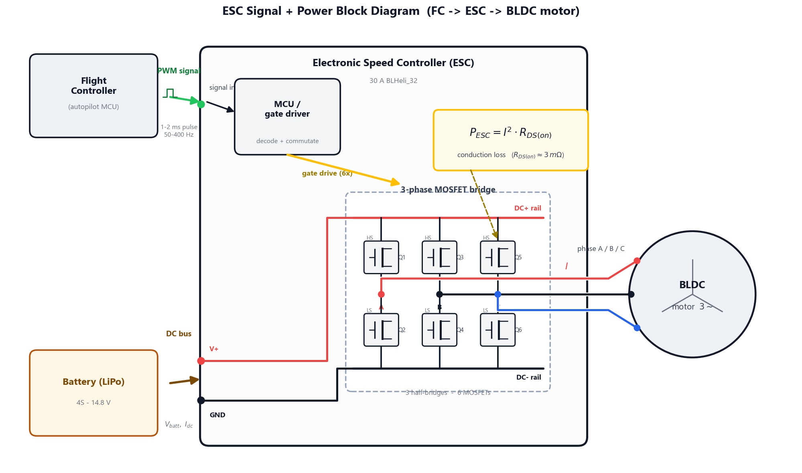

<h1>Lab Procedure: ESC Anatomy, Calibration, Protocol Latency &amp; Thermal Sizing</h1>

This document outlines the step-by-step workflow for <strong>Experiment 4: Power Electronics — ESC Anatomy, Throttle Calibration, Protocol Latency &amp; Thermal Sizing</strong>. The experiment runs across <strong>two modules and four stages</strong>. Module 1 covers the ESC's anatomy and its live throttle calibration; Module 2 covers signal-protocol latency and thermal sizing.

<blockquote>

The <strong>Continue to Module 2</strong> button appears only after <strong>both</strong> Module 1 tabs are complete: every component inspected on Tab 1 <strong>and</strong> the calibration recorded on Tab 2.

</blockquote>

<h2>Stage 1: Component Explorer — ESC Anatomy (Module 1 &middot; Tab 1)</h2>

<h3>Objective</h3>

Learn what an ESC is <em>made of</em> before calibrating it — identify every component on the board and the role it plays in turning a small throttle command into high-current three-phase motor power.

<h3>Step-by-Step Procedure</h3>
<ol>
<li><strong>Launch the simulator.</strong> Module 1 opens on <strong>Tab 1 &middot; Component Explorer</strong>, showing the ESC as an exploded 3D board (no live experiment here — this stage is pure anatomy).</li>
<li><strong>Pick an ESC platform</strong> from the breakout gallery (e.g. <em>20A BLHeli_S</em>, <em>30A BLHeli_32</em>, <em>4-in-1 45A / 60A</em> stacks). The teardown spec card lists its topology, firmware, continuous / burst current, MOSFET count, conduction resistance <i>R</i>DS(on), supported protocols, board size and mass.</li>
<li><strong>Move around the board.</strong> Left-drag to orbit, right-drag (or two-finger) to pan, and scroll to zoom. Toggle <strong>Teardown / exploded view</strong> to collapse or fan out the layers.</li>
<li><strong>Inspect every component.</strong> Click each callout in the 3D view, or each entry in the <strong>Components</strong> list on the left. For each part the <strong>Component Datasheet</strong> panel explains what it is, its role, and a design note. The components are: FR4 substrate, solder mask &amp; silkscreen, castellated I/O pads, power MOSFETs, MCU / gate-driver, electrolytic capacitor(s), SMD passives, signal connector (JST), battery leads, and mounting screws.</li>
<li><strong>Complete the tab.</strong> The datasheet tag counts your progress (e.g. <em>7 / 10 viewed</em>). Once every component has been inspected it reads <strong>all 10 viewed &#10003;</strong> — Tab 1 is complete. (This is one of the two requirements that reveal the Module 2 button.)</li>
</ol>

<h2>Stage 2: Calibrate &amp; Commission — Wire It, Then Map It (Module 1 &middot; Tab 2)</h2>

<h3>Objective</h3>

Build the real circuit by hand — drag wires from the battery to the ESC and from the ESC to the motor in the 3D view — then store the throttle endpoints, arm the ESC, and map the <em>real</em> pulse&rarr;throttle response against the <em>ideal</em> straight-line map.

<h3>Step-by-Step Procedure</h3>
<ol>
<li><strong>Open Tab 2 &middot; Calibrate &amp; Commission.</strong> In the left panel set the <strong>Drivetrain</strong>: the motor load (the catalogue mirrors Experiment 1), the battery pack and the state of charge. The bench appears bare — the battery and ESC power/phase leads are not pre-wired; the terminal pads are small gold posts you can pick up.</li>
<li><strong>Wire the power circuit.</strong> In the 3D view, click-drag from the battery's <strong>red (+)</strong> terminal to the ESC's <strong>red power-input</strong> pad, then drag from the battery's <strong>black (&minus;)</strong> terminal to the ESC's <strong>black power-input</strong> pad. There is no on-screen hint for which pad is which — the wiring is exactly as free-form as a real bench: cross the polarity, or bridge the battery's own two terminals directly, and the ESC is destroyed instantly (a real hobby ESC has no reverse-voltage protection) and must be replaced from the breakout gallery before you can continue.</li>
<li><strong>Wire the three phase leads.</strong> Drag a wire from each of the ESC's three gold phase pads to one of the motor's three phase terminals. All three must be connected, one-to-one, before the circuit is complete — a missing or doubled-up pad means the ESC can never sense rotor position and won't commutate. Swap any <strong>two</strong> of the three wires (not all three) and the motor will spin in reverse once running — a real BLDC consequence, not a warning label.</li>
<li><strong>Store the endpoints.</strong> Once wired, click <strong>Store endpoints</strong>. The ESC records 1000–2000 &micro;s and snaps the stick to idle. (Selecting a fault scenario first marks the stored endpoints invalid.)</li>
<li><strong>Arm at idle.</strong> Click <strong>Arm ESC</strong>. Arming is refused until the power wiring is complete (and the ESC is undamaged); once wired, arming always brings the stick to idle first, so the ESC arms cleanly and the HUD reads <strong>ARMED</strong>. Disarming is allowed at any throttle.</li>
<li><strong>Run the simulation.</strong> Click <strong>Run simulation</strong> — this also requires the phase wiring to be complete. Drag the <strong>Pulse width</strong> slider across its full 1000–2000 &micro;s range; the motor spins live and the oscilloscope chart plots:
  <ul>
  <li>the <strong>dashed blue Expected</strong> line — the ideal linear map you assumed, and</li>
  <li>the <strong>amber Obtained</strong> curve — the real ESC, including this unit's own dead-band (seeded per ESC, roughly 35–65 &micro;s — not a fixed textbook 50 &micro;s), any injected fault, and receiver jitter.</li>
  </ul>
</li>
<li><strong>Try the fault scenarios.</strong> Use the <strong>Fault Injection</strong> selector and re-sweep to watch the Obtained curve distort:
  <ul>
  <li><strong>Inverted endpoints</strong> — idle reads ~100% (the curve runs backwards): the "spins to full on power-up" hazard.</li>
  <li><strong>Minimum endpoint too high</strong> — the low third of the stick is dead and the live range is compressed.</li>
  <li><strong>Noisy receiver jitter</strong> — the throttle scatters around the true curve.</li>
  </ul>
  A stored fault blocks arming, exactly as a real ESC refuses a bad calibration.
</li>
<li><strong>Sign off.</strong> The <strong>Experiment Sign-off</strong> panel shows a PASS/WARN/FAIL verdict chip plus the objectives checklist: <em>wired</em>, <em>endpoints stored</em>, <em>armed at idle</em>, <em>swept the full range</em>, and <em>map tracks the ideal</em>. With both Module 1 tabs complete, the <strong>Continue to Module 2</strong> button appears.</li>
</ol>

<h2>Stage 3: Protocol &amp; Latency (Module 2 &middot; Tab 1)</h2>

<h3>Objective</h3>

<em>See</em> command latency as a real, visible delay; separate latency from resolution; and choose a flight-ready signal protocol.

<h3>Step-by-Step Procedure</h3>
<ol>
<li><strong>Open Module 2.</strong> Click <strong>Continue to Module 2</strong> — <code>index1.html</code> loads on <strong>Tab 1 &middot; Protocol &amp; Latency</strong>, restoring your ESC, motor and protocol.</li>
<li><strong>Watch the command-vs-response scope.</strong> The chart shows two traces: a <strong>blue command</strong> (your stick stepping up and down) and an <strong>amber ESC response</strong> that trails it by the protocol's latency. The <strong>&Delta;t</strong> readout and the <strong>Latency</strong> card show the lag.</li>
<li><strong>Step through the protocols.</strong> Use the <strong>Command protocol</strong> selector — <em>Standard PWM 50 Hz</em>, <em>Fast PWM 400 / 500 Hz</em>, <em>OneShot125</em>, <em>DShot300 / 600</em> — and watch the amber response chase the blue command:
  <ul>
  <li><strong>50 Hz</strong> — the response lags ~<strong>20 ms</strong> (a wide, obvious gap).</li>
  <li><strong>400 Hz</strong> — the gap shrinks to ~<strong>2.5 ms</strong>.</li>
  <li><strong>DShot</strong> — the response snaps almost on top of the command (tens of microseconds).</li>
  </ul>
</li>
<li><strong>Separate resolution from latency.</strong> Note the <strong>Resolution</strong> card stays at <strong>1000 steps</strong> for every analog rate — resolution is set by the timer tick, not the refresh rate. Select both 50 Hz and 400 Hz to satisfy the <em>Resolution unchanged</em> objective; DShot jumps to ~<strong>2000 levels</strong> with no calibration and no dead-band.</li>
<li><strong>Lock in a flight-ready protocol.</strong> The stage signs off only when you settle on a protocol with latency <strong>under 5 ms</strong> — <em>Standard PWM 50 Hz is too slow to pass</em> (it is the deliberate "fault" here). Choose 400 Hz, OneShot or DShot to complete the run-sheet.</li>
</ol>

<h2>Stage 4: Thermal Sweep &amp; Heatsink Sizing (Module 2 &middot; Tab 2)</h2>

<h3>Objective</h3>

Compute the ESC's conduction loss, run a thermal sweep to find the current at which the junction reaches 80 &deg;C, and size the cooling.

<h3>Step-by-Step Procedure</h3>
<ol>
<li><strong>Open Tab 2 &middot; Thermal Sweep.</strong> Set the <strong>Sustained Load</strong>: the phase current (use the <strong>Hover</strong> / <strong>Full load</strong> presets — full load is seeded from Experiment 1's real solved current when that experiment has been finalized, a datasheet default otherwise) and the <strong>Ambient temp</strong>.</li>
<li><strong>Read the live derivations.</strong> The derivation cards update live: <strong>Pack Voltage &amp; Loaded RPM</strong>, <strong>Conduction Loss</strong> <i>P</i> = <i>I</i>2&middot;<i>R</i>(<i>T</i>), and <strong>Thermal Equilibrium</strong> <i>T</i> = <i>T</i>amb + <i>P</i>&middot;<i>R</i>th. The MOSFET junction probes and the HUD hotspot track the operating point.</li>
<li><strong>Run the sweep.</strong> Click <strong>Run simulation</strong>. The <i>T</i>–<i>I</i> curve is plotted and the <strong>80 &deg;C passive-current threshold</strong> is found and reported.</li>
<li><strong>Read the verdict.</strong> The verdict card shows <strong>PASSIVE OK / HEATSINK REQ / OVER LIMIT</strong>. For a 30 A ESC (<i>R</i>ESC &asymp; 3 m&Omega;): at <strong>25 A</strong> &rarr; 1.875 W (passive OK); at <strong>30 A</strong> &rarr; 2.7 W (heatsink required).</li>
<li><strong>Enable the hot-resistance model.</strong> Toggle <strong>Hot-resistance feedback</strong> to let <i>R</i>DS(on) climb with temperature and solve the self-consistent hot operating point — a bare 30 A ESC settles at &asymp; <strong>93.6 &deg;C</strong>, over the 80 &deg;C limit. If the operating point diverges rather than settling, the instructor calls out <strong>thermal runaway</strong> — the same static-model trap Section 6 of the theory warns about.</li>
<li><strong>Fit the heatsink and re-run.</strong> Toggle <strong>Clamp-on heatsink</strong> to drop <i>R</i>th and run the sweep again: the safe threshold current rises and the hotspot falls to &asymp; <strong>53.4 &deg;C</strong> — safely under the limit.</li>
<li><strong>Sign off.</strong> The Experiment Sign-off panel's PASS/WARN/FAIL verdict and objectives checklist confirm the sweep was run, the hotspot stayed under 80 &deg;C, the full-throttle current came from Experiment 1 (not a default), the heatsink decision was made against the 2 W line, and the bulk capacitor is fitted. The full characterisation — dissipation, thermal state, and the calibrated dead-band map from Module 1 — is written to the shared build store for Experiment 5 (Flight Control System) and Experiment 9 (Thermal Management), completing Experiment 4.</li>
</ol>
