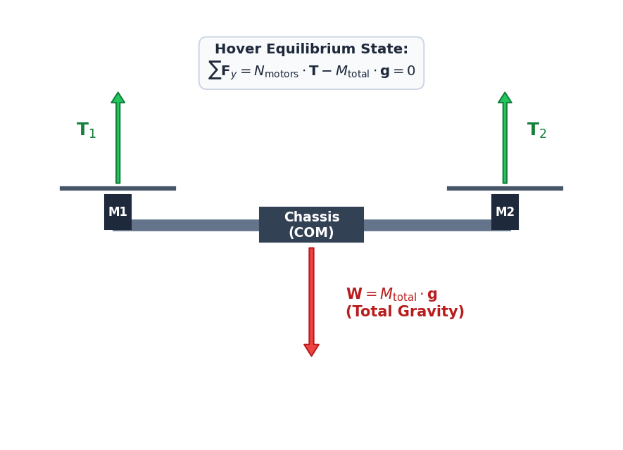
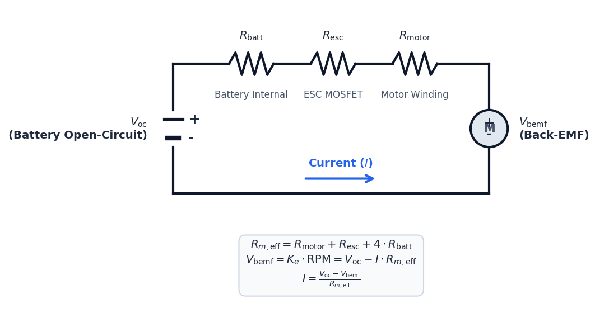

# Theoretical Background: Multirotor Propulsion Systems

A multirotor's propulsion system converts electrical energy stored in a chemical battery into aerodynamic thrust. Designing an efficient and safe drone requires understanding the coupled physics of aerodynamics, electro-circuit kinetics, thermodynamics, and battery chemistry.

Before working through the underlying physics, the animation below presents an exploded view of a complete propulsion unit. It separates the carbon-fibre frame, the BLDC motor, the propeller, the battery, and the avionics stack so each component can be identified before it is analysed in the sections that follow.

  <video controls playsinline preload="metadata" width="100%" style="max-width: 860px; border-radius: 8px;">
    <source src="./videos/propulsion_exploded_view.mp4" type="video/mp4">
    Your browser does not support the HTML5 video tag. You can
    <a href="./videos/propulsion_exploded_view.mp4">download the video</a> instead.
  </video>

---

## **1. Aerodynamic Force Balance & Hover State**

For a multirotor to maintain a stationary hover in three-dimensional space, the net vertical force acting on the aircraft must be zero. The total thrust generated by the <i>N</i>motors propellers must balance the gravity load (weight) of the drone:

&Sigma; <i>F</i><i>y</i> = <i>N</i>motors &middot; <i>T</i> - <i>M</i>total &middot; <i>g</i> = 0

<b><i>T</i>required = (<i>M</i>total &middot; <i>g</i>) &frasl; <i>N</i>motors</b>

Where:
* <i>T</i>required is the static thrust required per motor-propeller unit [N].
* <i>M</i>total is the total All-Up Mass (AUM) of the quadcopter, including the frame, electronics, battery, propulsion units, and any payload [kg].
* <i>g</i> is the acceleration due to gravity (9.80665 m/s2).
* <i>N</i>motors is the number of motors (typically 4 for standard quadcopters).

### **Worked Example — Hover Thrust**

Consider the coherent 5-inch build used throughout this chapter: a 250 mm carbon-fibre frame (`cf_250`, 68.2 g), four 2204-2300KV motors (25.0 g each), four 5045 propellers (3.1 g each), a 4S 2200 mAh LiPo (`4s_2200`, 162.0 g), four 30 A ESCs (`esc_30a_blheli32`, 9.5 g each), an F4 flight controller (6.2 g) and an ELRS receiver (3.5 g). Summing these masses gives an All-Up Mass of <i>M</i>total = 390.3 g &asymp; 0.390 kg. Substituting into the hover balance:

<i>T</i>required = (0.390 kg &middot; 9.80665 m&frasl;s2) &frasl; 4 &asymp; 0.957 N

Each motor-propeller unit must therefore generate about 0.957 N (&asymp; 97.6 gf) of static thrust to hold a hover — exactly one quarter of the 3.83 N total weight.

---

## **2. Propeller Aerodynamics (Blade Element Momentum Theory)**

Aerodynamic thrust (<i>T</i>) and drag torque (<i>Q</i>) are generated as the propeller blades rotate through the air, creating a pressure differential. Based on dimensional analysis and Blade Element Momentum Theory (BEMT), the performance is expressed as:

<i>T</i> = <i>C</i><i>t</i> &middot; &rho; &middot; <i>n</i>2 &middot; <i>D</i>4

<i>Q</i> = <i>C</i><i>q</i> &middot; &rho; &middot; <i>n</i>2 &middot; <i>D</i>5

Where:
* &rho; is the ambient air density [kg/m3], derived from altitude (<i>H</i>) using the International Standard Atmosphere (ISA) model:
  
&rho; = &rho;0 &middot; (1 - 0.0000225577 &middot; <i>H</i>)4.25588

  (with sea-level density &rho;0 = 1.225 kg/m3).
* <i>n</i> is the rotational speed of the propeller in revolutions per second [rps] (<i>n</i> = RPM / 60).
* <i>D</i> is the propeller diameter [m].
* <i>C</i><i>t</i> and <i>C</i><i>q</i> are the non-dimensional thrust and torque coefficients.

The velocity vectors, angles, and resulting incremental aerodynamic forces acting on a 2D airfoil cross-section of the blade are shown below:

### **Static Pitch Approximations**
In static conditions, the coefficients are heavily dependent on the propeller's pitch-to-diameter ratio (<i>P</i>/<i>D</i>):

<i>C</i><i>t</i>_static &asymp; 0.115 &middot; (<i>P</i> &frasl; <i>D</i>)

<i>C</i><i>q</i>_static &asymp; <i>C</i><i>t</i>_static &middot; (0.045 &middot; <i>Re</i>factor + 0.11 &middot; (<i>P</i> &frasl; <i>D</i>))

### **Low Reynolds Number Correction**
Small drone propellers operate in a low Reynolds number regime (<i>Re</i> &lt; 150,000) where viscous shear stresses dominate, increasing the profile drag coefficient. We apply a correction factor based on the 1/4-power law:

<i>Re</i>factor = (150,000 &frasl; <i>Re</i>)0.25

Where <i>Re</i> = (&rho; &middot; <i>v</i>tip &middot; <i>c</i>mean) &frasl; &mu;, with <i>v</i>tip = &pi; &middot; <i>n</i> &middot; <i>D</i> representing blade tip speed, <i>c</i>mean representing mean blade chord, and &mu; representing air dynamic viscosity.

### **Induced Inflow Correction**
As the propeller rotates, it induces a downward vertical velocity (<i>vi</i>) through the actuator disk, reducing the effective angle of attack of the blades. We calculate the induced advance ratio (<i>Ji</i>) and adjust the coefficients:

<i>J</i><i>i</i> = &radic;((2 &middot; <i>C</i><i>t</i>_static) &frasl; &pi;)

<i>C</i><i>t</i>_eff = <i>C</i><i>t</i>_static &middot; (1 - <i>J</i><i>i</i>)

<i>C</i><i>q</i>_eff = <i>C</i><i>q</i>_static &middot; (1 + 1.5 &middot; <i>J</i><i>i</i>2)

### **Worked Example — Static Thrust & Torque Coefficients**

Take one 5045 propeller (<i>D</i> = 0.127 m, <i>P</i>/<i>D</i> = 0.9, mean chord <i>c</i>mean &asymp; 0.1<i>D</i> = 0.0127 m) spinning at <i>n</i>rpm = 12,000 RPM (<i>n</i> = 200 rps) in sea-level air (&rho; = 1.225 kg/m3, &mu; = 1.81 &times; 10-5 Pa&middot;s). Stepping through the coefficient model of this section:

| Quantity | Substitution | Result |
|---|---|---|
| <i>C</i><i>t</i>_static | 0.115 &middot; 0.9 | 0.1035 |
| <i>v</i>tip = &pi; &middot; <i>n</i> &middot; <i>D</i> | &pi; &middot; 200 &middot; 0.127 | 79.8 m/s |
| <i>Re</i> | (1.225 &middot; 79.8 &middot; 0.0127) &frasl; (1.81 &times; 10-5) | 6.86 &times; 104 |
| <i>Re</i>factor | (150,000 &frasl; 68,590)0.25 | 1.216 |
| <i>C</i><i>q</i>_static | 0.1035 &middot; (0.045 &middot; 1.216 + 0.11 &middot; 0.9) | 0.01591 |
| <i>J</i><i>i</i> | &radic;(2 &middot; 0.1035 &frasl; &pi;) | 0.2567 |
| <i>C</i><i>t</i>_eff | 0.1035 &middot; (1 &minus; 0.2567) | 0.07693 |
| <i>C</i><i>q</i>_eff | 0.01591 &middot; (1 + 1.5 &middot; 0.25672) | 0.01748 |

Substituting the effective coefficients into the BEMT relations:

<i>T</i> = 0.07693 &middot; 1.225 &middot; 2002 &middot; 0.1274 &asymp; 0.981 N

<i>Q</i> = 0.01748 &middot; 1.225 &middot; 2002 &middot; 0.1275 &asymp; 0.0283 N&middot;m

At 12,000 RPM a single 5045 develops &asymp; 0.981 N — just above the 0.957 N per-motor hover requirement from Section 1 — confirming this motor-prop pair reaches hover at a modest throttle with thrust margin to spare.

---

## **3. Equivalent Electrical Circuit & Back-EMF**

The brushless DC (BLDC) motor acts as an electromechanical transducer. Under steady-state conditions, the electrical loop is represented by an equivalent series circuit containing the battery open-circuit voltage (<i>V</i>oc), system resistances, and the motor's Back-Electromotive Force (<i>V</i>bemf).

### **Total Effective Resistance**
The total winding resistance (<i>R</i><i>m</i>) is modified to include the battery's internal resistance (<i>R</i>batt) and the ESC MOSFET resistance (<i>R</i>esc):

<i>R</i><i>m</i>_eff = <i>R</i>motor + <i>R</i>esc + 4 &middot; <i>R</i>batt

* **ESC Resistance:** Ranging from 2 m&Omega; to 3 m&Omega; per phase depending on thermal cooling and rating.
* **Battery Resistance:** Scales with capacity (<i>C</i>mah) and cell count (<i>S</i>):
  
<i>R</i>batt_nominal &asymp; <i>S</i> &middot; 0.012 &middot; (1500 &frasl; <i>C</i>mah) &Omega;

### **Back-EMF & Applied Voltage**
When the motor spins at speed <i>n</i>rpm, it generates a counter-voltage opposing the applied voltage:

<i>V</i>bemf = <i>n</i>rpm &frasl; <i>KV</i>

Where <i>KV</i> is the motor velocity constant [RPM/V].
The effective voltage applied to the windings by the ESC switching MOSFETs under throttle <i>u</i> &isin; [0, 1] is:

<i>V</i>applied = <i>u</i> &middot; <i>V</i>battery_terminal

### **Steady-State Current & Torque**
The loop current (<i>I</i>) is driven by the difference between the applied voltage and Back-EMF:

<i>I</i> = (<i>V</i>applied - <i>V</i>bemf) &frasl; <i>R</i><i>m</i>_eff

The motor produces torque (<i>Q</i><i>m</i>) proportional to this current, which must balance the aerodynamic torque (<i>Q</i>) and winding friction losses:

<i>Q</i><i>m</i> = <i>K</i><i>t</i> &middot; (<i>I</i> - <i>I</i>0)

Where <i>K</i><i>t</i> = 60 &frasl; (2&pi; &middot; <i>KV</i>) is the motor torque constant [N·m/A], and <i>I</i>0 is the no-load current.

### **Worked Example — Circuit Operating Point**

For the 2204-2300KV motor (<i>KV</i> = 2300 RPM/V, <i>R</i>motor = 0.095 &Omega;, <i>I</i>0 = 0.30 A) on the 4S 2200 mAh pack through a 30 A ESC (<i>R</i>esc = 0.0025 &Omega;), first build the effective resistance. The pack internal resistance is <i>R</i>batt = 4 &middot; 0.012 &middot; (1500 &frasl; 2200) &asymp; 0.0327 &Omega;, so:

<i>R</i><i>m</i>_eff = 0.095 + 0.0025 + 4 &middot; 0.0327 &asymp; 0.2284 &Omega;

At the hover speed <i>n</i>rpm = 12,000 RPM the back-EMF is:

<i>V</i>bemf = 12,000 &frasl; 2300 &asymp; 5.22 V

With an applied voltage <i>V</i>applied &asymp; 6.84 V (throttle <i>u</i> &asymp; 0.46 of the 14.8 V terminal), the loop current is:

<i>I</i> = (6.84 &minus; 5.22) &frasl; 0.2284 &asymp; 7.12 A

With <i>K</i><i>t</i> = 60 &frasl; (2&pi; &middot; 2300) &asymp; 0.00415 N&middot;m/A, the motor torque <i>Q</i><i>m</i> = 0.00415 &middot; (7.12 &minus; 0.30) &asymp; 0.0283 N&middot;m, which exactly balances the aerodynamic torque <i>Q</i> computed in Section 2. The 7.12 A draw sits well below the motor's 25 A limit, so this hover operating point is safe.

---

## **4. Dynamic Thermal & Convective Cooling Kinetics**

The electrical current flowing through the windings generates heat due to resistive losses (Joule heating). The rate of temperature change (<i>dT</i>/<i>dt</i>) of the motor is solved using a first-order lumped capacitance thermal model:

<i>dT</i> &frasl; <i>dt</i> = (<i>P</i>loss - (<i>T</i> - <i>T</i>ambient) &middot; <i>h</i>cooling) &frasl; (<i>M</i>motor &middot; <i>C</i><i>p</i>)

Where:
* <i>P</i>loss = <i>I</i>2 &middot; <i>R</i>motor is the electrical copper loss [W] (iron core losses are neglected for simplicity).
* <i>T</i> is the current winding temperature [°C], and <i>T</i>ambient is the air temperature (typically 25&deg;C).
* <i>M</i>motor is the physical mass of the motor [kg], and <i>C</i><i>p</i> is the specific heat capacity of copper/aluminum (900 J/(kg·K)).
* <i>h</i>cooling is the dynamic convective heat transfer coefficient [W/K], which scales with the propeller wash velocity and blade tip speed:
  
<i>h</i>cooling = 0.025 + 0.006 &middot; &radic;<i>v</i>tip + 0.012 &middot; <i>vi</i>

### **Worked Example — Steady-State Winding Temperature**

Continuing the hover operating point (<i>I</i> = 7.12 A, <i>R</i>motor = 0.095 &Omega;), the copper loss is:

<i>P</i>loss = 7.122 &middot; 0.095 &asymp; 4.81 W

The induced wash speed through the disk (area <i>A</i> = &pi;<i>D</i>2&frasl;4 = 0.01267 m2) is <i>vi</i> = &radic;(<i>T</i> &frasl; (2&rho;<i>A</i>)) = &radic;(0.981 &frasl; (2 &middot; 1.225 &middot; 0.01267)) &asymp; 5.62 m/s, which with the tip speed <i>v</i>tip = 79.8 m/s gives a cooling coefficient:

<i>h</i>cooling = 0.025 + 0.006 &middot; &radic;79.8 + 0.012 &middot; 5.62 &asymp; 0.146 W/K

At thermal equilibrium (<i>dT</i>/<i>dt</i> = 0) the steady temperature rise above ambient is <i>P</i>loss &frasl; <i>h</i>cooling = 4.81 &frasl; 0.146 &asymp; 32.9 &deg;C, so the winding settles near 25 + 32.9 &asymp; 57.9 &deg;C — comfortably below the 150 &deg;C insulation limit.

If the motor temperature exceeds 150&deg;C, the wire insulation melts, triggering short circuits, motor burnout, and eventual crash.

This heat flow and dissipation behavior can be represented by an equivalent thermal RC circuit, where <i>P</i>loss acts as a current heat flux source, <i>C</i>th represents the thermal capacitance (storing heat), and <i>R</i>th represents the thermal resistance of convective cooling:

---

## **5. Battery Voltage Sag & Discharge Dynamics**

As a Lithium Polymer (LiPo) battery discharges, its open-circuit voltage (<i>V</i>oc) drops as a function of the State of Charge (<i>SoC</i> &isin; [0, 1]):

<i>V</i>oc_cell = 3.5 + 0.7 &middot; <i>SoC</i> + 0.1 &middot; <i>SoC</i>3

Under high current draw, the terminal voltage drops (sags) below the open-circuit voltage due to internal cell resistance:

<i>V</i>terminal = <i>N</i>cells &middot; (<i>V</i>oc_cell - <i>I</i> &middot; <i>R</i>cell_eff)

Near depletion (<i>SoC</i> &lt; 0.30), chemical reaction rates slow down, causing cell internal resistance to grow exponentially:

<i>R</i>cell_eff = <i>R</i>cell_nominal &middot; (1.0 + 0.25 &middot; <i>e</i>5.0 &middot; (0.3 - <i>SoC</i>))

This voltage sag reduces <i>V</i>applied, causing a corresponding drop in RPM and thrust, representing battery depletion effects during flight.

### **Worked Example — Voltage Sag at Hover**

At half charge (<i>SoC</i> = 0.5) the per-cell open-circuit voltage of the 4S 2200 mAh pack is <i>V</i>oc_cell = 3.5 + 0.7 &middot; 0.5 + 0.1 &middot; 0.53 &asymp; 3.863 V. The per-cell nominal resistance is <i>R</i>cell_nominal = 0.012 &middot; (1500 &frasl; 2200) &asymp; 0.00818 &Omega;. Since <i>SoC</i> &gt; 0.30 the cell resistance is still near nominal:

<i>R</i>cell_eff = 0.00818 &middot; (1 + 0.25 &middot; <i>e</i>5.0 &middot; (0.3 &minus; 0.5)) &asymp; 0.00893 &Omega;

Drawing the hover current <i>I</i> = 7.12 A from Section 3:

<i>V</i>terminal = 4 &middot; (3.863 &minus; 7.12 &middot; 0.00893) &asymp; 15.2 V

Near depletion (<i>SoC</i> = 0.2) the same current sees a swollen resistance <i>R</i>cell_eff &asymp; 0.01155 &Omega; and a lower <i>V</i>oc_cell &asymp; 3.641 V, dropping the terminal voltage to &asymp; 14.2 V. This &asymp; 1 V sag directly lowers <i>V</i>applied, forcing a higher throttle to hold the same RPM and thrust as the pack empties.
