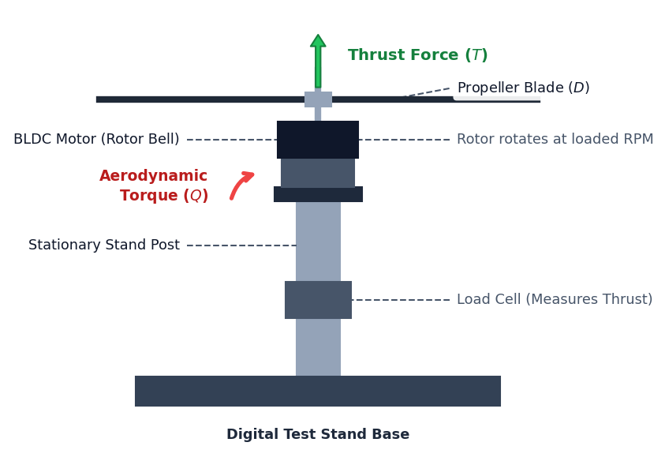

<h1>Lab Procedure: Propulsion System Design &amp; Characterization</h1>

The whole experiment runs on one page. You pick the hardware on the left, run the bench in the middle, and read the results on the right. There are five sub-experiments grouped into three modules, and the counter next to <strong>Experiment Progress</strong> tells you how many you have cleared.

Modules 2 and 3 start locked, with a padlock on their tabs. Pass the <strong>Assembly Check</strong> in Module 1 and they open &mdash; there is no point characterising a motor on a build that does not physically go together.

<table>
<thead><tr><th>Module</th><th>Sub-experiments</th></tr></thead>
<tbody>
<tr><td>Module 1 &middot; Assembly &amp; Thrust</td><td>Assembly Check, Static Thrust</td></tr>
<tr><td>Module 2 &middot; Motor Characterisation</td><td>Thermal &middot; RPM Loss, Motor Efficiency</td></tr>
<tr><td>Module 3 &middot; Flight Verification</td><td>Hover / Flight</td></tr>
</tbody>
</table>

<h2>Getting your bearings</h2>

Three columns, and they never move:

<ul>
<li><strong>Input Parameters</strong> (left) holds the component tiles &mdash; chassis, propeller, motor, ESC, battery, flight controller, receiver, attachments &mdash; plus a <strong>Density Altitude</strong> slider (0&ndash;3000 m, with the resulting air density &rho; underneath) and a <strong>Mass Budget</strong> card. Click the mass card for the itemised breakdown.</li>
<li>The <strong>3D viewport</strong> (centre) carries the module tabs along the top and the sub-experiment tabs along the bottom. Drag to orbit, scroll to zoom. The <strong>Live Telemetry</strong> overlay reads thrust, RPM, current, power, motor and ESC temperature, battery state and altitude, with a phase word at the bottom (STANDBY, DRIVING, OVERHEAT, and so on).</li>
<li>Under the viewport sit <strong>&#9654; Run Sim</strong>, <strong>Reset</strong>, the <strong>Throttle</strong> slider (it appears only where you actually drive it) and the progress bar. Below that, the <strong>Calculations</strong> card opens the full derivation for whatever tab is active, and the <strong>Diagnostics Log</strong> lists every problem the solver can see. A blocking error there will refuse to start the run &mdash; the log flashes instead.</li>
<li><strong>Outputs</strong> (right) has the live graph, the analysis charts, and <strong>Components Unlocked</strong>, which stays locked until all five sub-experiments are done.</li>
</ul>

The orb in the bottom-right corner is the <strong>Lab Instructor</strong>. It walks you through the sequence, replays its audio on demand, and has separate volume sliders for the voice and the bench sound effects.

<h2>Module 1 &middot; Assembly Check</h2>

<h3>Objective</h3>

Get a set of parts that physically fit each other and leave enough margin to fly.

<ol>
<li>Work down the component tiles and pick one option in each category. The 3D model rebuilds as you go, and the mass budget updates with it.</li>
<li>Keep an eye on the <strong>Diagnostics Log</strong>. It is the honest list: propeller-versus-frame collisions, a pack with more cells than the ESC or motor is rated for, phase current past the motor's limit. Errors marked as blocking have to be cleared before the run will start.</li>
<li>Set the <strong>Density Altitude</strong> slider if you want to fly somewhere other than sea level. Thinner air means less thrust from the same RPM.</li>
<li>Press <strong>&#9654; Run Sim</strong>. It is a short two-second integrity sweep with the props barely turning &mdash; it is checking geometry and margins, not performance.</li>
<li>A pass reads <em>"Assembly OK &mdash; geometry &amp; margins verified, T/W x.xx"</em>. A fail sends you back to the log.</li>
</ol>

<blockquote>

Put a 10" propeller on a 210 mm frame and the props overlap. Fit a 6S pack to a 4S-rated ESC and the board pops on spin-up, with sparks and smoke, about half a second into the run. Both are worth doing once on purpose.

</blockquote>

<h2>Module 1 &middot; Static Thrust</h2>

<h3>Objective</h3>

Measure what one motor-and-propeller pair actually produces on the thrust stand, across the throttle range.

<ol>
<li>Switch to the <strong>Static Thrust</strong> tab. The viewport swaps the drone for a single motor and propeller on a load-cell stand.</li>
<li>Press <strong>&#9654; Run Sim</strong>. The <strong>Throttle</strong> slider appears once the run is live &mdash; this bench is manual, so nothing happens until you move it.</li>
<li>Bring the throttle up slowly and watch the telemetry. Thrust is reported for all four motors; current is per motor.</li>
<li>There is no fixed run length. The verdict tracks whatever throttle you are holding, and it is locked in when you press <strong>&#9632; Stop</strong>.</li>
<li>Hold a fault for three seconds &mdash; current past the motor limit, windings over 150 &deg;C, or the ESC over 110 &deg;C &mdash; and the run ends itself with a burnout verdict naming the temperature and current that did it.</li>
</ol>

A healthy pairing reports something like <em>"4&times; motors make 12.4 N vs 3.8 N weight (T/W 3.24)"</em>. A motor that cannot turn its propeller at all reads as stalled.

<h2>Module 2 &middot; Thermal &middot; RPM Loss</h2>

<h3>Objective</h3>

Watch copper loss heat the windings, and watch the hot windings give back RPM.

<ol>
<li>Open Module 2 and stay on the <strong>Thermal &middot; RPM Loss</strong> tab.</li>
<li>Start the run and hold a steady throttle. Pick a setting you would actually cruise at rather than slamming it to 100% straight away.</li>
<li>The phase word moves from STABLE to WARM at 90 &deg;C and to RUNAWAY at 140 &deg;C. Motor and ESC temperatures are separate readouts; they do not rise together.</li>
<li>RPM loss is measured against a cold-motor baseline at the same throttle, so the number stays meaningful wherever you park the slider.</li>
<li>To pass, the winding has to settle under 100 &deg;C with less than 8% RPM loss. An oversized propeller on a small motor is the reliable way to fail it.</li>
</ol>

The reason is in the copper: winding resistance climbs about 0.39% per &deg;C, so a hot motor draws more current for the same voltage, which makes more heat. That is the loop that runs away.

<h2>Module 2 &middot; Motor Efficiency</h2>

<h3>Objective</h3>

Find where in the throttle range the motor is actually worth its current draw.

<ol>
<li>Switch to the <strong>Motor Efficiency</strong> tab and start the run.</li>
<li>Sweep the throttle by hand, slowly, across the full range. The curve you get is the range you explored &mdash; there is no automatic ramp doing it for you.</li>
<li>The live graph traces motor efficiency &eta; and grams-per-watt together. Efficiency is low at both ends: at low throttle the no-load current dominates, at high throttle <i>I</i>2<i>R</i> does.</li>
<li>Open the <strong>Calculations</strong> card mid-sweep to see where the input power is going &mdash; shaft power against copper loss, with the numbers from your build substituted in.</li>
<li>Peak &eta; of 70% or better passes. Above 80% the verdict calls the build efficient.</li>
</ol>

Compare the peak against the hover throttle you measured on the thrust bench. If the drone hovers at 40% and the motor peaks at 75%, it is spending its whole flight off the sweet spot.

<h2>Module 3 &middot; Hover / Flight</h2>

<h3>Objective</h3>

Fly the assembled drone and see whether the build holds together for a full pack.

<ol>
<li>Open Module 3. The drone sits on the pad and the throttle slider is available before you even start, so you can set an opening position.</li>
<li>Press <strong>&#9654; Run Sim</strong> and fly it manually. Throttle commands an altitude between 0.1 m and 4 m; the vertical dynamics are integrated properly, so it overshoots and settles rather than snapping to position.</li>
<li>Once you are holding a steady altitude the simulator jumps to <strong>60&times; fast-forward</strong> and shows a badge saying so. That is how several minutes of endurance fit into a short run. Move the throttle and it drops back to real time.</li>
<li>Two faults are decided before you leave the ground. If the motor cannot turn the prop it reads STALLED; if four motors cannot lift the mass it reads THRUST DEFICIT, and either way the run ends after about three seconds with the numbers that caused it.</li>
<li>In the air, watch the battery. As the pack empties its voltage sags, the sag costs you RPM, and holding altitude costs more throttle. Sustained overheating for three seconds burns the powertrain out mid-flight, and the drone drops.</li>
</ol>

Clear all five sub-experiments and <strong>Components Unlocked</strong> opens with a real motor drawn at random from the catalogue &mdash; the reward for Experiment 1, and a part you can carry into the experiments that follow.

