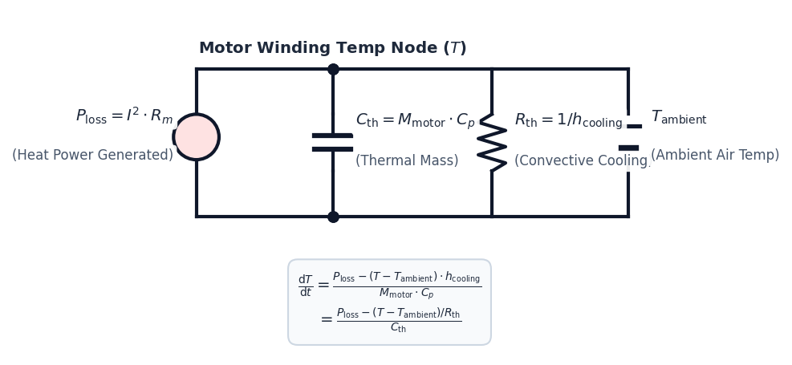

# Theoretical Background: Multirotor Propulsion Systems

A multirotor's propulsion system converts electrical energy stored in a chemical battery into aerodynamic thrust. Designing an efficient and safe drone requires understanding the coupled physics of aerodynamics, electro-circuit kinetics, thermodynamics, and battery chemistry.

---

## **1. Aerodynamic Force Balance & Hover State**

For a multirotor to maintain a stationary hover in three-dimensional space, the net vertical force acting on the aircraft must be zero. The total thrust generated by the <i>N</i>motors propellers must balance the gravity load (weight) of the drone:

&Sigma; <i>F</i><i>y</i> = <i>N</i>motors &middot; <i>T</i> - <i>M</i>total &middot; <i>g</i> = 0

<b><i>T</i>required = (<i>M</i>total &middot; <i>g</i>) &frasl; <i>N</i>motors</b>

Where:
* <i>T</i>required is the static thrust required per motor-propeller unit [N].
* <i>M</i>total is the total All-Up Mass (AUM) of the quadcopter, including the frame, electronics, battery, propulsion units, and any payload [kg].
* <i>g</i> is the acceleration due to gravity (9.80665 m/s2).
* <i>N</i>motors is the number of motors (typically 4 for standard quadcopters).

---

## **2. Propeller Aerodynamics (Blade Element Momentum Theory)**

Aerodynamic thrust (<i>T</i>) and drag torque (<i>Q</i>) are generated as the propeller blades rotate through the air, creating a pressure differential. Based on dimensional analysis and Blade Element Momentum Theory (BEMT), the performance is expressed as:

<i>T</i> = <i>C</i><i>t</i> &middot; &rho; &middot; <i>n</i>2 &middot; <i>D</i>4

<i>Q</i> = <i>C</i><i>q</i> &middot; &rho; &middot; <i>n</i>2 &middot; <i>D</i>5

Where:
* &rho; is the ambient air density [kg/m3], derived from altitude (<i>H</i>) using the International Standard Atmosphere (ISA) model:
  
&rho; = &rho;0 &middot; (1 - 0.0000225577 &middot; <i>H</i>)4.25588

  (with sea-level density &rho;0 = 1.225 kg/m3).
* <i>n</i> is the rotational speed of the propeller in revolutions per second [rps] (<i>n</i> = RPM / 60).
* <i>D</i> is the propeller diameter [m].
* <i>C</i><i>t</i> and <i>C</i><i>q</i> are the non-dimensional thrust and torque coefficients.

The velocity vectors, angles, and resulting incremental aerodynamic forces acting on a 2D airfoil cross-section of the blade are shown below:

### **Static Pitch Approximations**
In static conditions, the coefficients are heavily dependent on the propeller's pitch-to-diameter ratio (<i>P</i>/<i>D</i>):

<i>C</i><i>t</i>_static &asymp; 0.115 &middot; (<i>P</i> &frasl; <i>D</i>)

<i>C</i><i>q</i>_static &asymp; <i>C</i><i>t</i>_static &middot; (0.045 &middot; <i>Re</i>factor + 0.11 &middot; (<i>P</i> &frasl; <i>D</i>))

### **Low Reynolds Number Correction**
Small drone propellers operate in a low Reynolds number regime (<i>Re</i> &lt; 150,000) where viscous shear stresses dominate, increasing the profile drag coefficient. We apply a correction factor based on the 1/4-power law:

<i>Re</i>factor = (150,000 &frasl; <i>Re</i>)0.25

Where <i>Re</i> = (&rho; &middot; <i>v</i>tip &middot; <i>c</i>mean) &frasl; &mu;, with <i>v</i>tip = &pi; &middot; <i>n</i> &middot; <i>D</i> representing blade tip speed, <i>c</i>mean representing mean blade chord, and &mu; representing air dynamic viscosity.

### **Induced Inflow Correction**
As the propeller rotates, it induces a downward vertical velocity (<i>vi</i>) through the actuator disk, reducing the effective angle of attack of the blades. We calculate the induced advance ratio (<i>Ji</i>) and adjust the coefficients:

<i>J</i><i>i</i> = &radic;((2 &middot; <i>C</i><i>t</i>_static) &frasl; &pi;)

<i>C</i><i>t</i>_eff = <i>C</i><i>t</i>_static &middot; (1 - <i>J</i><i>i</i>)

<i>C</i><i>q</i>_eff = <i>C</i><i>q</i>_static &middot; (1 + 1.5 &middot; <i>J</i><i>i</i>2)

---

## **3. Equivalent Electrical Circuit & Back-EMF**

The brushless DC (BLDC) motor acts as an electromechanical transducer. Under steady-state conditions, the electrical loop is represented by an equivalent series circuit containing the battery open-circuit voltage (<i>V</i>oc), system resistances, and the motor's Back-Electromotive Force (<i>V</i>bemf).

### **Total Effective Resistance**
The total winding resistance (<i>R</i><i>m</i>) is modified to include the battery's internal resistance (<i>R</i>batt) and the ESC MOSFET resistance (<i>R</i>esc):

<i>R</i><i>m</i>_eff = <i>R</i>motor + <i>R</i>esc + 4 &middot; <i>R</i>batt

* **ESC Resistance:** Ranging from 2 m&Omega; to 3 m&Omega; per phase depending on thermal cooling and rating.
* **Battery Resistance:** Scales with capacity (<i>C</i>mah) and cell count (<i>S</i>):
  
<i>R</i>batt_nominal &asymp; <i>S</i> &middot; 0.012 &middot; (1500 &frasl; <i>C</i>mah) &Omega;

### **Back-EMF & Applied Voltage**
When the motor spins at speed <i>n</i>rpm, it generates a counter-voltage opposing the applied voltage:

<i>V</i>bemf = <i>n</i>rpm &frasl; <i>KV</i>

Where <i>KV</i> is the motor velocity constant [RPM/V].
The effective voltage applied to the windings by the ESC switching MOSFETs under throttle <i>u</i> &isin; [0, 1] is:

<i>V</i>applied = <i>u</i> &middot; <i>V</i>battery_terminal

### **Steady-State Current & Torque**
The loop current (<i>I</i>) is driven by the difference between the applied voltage and Back-EMF:

<i>I</i> = (<i>V</i>applied - <i>V</i>bemf) &frasl; <i>R</i><i>m</i>_eff

The motor produces torque (<i>Q</i><i>m</i>) proportional to this current, which must balance the aerodynamic torque (<i>Q</i>) and winding friction losses:

<i>Q</i><i>m</i> = <i>K</i><i>t</i> &middot; (<i>I</i> - <i>I</i>0)

Where <i>K</i><i>t</i> = 60 &frasl; (2&pi; &middot; <i>KV</i>) is the motor torque constant [N·m/A], and <i>I</i>0 is the no-load current.

---

## **4. Dynamic Thermal & Convective Cooling Kinetics**

The electrical current flowing through the windings generates heat due to resistive losses (Joule heating). The rate of temperature change (<i>dT</i>/<i>dt</i>) of the motor is solved using a first-order lumped capacitance thermal model:

<i>dT</i> &frasl; <i>dt</i> = (<i>P</i>loss - (<i>T</i> - <i>T</i>ambient) &middot; <i>h</i>cooling) &frasl; (<i>M</i>motor &middot; <i>C</i><i>p</i>)

Where:
* <i>P</i>loss = <i>I</i>2 &middot; <i>R</i>motor is the electrical copper loss [W] (iron core losses are neglected for simplicity).
* <i>T</i> is the current winding temperature [°C], and <i>T</i>ambient is the air temperature (typically 25&deg;C).
* <i>M</i>motor is the physical mass of the motor [kg], and <i>C</i><i>p</i> is the specific heat capacity of copper/aluminum (900 J/(kg·K)).
* <i>h</i>cooling is the dynamic convective heat transfer coefficient [W/K], which scales with the propeller wash velocity and blade tip speed:
  
<i>h</i>cooling = 0.025 + 0.006 &middot; &radic;<i>v</i>tip + 0.012 &middot; <i>vi</i>

If the motor temperature exceeds 150&deg;C, the wire insulation melts, triggering short circuits, motor burnout, and eventual crash.

This heat flow and dissipation behavior can be represented by an equivalent thermal RC circuit, where <i>P</i>loss acts as a current heat flux source, <i>C</i>th represents the thermal capacitance (storing heat), and <i>R</i>th represents the thermal resistance of convective cooling:

---

## **5. Battery Voltage Sag & Discharge Dynamics**

As a Lithium Polymer (LiPo) battery discharges, its open-circuit voltage (<i>V</i>oc) drops as a function of the State of Charge (<i>SoC</i> &isin; [0, 1]):

<i>V</i>oc_cell = 3.5 + 0.7 &middot; <i>SoC</i> + 0.1 &middot; <i>SoC</i>3

Under high current draw, the terminal voltage drops (sags) below the open-circuit voltage due to internal cell resistance:

<i>V</i>terminal = <i>N</i>cells &middot; (<i>V</i>oc_cell - <i>I</i> &middot; <i>R</i>cell_eff)

Near depletion (<i>SoC</i> &lt; 0.30), chemical reaction rates slow down, causing cell internal resistance to grow exponentially:

<i>R</i>cell_eff = <i>R</i>cell_nominal &middot; (1.0 + 0.25 &middot; <i>e</i>5.0 &middot; (0.3 - <i>SoC</i>))

This voltage sag reduces <i>V</i>applied, causing a corresponding drop in RPM and thrust, representing battery depletion effects during flight.
