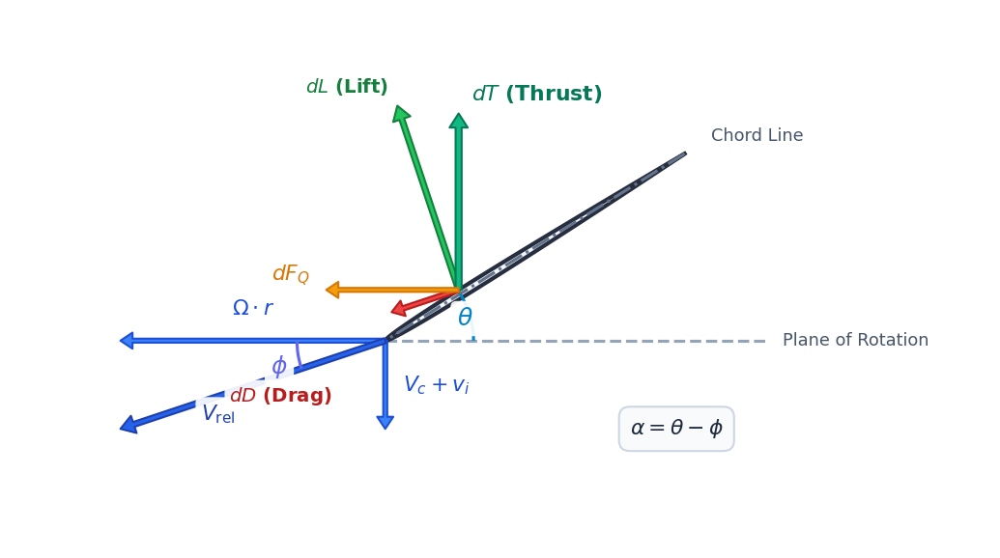

# Theoretical Background: Multirotor Propulsion Systems

A multirotor's propulsion system converts electrical energy stored in a chemical battery into aerodynamic thrust. Designing an efficient and safe drone requires understanding the coupled physics of aerodynamics, electro-circuit kinetics, thermodynamics, and battery chemistry.

---

## **1. Aerodynamic Force Balance & Hover State**

For a multirotor to maintain a stationary hover in three-dimensional space, the net vertical force acting on the aircraft must be zero. The total thrust generated by the $N_{motors}$ propellers must balance the gravity load (weight) of the drone:

$$\sum F_y = N_{motors} \cdot T - M_{total} \cdot g = 0$$

$$\mathbf{T_{required} = \frac{M_{total} \cdot g}{N_{motors}}}$$

Where:
* $T_{required}$ is the static thrust required per motor-propeller unit [N].
* $M_{total}$ is the total All-Up Mass (AUM) of the quadcopter, including the frame, electronics, battery, propulsion units, and any payload [kg].
* $g$ is the acceleration due to gravity ($9.80665 \text{ m/s}^2$).
* $N_{motors}$ is the number of motors (typically $4$ for standard quadcopters).

---

## **2. Propeller Aerodynamics (Blade Element Momentum Theory)**

Aerodynamic thrust ($T$) and drag torque ($Q$) are generated as the propeller blades rotate through the air, creating a pressure differential. Based on dimensional analysis and Blade Element Momentum Theory (BEMT), the performance is expressed as:

$$T = C_t \cdot \rho \cdot n^2 \cdot D^4$$

$$Q = C_q \cdot \rho \cdot n^2 \cdot D^5$$

Where:
* $\rho$ is the ambient air density [$\text{kg/m}^3$], derived from altitude ($H$) using the International Standard Atmosphere (ISA) model:
  $$\rho = \rho_0 \cdot \left(1 - 0.0000225577 \cdot H\right)^{4.25588}$$
  (with sea-level density $\rho_0 = 1.225 \text{ kg/m}^3$).
* $n$ is the rotational speed of the propeller in revolutions per second [rps] ($n = \text{RPM} / 60$).
* $D$ is the propeller diameter [m].
* $C_t$ and $C_q$ are the non-dimensional thrust and torque coefficients.

The velocity vectors, angles, and resulting incremental aerodynamic forces acting on a 2D airfoil cross-section of the blade are shown below:

### **Static Pitch Approximations**
In static conditions, the coefficients are heavily dependent on the propeller's pitch-to-diameter ratio ($P/D$):

$$C_{t\_static} \approx 0.115 \cdot \left(\frac{P}{D}\right)$$

$$C_{q\_static} \approx C_{t\_static} \cdot \left(0.045 \cdot Re_{factor} + 0.11 \cdot \frac{P}{D}\right)$$

### **Low Reynolds Number Correction**
Small drone propellers operate in a low Reynolds number regime ($Re < 150,000$) where viscous shear stresses dominate, increasing the profile drag coefficient. We apply a correction factor based on the $1/4$-power law:

$$Re_{factor} = \left(\frac{150,000}{Re}\right)^{0.25}$$

Where $Re = \frac{\rho \cdot v_{tip} \cdot c_{mean}}{\mu}$, with $v_{tip} = \pi \cdot n \cdot D$ representing blade tip speed, $c_{mean}$ representing mean blade chord, and $\mu$ representing air dynamic viscosity.

### **Induced Inflow Correction**
As the propeller rotates, it induces a downward vertical velocity ($v_i$) through the actuator disk, reducing the effective angle of attack of the blades. We calculate the induced advance ratio ($J_i$) and adjust the coefficients:

$$J_i = \sqrt{\frac{2 \cdot C_{t\_static}}{\pi}}$$

$$C_{t\_eff} = C_{t\_static} \cdot (1 - J_i)$$

$$C_{q\_eff} = C_{q\_static} \cdot \left(1 + 1.5 \cdot J_i^2\right)$$

---

## **3. Equivalent Electrical Circuit & Back-EMF**

The brushless DC (BLDC) motor acts as an electromechanical transducer. Under steady-state conditions, the electrical loop is represented by an equivalent series circuit containing the battery open-circuit voltage ($V_{oc}$), system resistances, and the motor's Back-Electromotive Force ($V_{bemf}$).

### **Total Effective Resistance**
The total winding resistance ($R_m$) is modified to include the battery's internal resistance ($R_{batt}$) and the ESC MOSFET resistance ($R_{esc}$):

$$R_{m\_eff} = R_{motor} + R_{esc} + 4 \cdot R_{batt}$$

* **ESC Resistance:** Ranging from $2 \text{ m}\Omega$ to $3 \text{ m}\Omega$ per phase depending on thermal cooling and rating.
* **Battery Resistance:** Scales with capacity ($C_{mah}$) and cell count ($S$):
  $$R_{batt\_nominal} \approx S \cdot 0.012 \cdot \left(\frac{1500}{C_{mah}}\right)\ \Omega$$

### **Back-EMF & Applied Voltage**
When the motor spins at speed $n_{rpm}$, it generates a counter-voltage opposing the applied voltage:

$$V_{bemf} = \frac{n_{rpm}}{KV}$$

Where $KV$ is the motor velocity constant [RPM/V].
The effective voltage applied to the windings by the ESC switching MOSFETs under throttle $u \in [0, 1]$ is:

$$V_{applied} = u \cdot V_{battery\_terminal}$$

### **Steady-State Current & Torque**
The loop current ($I$) is driven by the difference between the applied voltage and Back-EMF:

$$I = \frac{V_{applied} - V_{bemf}}{R_{m\_eff}}$$

The motor produces torque ($Q_m$) proportional to this current, which must balance the aerodynamic torque ($Q$) and winding friction losses:

$$Q_m = K_t \cdot (I - I_0)$$

Where $K_t = \frac{60}{2\pi \cdot KV}$ is the motor torque constant [N·m/A], and $I_0$ is the no-load current.

---

## **4. Dynamic Thermal & Convective Cooling Kinetics**

The electrical current flowing through the windings generates heat due to resistive losses (Joule heating). The rate of temperature change ($dT/dt$) of the motor is solved using a first-order lumped capacitance thermal model:

$$\frac{dT}{dt} = \frac{P_{loss} - (T - T_{ambient}) \cdot h_{cooling}}{M_{motor} \cdot C_p}$$

Where:
* $P_{loss} = I^2 \cdot R_{motor}$ is the electrical copper loss [W] (iron core losses are neglected for simplicity).
* $T$ is the current winding temperature [°C], and $T_{ambient}$ is the air temperature (typically $25^\circ\text{C}$).
* $M_{motor}$ is the physical mass of the motor [kg], and $C_p$ is the specific heat capacity of copper/aluminum (900 J/(kg·K)).
* $h_{cooling}$ is the dynamic convective heat transfer coefficient [W/K], which scales with the propeller wash velocity and blade tip speed:
  $$h_{cooling} = 0.025 + 0.006 \cdot \sqrt{v_{tip}} + 0.012 \cdot v_i$$

If the motor temperature exceeds $150^\circ\text{C}$, the wire insulation melts, triggering short circuits, motor burnout, and eventual crash.

This heat flow and dissipation behavior can be represented by an equivalent thermal RC circuit, where $P_{loss}$ acts as a current heat flux source, $C_{th}$ represents the thermal capacitance (storing heat), and $R_{th}$ represents the thermal resistance of convective cooling:

---

## **5. Battery Voltage Sag & Discharge Dynamics**

As a Lithium Polymer (LiPo) battery discharges, its open-circuit voltage ($V_{oc}$) drops as a function of the State of Charge ($SoC \in [0, 1]$):

$$V_{oc\_cell} = 3.5 + 0.7 \cdot SoC + 0.1 \cdot SoC^3$$

Under high current draw, the terminal voltage drops (sags) below the open-circuit voltage due to internal cell resistance:

$$V_{terminal} = N_{cells} \cdot \left(V_{oc\_cell} - I \cdot R_{cell\_eff}\right)$$

Near depletion ($SoC < 0.30$), chemical reaction rates slow down, causing cell internal resistance to grow exponentially:

$$R_{cell\_eff} = R_{cell\_nominal} \cdot \left(1.0 + 0.25 \cdot e^{5.0 \cdot (0.3 - SoC)}\right)$$

This voltage sag reduces $V_{applied}$, causing a corresponding drop in RPM and thrust, representing battery depletion effects during flight.
