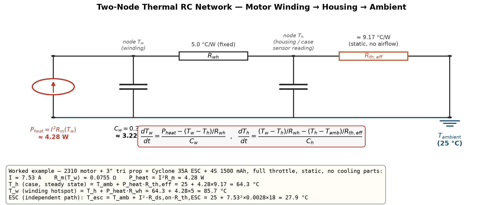
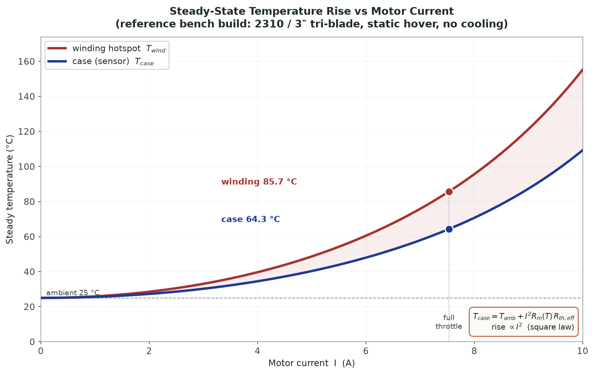
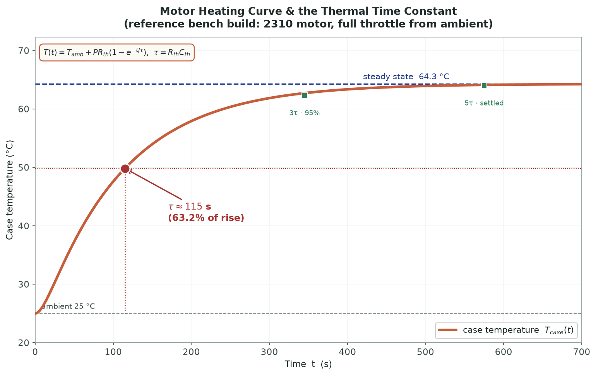
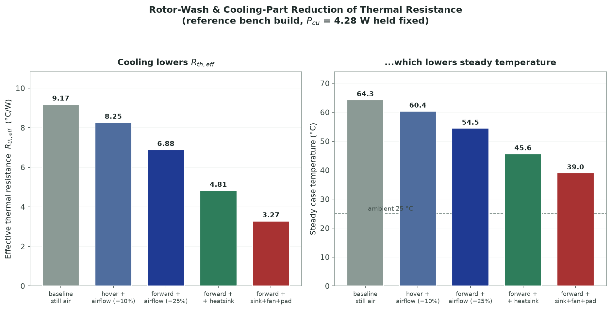

<h1>Theoretical Background: Drone Motor &amp; ESC Thermal Management</h1>

Every watt a propulsion system fails to convert into shaft power is dissipated as heat, and heat is what ultimately limits how hard a drone can be flown. A motor does not fail because it runs out of torque — it fails because its winding enamel melts; an ESC does not stop switching because it runs out of current headroom — it browns out because its MOSFETs cook. This experiment treats the motor and the ESC as <strong>thermal systems</strong>: bodies that generate heat internally from resistive loss, store it in their own mass, and shed it to the surrounding air through a thermal resistance that the propeller's own downwash can change. The chapter works through the four things that decide whether a build survives a sustained full-throttle hold: how much heat the copper actually generates, what steady temperature that heat settles at, how long the part takes to get there, and how much cooling airflow buys back.

<blockquote>

<strong>Note on the build used throughout this chapter.</strong> Every worked example below uses the same coherent bench build: a 2310 2400&nbsp;KV motor (33&nbsp;g, <i>R</i>m,20&deg;C = 0.060&nbsp;&Omega;), a 3&Prime; tri-blade propeller, a Cyclone 35A ESC (<i>R</i>DS(on) = 0.0028&nbsp;&Omega;), and a 4S 1500&nbsp;mAh pack, run at full throttle in still air with an ambient of <i>T</i>amb = 25&nbsp;&deg;C and no cooling parts fitted. Every number is computed from the governing equations below using the same constants the simulator's solver uses, so the figures match what the bench readout reports for this build.

</blockquote>

<h2>1. Where the Heat Comes From — Copper (I²R) Loss</h2>

The dominant heat source in a running BLDC motor is <strong>resistive (copper, or <i>I</i>2<i>R</i>) loss</strong> in the stator windings. Every amp the ESC pushes through the phase resistance dissipates power as heat:

<i>P</i>cu = <i>I</i>2 &middot; <i>R</i>m(<i>T</i>)

The winding resistance is not constant — copper's resistivity climbs with temperature, so a hot motor is a <em>worse</em> motor, dissipating more for the same current. This is captured by the copper temperature coefficient <i>&alpha;</i>Cu = 0.00393&nbsp;/&deg;C:

<i>R</i>m(<i>T</i>) = <i>R</i>m,20&deg;C &middot; [1 + <i>&alpha;</i>Cu(<i>T</i> &minus; 20)]

Because <i>R</i>m rises with <i>T</i>, and <i>T</i> rises with <i>P</i>cu, and <i>P</i>cu rises with <i>R</i>m, the three quantities are coupled: the simulator solves them together as a fixed point, exactly as a real motor settles to a self-consistent operating temperature. When a winding is grossly over-propped for its size and no cooling is present, this positive feedback has no stable fixed point below the enamel-failure ceiling of <strong>240&nbsp;&deg;C</strong> — the model then reports <strong>thermal runaway</strong> and the winding is treated as burnt out.

<h3>The Lumped-Capacitance Model &amp; the Two-Node RC Analogy</h3>

A body generating heat internally and losing it to ambient behaves like an electrical RC circuit, with an exact one-to-one analogy:

<table>
<thead><tr><th>Thermal quantity</th><th>Electrical analogue</th></tr></thead>
<tbody>
<tr><td>Heat-generation rate <i>P</i> [W]</td><td>current source [A]</td></tr>
<tr><td>Temperature rise <i>T</i> &minus; <i>T</i>amb [&deg;C]</td><td>voltage [V]</td></tr>
<tr><td>Thermal resistance <i>R</i>th [&deg;C/W]</td><td>resistance [&Omega;]</td></tr>
<tr><td>Thermal capacitance <i>C</i>th = <i>m</i>&middot;<i>c</i>p [J/&deg;C]</td><td>capacitance [F]</td></tr>
</tbody>
</table>

The simplest model lumps the whole motor into one node: heat <i>P</i>cu flows into a thermal mass <i>C</i>th and leaks to ambient through <i>R</i>th. In reality the copper winding runs hotter than the aluminium case that a sensor can actually touch, so the simulator uses a research-grade <strong>two-node network</strong>: a fast <em>winding</em> node (capacitance <i>C</i>w, where the heat is generated) conducts through a fixed winding-to-housing resistance <i>R</i>wh = 5&nbsp;&deg;C/W into a slow <em>housing</em> node (<i>C</i>h), which finally convects and radiates to ambient through the airflow-dependent <i>R</i>th,eff. The winding hotspot is then <em>emergent</em> — it falls straight out of the network rather than being added on by hand.

<h2>2. Steady-State Temperature Rise</h2>

Left running at a constant load long enough, every transient dies away and the part reaches a <strong>steady state</strong>: the heat generated exactly equals the heat shed, and the temperature stops climbing. Setting the net heat flow to zero, the case (housing) temperature is simply the ambient plus the loss driven across the effective thermal resistance, and the winding hotspot sits one more <i>R</i>wh drop above that:

<i>T</i>case = <i>T</i>amb + <i>P</i>cu &middot; <i>R</i>th,eff &nbsp;&nbsp;&nbsp; <i>T</i>winding = <i>T</i>case + <i>P</i>cu &middot; <i>R</i>wh

Because <i>T</i>case is linear in <i>P</i>cu and <i>P</i>cu = <i>I</i>2<i>R</i>m, the temperature rise grows with the <strong>square of current</strong> — doubling the current draw very nearly quadruples the temperature rise above ambient. This is why an over-propped motor that pulls twice the intended current does not run twice as hot but roughly four times as far above ambient, and why current, not power, is the quantity a thermal budget is written against.

<blockquote>

<strong>Worked example — steady-state temperatures of the bench build at full throttle.</strong>
Solving the coupled motor/propeller/pack point for this build gives a full-throttle winding current whose copper loss is <i>P</i>cu = 4.283&nbsp;W. The 33&nbsp;g motor's effective housing-to-ambient resistance works out to <i>R</i>th,eff = 9.171&nbsp;&deg;C/W (a lighter motor has less surface area, so a higher <i>R</i>th):

<i>T</i>case = 25 + 4.283 &middot; 9.171 = 25 + 39.28 = <b>64.3&nbsp;&deg;C</b>

<i>T</i>winding = 64.3 + 4.283 &middot; 5 = 64.3 + 21.4 = <b>85.7&nbsp;&deg;C</b>

The case sensor reads a comfortable 64&nbsp;&deg;C, but the copper the sensor cannot see is 21&nbsp;&deg;C hotter at 86&nbsp;&deg;C — still safe, but the gap is exactly why a case-temperature reading always understates the real thermal margin. Larger, heavier motors run cooler for the same loss because their bigger surface area lowers <i>R</i>th,eff.

</blockquote>

<h2>3. The Thermal Time Constant</h2>

Steady state is not reached instantly — the part's own thermal mass has to be heated up first. For a single-node RC body the temperature rise toward its final value is a rising exponential:

<i>T</i>(<i>t</i>) = <i>T</i>amb + <i>P</i>&middot;<i>R</i>th &middot; (1 &minus; <i>e</i>&minus;<i>t</i>/<i>&tau;</i>) &nbsp;&nbsp;&nbsp; <i>&tau;</i> = <i>R</i>th &middot; <i>C</i>th

The <strong>thermal time constant</strong> <i>&tau;</i> is the product of thermal resistance and thermal capacitance, and it fixes the timescale of the whole heating curve. The most useful physical reading of <i>&tau;</i> is the <strong>63.2%-of-rise crossing</strong>: at <i>t</i> = <i>&tau;</i> the part has climbed 63.2% of the way from ambient to its final steady temperature; by 3<i>&tau;</i> it is 95% there, and by 5<i>&tau;</i> it is effectively settled. A large <i>&tau;</i> is protective — a heavy motor with a big <i>C</i>th can absorb a punishing burst for tens of seconds before it gets anywhere near its steady temperature, which is why short aerobatic bursts are survivable where the same current held indefinitely would not be.

The lumped thermal capacitance is the part's mass times the specific heat of its dominant material — copper's <i>c</i>p = 385&nbsp;J/(kg&middot;&deg;C) for the winding:

<i>C</i>th = <i>m</i> &middot; <i>c</i>p

<blockquote>

<strong>Worked example — heating time constant of the bench motor.</strong>
The two-node split of this build gives a winding capacitance <i>C</i>w = 3.22&nbsp;J/&deg;C and a housing capacitance <i>C</i>h = 7.52&nbsp;J/&deg;C (total <i>C</i>th &asymp; 10.7&nbsp;J/&deg;C). The first-order estimate of the dominant time constant is

<i>&tau;</i> &asymp; <i>R</i>th,eff &middot; <i>C</i>th = 9.171 &middot; 10.7 &asymp; <b>104&nbsp;s</b>

Integrating the true two-node case-temperature curve to its measurable 63.2% crossing gives <i>&tau;</i> &asymp; <b>114&nbsp;s</b> — a little above the simple product, because the winding node has to charge before the housing node can. Either way the motor takes on the order of two minutes to approach its steady 64&nbsp;&deg;C case temperature; a five-second full-throttle punch barely moves the needle.

</blockquote>

<h2>4. ESC Conduction Loss &amp; Survivability</h2>

The ESC has its own thermal story. Its MOSFET bridge dissipates heat by <strong>conduction loss</strong> as phase current flows through the on-resistance of the switching FETs, with a soft penalty that grows once the current approaches the board's rated limit (rising switching and reverse-recovery losses):

<i>P</i>esc = <i>I</i>2 &middot; <i>R</i>DS(on) &middot; [1 + (<i>I</i>/<i>I</i>limit)2]

That heat settles the ESC to a steady temperature through its own thermal resistance, <i>T</i>esc = <i>T</i>amb + <i>P</i>esc&middot;<i>R</i>th,esc, and the board is judged against a hard <strong>over-temperature limit of <i>T</i>esc,limit = 80&nbsp;&deg;C</strong>. Below it the board is fine; above it the FET junctions are past their safe operating area and the ESC is flagged as failed. Because the ESC's aluminium PCB and FET packages have a high specific heat (<i>c</i>p &asymp; 800&nbsp;J/kg&middot;&deg;C), it also has a meaningful time constant of its own.

<blockquote>

<strong>Worked example — ESC temperature on the bench build.</strong>
On this single-motor 3&Prime; bench point the Cyclone 35A ESC's conduction loss is small relative to its 35&nbsp;A rating, so it settles at <i>T</i>esc = <b>27.9&nbsp;&deg;C</b> — only 2.9&nbsp;&deg;C above ambient, comfortably under the 80&nbsp;&deg;C limit. Re-run the same board on a hard-pulling 6S build near its current ceiling and the (<i>I</i>/<i>I</i>limit)2 penalty term dominates, driving the ESC past 80&nbsp;&deg;C and tripping the survivability check — the classic reason a correctly-sized motor still needs a correctly-sized (or actively cooled) ESC behind it.

</blockquote>

<h2>5. Cooling: Rotor-Wash, Forced Convection &amp; Cooling Parts</h2>

Every temperature above is set by <i>R</i>th,eff, and <i>R</i>th,eff is not fixed — it falls as airflow over the case improves convective heat transfer. The simulator models three independent ways to lower it.

<strong>Rotor-wash / forced-convection airflow.</strong> The propeller's own downwash blows over the motor and ESC, raising the convection coefficient and cutting <i>R</i>th. How much depends on the flight regime, because a hovering craft recirculates its own hot exhaust back over the case while a craft in forward flight sweeps through clean, cool air:

<i>R</i>th,eff = <i>R</i>th &middot; (1 &minus; <i>f</i>) &nbsp;&nbsp;&nbsp; <i>f</i> = <i>f</i>lo + (<i>f</i>hi &minus; <i>f</i>lo) &middot; coolFactor

where the cooling airflow control <em>coolFactor</em> runs 0&ndash;1, and the achievable reduction fraction <i>f</i> spans <strong>3%&ndash;10% in static hover</strong> but a much stronger <strong>15%&ndash;25% in forward flight</strong> — the same fan speed buys far more cooling once the craft is moving.

<strong>Bolt-on cooling parts.</strong> A heatsink, thermal pad, or ducted fan mounted on the motor or ESC each cut the local <i>R</i>th by a fixed fraction, and they <em>stack multiplicatively</em> on top of the airflow reduction above:

<table>
<thead><tr><th>Cooling part</th><th>Mechanism</th><th>Rth reduction</th></tr></thead>
<tbody>
<tr><td>Heatsink</td><td>added radiating surface area</td><td>&minus;30%</td></tr>
<tr><td>Ducted fan</td><td>forced airflow over the case</td><td>&minus;20%</td></tr>
<tr><td>Thermal pad</td><td>improved contact conduction</td><td>&minus;15%</td></tr>
</tbody>
</table>

<i>R</i>th,final = <i>R</i>th,eff &middot; &prod; (1 &minus; fracpart)

<blockquote>

<strong>Worked example — cooling the bench motor in forward flight.</strong>
Start from the still-air <i>R</i>th,eff = 9.171&nbsp;&deg;C/W. Put the craft into forward flight at full cooling airflow (coolFactor = 1, <i>f</i> = 0.25) and add a heatsink (&minus;30%):

<i>R</i>th,final = 9.171 &middot; (1 &minus; 0.25) &middot; (1 &minus; 0.30) = 9.171 &middot; 0.75 &middot; 0.70 = <b>4.81&nbsp;&deg;C/W</b>

The effective thermal resistance is nearly halved, which directly halves the steady-state temperature rise: the same 4.283&nbsp;W of copper loss now lifts the case only 4.283&middot;4.81 &asymp; 20.6&nbsp;&deg;C, to about 45.6&nbsp;&deg;C instead of 64.3&nbsp;&deg;C. Cooling does not reduce the heat generated — it reduces the temperature that heat settles at, and that is often the entire difference between a build that survives a sustained hold and one that cooks.

</blockquote>

